## Introduction

In 2017, [I wrote about](https://chollinger.com/blog/2017/03/tiny-telematics-with-spark-and-zeppelin/) how to build a basic, Open Source, Hadoop-driven Telematics application (using Spark, Hive, HDFS, and Zeppelin) that can track your movements while driving, show you how your driving skills are, or how often you go over the speed limit - all without relying on 3rd party vendors processing and using that data on your behalf.

This time around, we will re-vamp this application and transform it into a more modern\[1\], "serverless", real-time application by using Amazon’s AWS, an actual GPS receiver, and a GNU/Linux machine.

_\[1\] See conclusion_ 

## Tiny Telematics in 2019

I recently wrote about [Hadoop vs. Public Clouds.](https://chollinger.com/blog/2019/07/a-look-at-apache-hadoop-in-2019/) Part of the conclusion was that Public Cloud Provider (like AWS, GCP, and Azure) can provide big benefits at the cost of autonomy over your tech-stack.

In this article, we will see how the benefits of this new development can help us to re-design a 2 year old project.

Sample output of the solution

## Architecture

### Goals

Our goals are simple:

1. Every trip that is taken in a car should be captured and collected; we should be able to see where we went, when we went there, what route we took, and how fast we were going
2. A visualization should show us the route and our speed
3. Simple queries, like “What was my top speed today?” should be possible
4. The running costs should be reasonable

### Guiding Principles

Our guiding principles should be the following:

1. Data should be ingested and processed in real-time; if you are moving and data is being collected, the output should be available within a couple of minutes at the latest; if you have no internet connection, the data should be cached and sent later \[1\]
2. We don’t want to bother with infrastructure and server management; everything should be running in a fully managed environment ("severless")
3. The architecture and code should be simple and straightforward; we want this to be ready-to-go in a couple of hours 

### Out of Scope

Last but not least, we also ignore some things:

1. The device used will be a laptop; a similar setup will work on Android, a RaspberryPI, or any SOC device, as long as it has a Linux kernel 
2. Internet connectivity will be provided via a phone’s hotspot; no separate SIM card to provide native connectivity will be used
3. Power delivery will be done either via 12V or a battery
4. Certain “enterprise” components - LDAP integration, VPCs, long rule sets, ACLs etc. - are out of scope; we assume that those would be per-existing in an enterprise cloud 
5. Authentication will be simplified; no Oauth/SSAO flow will be used - we will use the device’s MAC ID as a unique ID (even though it really isn’t)
6. We stick to querying S3 data; more scalable solutions, such as DynamoDB, won’t be in scope 

### Architecture Diagram

This leads us to the following AWS architecture: 

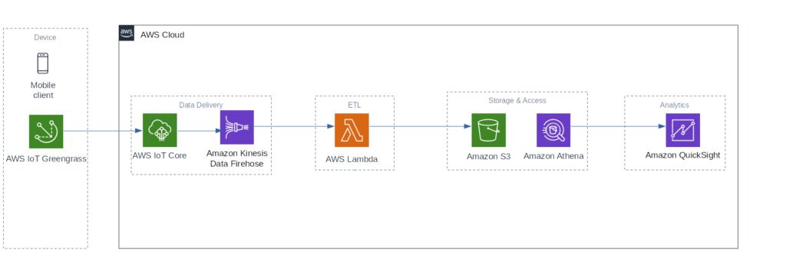

AWS Architecture

With these steps - 

1. A mobile client collects data in real-time by using the **gpsd** Linux daemon 
2. The AWS **IoT Greengrass Core** library simulates a local AWS environment by running a Lambda function _directly on the device_. **IoT Greengrass** manages deployment, authentication, network and various other things for us - this makes our data collection code very simple. A local **Lambda** function will process the data
3. **Kinesis Firehose** will take the data, run some basic transformation and validation using **Lambda**, and stores it to AWS S3
4. Amazon **Athena** + **QuickSight** will be used to analyze and visualize the data. The main reason for QuickSight is its capability to visualize geospatial data without the need for external tools or databases like Nominatim

_\[1\] Quicker processing is easily achieved with more money, for instance through Kinesis polling intervals (see below) - hence, we define a “near real time” goal, as somebody - me - has to pay for this ;)_

## Step 1: Getting Real Time GPS Data

In the original article, we used [SensorLog](https://apps.apple.com/us/app/sensorlog/id388014573), a great little app for iOS, to get all the iPhone’s sensor data and stored it into a CSV file that was then processed later in a **batch** load scenario. This is an easy solution, but with the investment of ~$15, you can get your hands on an actual GPS receiver that works almost out of the box with any GNU/Linux device, such as a RaspberryPI or a Laptop.

### Set up gpsd

So, this time around we will be relying on **[gpsd](https://gpsd.gitlab.io/gpsd/gpsd.html)**, the Linux kernel’s interface daemon for GPS receivers. Using this and an inexpensive GPS dongle, we can get real-time GPS data, straight from the USB TTY. We will also be able to use Python to parse this data.

We will be using this GPS receiver: [Diymall Vk-172](https://smile.amazon.com/gp/product/B00NWEEWW8/ref=ppx_yo_dt_b_asin_title_o00_s00?ie=UTF8&psc=1), and for the hardware, I am using my System76 Gazelle Laptop, running Pop!\_OS 19.04 x86\_64 with the 5.0.0-21 Kernel. Other options are available.

The dongle on my Laptop

Setting this up is straightforward:


#!/bin/bash
 
if [[ -z $SUDO_USER ]]; then
    echo "Script must be called as sudo"
    exit 1
fi
 
# Install dependencies
apt-get install gpsd gpsd-clients python-gps ntp
 
# Backup
GPSD=/etc/default/gpsd
cp ${GPSD} /etc/default/gpsd.bkp
 
# kill
kilall gpsd
rm -f /var/run/gpsd.sock
 
# Source and check
source ${GPSD}
if [[ $? -ne 0 ]]; then
    echo "Can't read ${GPSD}"
    exit 1
fi
 
# Get drives
lsusb
 
# Replace devices
if [[ -z "${DEVICES}" ]]; then
    echo "Replacing DEVICES"
    sed -i 's#DEVICES=""#DEVICES="/dev/ttyACM0"#g' ${GPSD}
fi
 
if [[ -z "${GPSD_OPTIONS}" ]]; then
    sed -i 's#GPSD_OPTIONS=""#GPSD_OPTIONS="-n"#g' ${GPSD}
fi
 
# Restart
service gpsd restart
# Manual
#gpsd /dev/ttyACM0 -F /var/run/gpsd.sock


Essentially, we are configuring the gpsd daemon to read from the right TTY and display it on screen. The above script is just a guideline - your TTY interface might be different.

Test this with


christian @ pop-os ➜  ~  gpsmon


And you should see data coming in.

Just make sure you are near a window or outside in order to get a connection, otherwise you might see timeouts:

I have to be outside to get a signal - very fun in Georgia heat and humidity

gpsd can collect the following data:

| Type             | Description                                             |
|------------------|---------------------------------------------------------|
| DBUS_TYPE_DOUBLE | Time (seconds since Unix epoch)                         |
| DBUS_TYPE_INT32  | mode                                                    |
| DBUS_TYPE_DOUBLE | Time uncertainty (seconds).                             |
| DBUS_TYPE_DOUBLE | Latitude in degrees.                                    |
| DBUS_TYPE_DOUBLE | Longitude in degrees.                                   |
| DBUS_TYPE_DOUBLE | Horizontal uncertainty in meters, 95% confidence.       |
| DBUS_TYPE_DOUBLE | Altitude in meters.                                     |
| DBUS_TYPE_DOUBLE | Altitude uncertainty in meters, 95% confidence.         |
| DBUS_TYPE_DOUBLE | Course in degrees from true north.                      |
| DBUS_TYPE_DOUBLE | Course uncertainty in meters, 95% confidence.           |
| DBUS_TYPE_DOUBLE | Speed, meters per second.                               |
| DBUS_TYPE_DOUBLE | Speed uncertainty in meters per second, 	95% confidence. |
| DBUS_TYPE_DOUBLE | Climb, meters per second.                               |
| DBUS_TYPE_DOUBLE | Climb uncertainty in meters per second, 	95% confidence. |
| DBUS_TYPE_STRING | Device name                                             |

And for the sake of simplicity, we will focus on latitude, longitude, altitude, speed, and time.

## Step 2: AWS IoT Core & Greengrass

The AWS IoT core will deploy a **Lambda** function to your device. This function will run locally, collect the GPS data, and sends it back to AWS via MQTT. It will also handle caching in case an internet connection is not available.

### A Local Lambda Function

First off, we’ll have to write a function to do just that:


from gps import *
import greengrasssdk
import platform
import json
import uuid
 
 
class Record:
    def __init__(self, lat, long, altitude, timestamp, speed):
        self.lat = lat
        self.long = long
        self.altitude = altitude
        self.timestamp = timestamp
        self.speed = speed
        self.id = hex(uuid.getnode())
 
    def __str__(self):
        return str(json.dumps(self.__dict__))
 
    def to_json(self):
        return json.dumps(self, default=lambda o: o.__dict__,
                          sort_keys=True, indent=4)
 
 
def push_to_iot_core(records):
    print('Got batch with size {}'.format(len(records)))
    data = json.dumps(records)
    print(data)
    client.publish(topic='telematics/raw', payload=data)
 
 
def poll_gps(_gpsd, batch=128):
    print('Starting GPS poll, batch: {}'.format(batch))
    data = []
    i = 0
    while True:
        report = _gpsd.next()
        # TPV - Time Position Velocity
        if report['class'] == 'TPV':
            # Get data
            lat = getattr(report, 'lat', 0.0)
            long = getattr(report, 'lon', 0.0)
            time = getattr(report, 'time', '')
            altitude = getattr(report, 'alt', 'nan')
            speed = getattr(report, 'speed', 'nan')
            record = Record(lat, long, altitude, time, speed)
            data.append(json.dumps(record.__dict__))
            if i >= batch:
                push_to_iot_core(data)
                data = []
                i = 0
            else:
                i += 1
 
 
def lambda_handler(event, context):
    return
 
 
# Start
gpsd = gps(mode=WATCH_ENABLE | WATCH_NEWSTYLE)
 
# Greengrass
client = greengrasssdk.client('iot-data')
my_platform = platform.platform()
print('Platform: {}'.format(my_platform))
 
print('Starting...')
poll_gps(gpsd, 25)


This function uses the gps and greengrass module to collect the data in pre-defined batches.

At this point, we also define our default values in the common case that a certain attribute - like latitude, longitude, or speed - cannot be read. We will use some ETL/filters on this later on.

### AWS IoT Group

Next, create an **AWS IoT Core Group** (please see the [AWS documentation](https://docs.aws.amazon.com/greengrass/latest/developerguide/gg-config.html) for details).

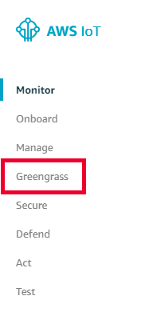

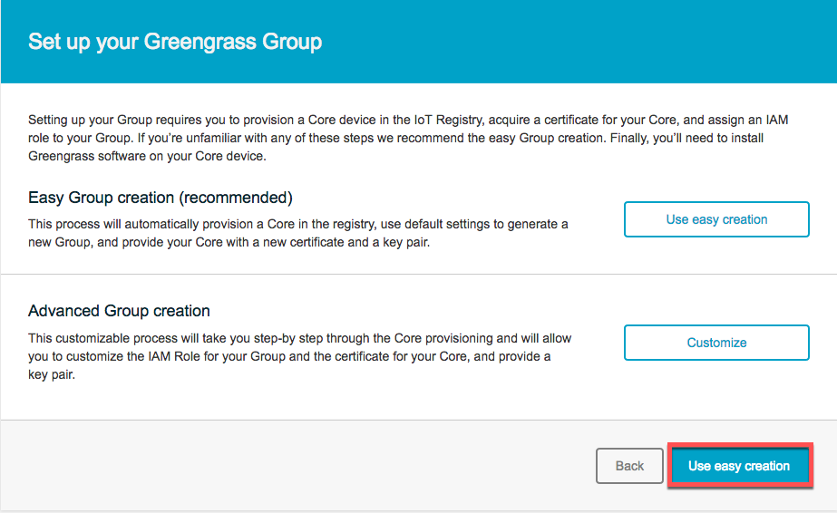

Once the group has been created, download the certificate and key files and ensure you get the right client data for your r[espective architecture](https://docs.aws.amazon.com/greengrass/latest/developerguide/what-is-gg.html#gg-core-download-tab):

### Deploying the Greengrass client

We can then deploy the **Greengrass client** to our device. The default configuration assumes a dedicated root folder, but we will run this in our user’s home directory:


# Download data
cd /home/greengrass/
tar -xzvf greengrass-linux-x86-64-1.9.2.tar.gz -C .
tar -xzvf $HASH-setup.tar.gz -C ./greengrass
 
# Set AWS root CA
cd /home/greengrass/greengrass/certs
wget -O root.ca.pem https://www.amazontrust.com/repository/AmazonRootCA1.pem
 
# Edit config
sed -i 's#file:///greengrass/#file:///home/greengrass/greengrass/#g' /home/greengrass/greengrass/config/config.json
 
# Start client
sudo /home/greengrass/gcc/core/greengrassd start
 
# Greengrass successfully started with PID: 9419
 
# User
sudo useradd ggc_user
sudo passwd ggc_user
id ggc_user
# uid=1001(ggc_user) gid=1001(ggc_user) groups=1001(ggc_user)


If you are deploying this to a dedicated device (where the daemon will be running constantly, e.g. on a Raspberry Pi), I suggest sticking to the default of using /greengrass.

### Deploying the Function to AWS

Next, we need to deploy our **Lambda** **function** to AWS. As we are using custom pip dependencies, please see the **deploy\_venv.sh** script that uses a Python Virtual Environment to package dependencies:


#!/bin/bash
rm -f function.zip
if [[ ! -d "./v-env" ]]; then
    python3 -m venv v-env
    source v-env/bin/activate
    pip3 install gps
    pip3 install greengrasssdk
    deactivate
fi
cd v-env/lib/python3.7/site-packages
zip -r9 ${OLDPWD}/function.zip .
cd $OLDPWD
zip -g function.zip lambda_function.py


On the AWS console, you can now upload the code:

It is important you create an **alias** and a **version**, as this will be referenced later on when configuring the IoT pipeline:

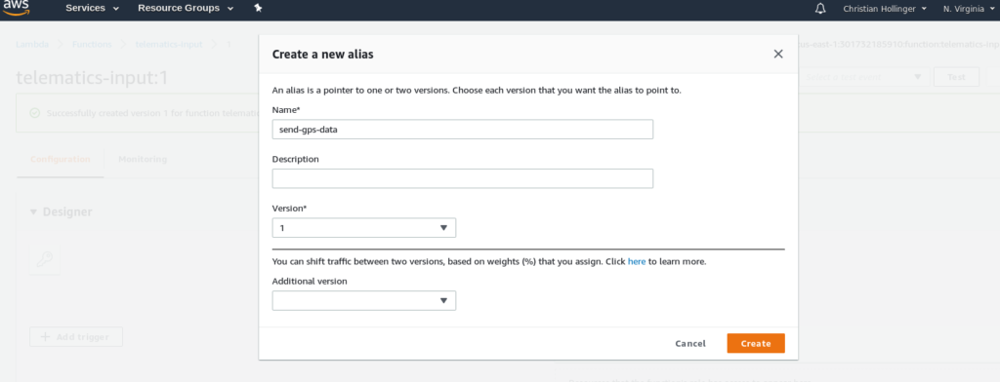

### Configuring Lambda on AWS IoT Core

Next, head back to the AWS IoT Core Group we created earlier and add a Lambda function.

Go to the group

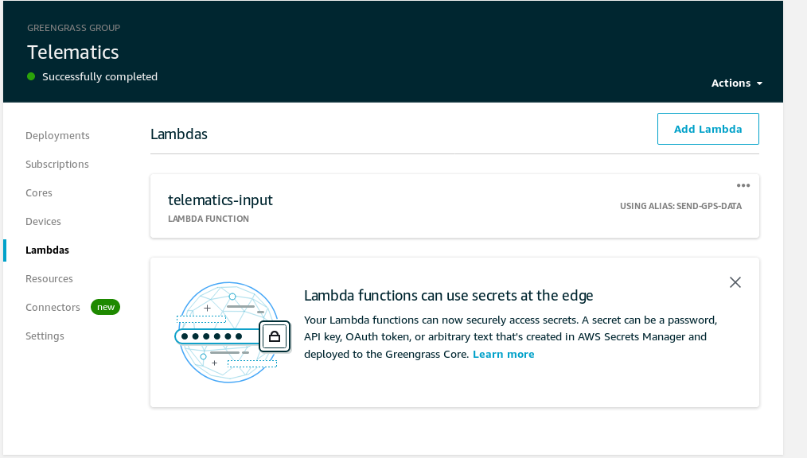

Set up the function

Keep in mind: As we won’t be able to run containers (as we need to talk to the USB GPS device via TTY), ensure that this is configured correctly:

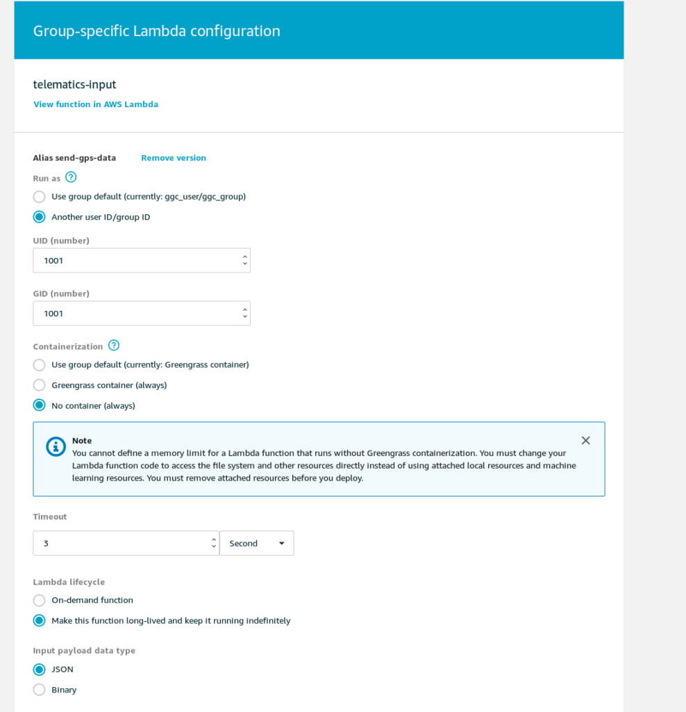

Another thing worth mentioning is the custom user ID. The client runs under a certain username and I strongly suggest setting up a service account for it.

Once that is completed, click on deploy and the Lambda function will be deployed to your clients.

### Test the Function locally

Finally, after deployment, ensure the user is running the container and check the local logs:

(This is running in my office and hence only shows lat/long as 0/0)

Great! Now our Lambda function runs locally and sends our location to AWS every second. Neat.  

## Step 3: Kinesis Firehose & ETL

Next, we send the data to Kinesis Firehose, which will run a Lambda function and stores the data to S3 so we can query it later. 

By doing this (as opposed to triggering Lambda directly), we bundle our data into manageable packages, so that we don’t have to invoke (and pay for) a Lambda function for every handful of records. We also don’t need to handle the logic to organize the keys on the S3 bucket.

### Creating an ETL Lambda Function

First off, we’ll create a Lambda function again. This time, this function will **run on AWS** and not on the device. We'll call it **telematics-etl**.

import json
import base64
 
 
def lambda_handler(event, context):
    # print(event)
    output_data = []
    for record in event['records']:
        success = []
        failed = []
        payload = base64.b64decode(record['data'])
        data = json.loads(payload)
        for elem in data:
            # print(elem)
            _elem = json.loads(elem)
            # Lat/long are required, unless we want to wind up in the Atlantic ocean
            if _elem['lat'] == 0 or _elem['long'] == 0:
                print('Lat/Long is invalid')
                failed.append(_elem)
            else:
                # Filter default values and assign reasonable defaults
                if _elem['speed'] == 'nan':
                    _elem['speed'] = -999
                if _elem['altitude'] == 'nan':
                    _elem['altitude'] = -999
                success.append(_elem)
        # Output ready for Athena, one JSON element per line, no arrays
        _outputstr = ''
        for js in success:
            _outputstr += str(json.dumps(js).encode('utf-8')) + '\n'
        # TODO: ugly hack with base64 encoding late at night
        output_record = {
            'recordId': record['recordId'],
            'result': 'Ok',
            'data': base64.b64encode(json.dumps(_outputstr).replace('\\n', '\n').replace('\\', '').replace('b\'','').encode("utf-8")).decode('utf-8')
        }
        output_data.append(output_record)
    print('Successfully processed {} records.'.format(len(event['records'])))
 
    print(output_data)
    return {'records': output_data}


The function simply filters invalid records (those with a latitude/longitude pair of 0, the default we defined earlier) and changes “nan” Strings for speed and altitude to an integer of -999, which we define as error code. 

The function’s output is the base64 encoded data alongside an “**Ok**” status as well as the original **recordID**.

We also need to make sure we have one **JSON per line** **and no array**, as would be default with json.dumps(data). This is a limitation of the JSON Hive parser Athena uses. Please forgive the nasty hack in the code.  
Naturally, more complex processing can be done here.

Once done, deploy the function to AWS.

### Test the Function

Once done, we can test this with a test record that can look like this:


{
  "invocationId": "85f5da9d-e841-4ea7-8503-434dbb7d1eeb",
  "deliveryStreamArn": "arn:aws:firehose:us-east-1:301732185910:deliverystream/telematics-target",
  "region": "us-east-1",
  "records": [
    {
      "recordId": "49598251732893957663814002186639229698740907093727903746000000",
      "approximateArrivalTimestamp": 1564954575255,
      "data": "WyJ7XCJsYXRcIjogMC4wLCBcImxvbmdcIjogMC4wLCBcImFsdGl0dWRlXCI6IFwibmFuXCIsIFwidGltZXN0YW1wXCI6IFwiMjAxOS0wOC0wNFQyMTozNjoxMC4wMDBaXCIsIFwic3BlZWRcIjogXCJuYW5cIn0iLCAie1wibGF0XCI6IDAuMCwgXCJsb25nXCI6IDAuMCwgXCJhbHRpdHVkZVwiOiBcIm5hblwiLCBcInRpbWVzdGFtcFwiOiBcIjIwMTktMDgtMDRUMjE6MzY6MTAuMDAwWlwiLCBcInNwZWVkXCI6IFwibmFuXCJ9IiwgIntcImxhdFwiOiAwLjAsIFwibG9uZ1wiOiAwLjAsIFwiYWx0aXR1ZGVcIjogXCJuYW5cIiwgXCJ0aW1lc3RhbXBcIjogXCIyMDE5LTA4LTA0VDIxOjM2OjExLjAwMFpcIiwgXCJzcGVlZFwiOiBcIm5hblwifSIsICJ7XCJsYXRcIjogMC4wLCBcImxvbmdcIjogMC4wLCBcImFsdGl0dWRlXCI6IFwibmFuXCIsIFwidGltZXN0YW1wXCI6IFwiMjAxOS0wOC0wNFQyMTozNjoxMS4wMDBaXCIsIFwic3BlZWRcIjogXCJuYW5cIn0iLCAie1wibGF0XCI6IDAuMCwgXCJsb25nXCI6IDAuMCwgXCJhbHRpdHVkZVwiOiBcIm5hblwiLCBcInRpbWVzdGFtcFwiOiBcIjIwMTktMDgtMDRUMjE6MzY6MTIuMDAwWlwiLCBcInNwZWVkXCI6IFwibmFuXCJ9IiwgIntcImxhdFwiOiAwLjAsIFwibG9uZ1wiOiAwLjAsIFwiYWx0aXR1ZGVcIjogXCJuYW5cIiwgXCJ0aW1lc3RhbXBcIjogXCIyMDE5LTA4LTA0VDIxOjM2OjEyLjAwMFpcIiwgXCJzcGVlZFwiOiBcIm5hblwifSIsICJ7XCJsYXRcIjogMC4wLCBcImxvbmdcIjogMC4wLCBcImFsdGl0dWRlXCI6IFwibmFuXCIsIFwidGltZXN0YW1wXCI6IFwiMjAxOS0wOC0wNFQyMTozNjoxMy4wMDBaXCIsIFwic3BlZWRcIjogXCJuYW5cIn0iLCAie1wibGF0XCI6IDAuMCwgXCJsb25nXCI6IDAuMCwgXCJhbHRpdHVkZVwiOiBcIm5hblwiLCBcInRpbWVzdGFtcFwiOiBcIjIwMTktMDgtMDRUMjE6MzY6MTMuMDAwWlwiLCBcInNwZWVkXCI6IFwibmFuXCJ9IiwgIntcImxhdFwiOiAwLjAsIFwibG9uZ1wiOiAwLjAsIFwiYWx0aXR1ZGVcIjogXCJuYW5cIiwgXCJ0aW1lc3RhbXBcIjogXCIyMDE5LTA4LTA0VDIxOjM2OjE0LjAwMFpcIiwgXCJzcGVlZFwiOiBcIm5hblwifSIsICJ7XCJsYXRcIjogMC4wLCBcImxvbmdcIjogMC4wLCBcImFsdGl0dWRlXCI6IFwibmFuXCIsIFwidGltZXN0YW1wXCI6IFwiMjAxOS0wOC0wNFQyMTozNjoxNC4wMDBaXCIsIFwic3BlZWRcIjogXCJuYW5cIn0iLCAie1wibGF0XCI6IDAuMCwgXCJsb25nXCI6IDAuMCwgXCJhbHRpdHVkZVwiOiBcIm5hblwiLCBcInRpbWVzdGFtcFwiOiBcIjIwMTktMDgtMDRUMjE6MzY6MTUuMDAwWlwiLCBcInNwZWVkXCI6IFwibmFuXCJ9Il0="
    },
    {
      "recordId": "49598251732893957663814002186767375835620058198563618818000000",
      "approximateArrivalTimestamp": 1564954580338,
      "data": "WyJ7XCJsYXRcIjogMC4wLCBcImxvbmdcIjogMC4wLCBcImFsdGl0dWRlXCI6IFwibmFuXCIsIFwidGltZXN0YW1wXCI6IFwiMjAxOS0wOC0wNFQyMTozNjoxNS4wMDBaXCIsIFwic3BlZWRcIjogXCJuYW5cIn0iLCAie1wibGF0XCI6IDAuMCwgXCJsb25nXCI6IDAuMCwgXCJhbHRpdHVkZVwiOiBcIm5hblwiLCBcInRpbWVzdGFtcFwiOiBcIjIwMTktMDgtMDRUMjE6MzY6MTYuMDAwWlwiLCBcInNwZWVkXCI6IFwibmFuXCJ9IiwgIntcImxhdFwiOiAwLjAsIFwibG9uZ1wiOiAwLjAsIFwiYWx0aXR1ZGVcIjogXCJuYW5cIiwgXCJ0aW1lc3RhbXBcIjogXCIyMDE5LTA4LTA0VDIxOjM2OjE2LjAwMFpcIiwgXCJzcGVlZFwiOiBcIm5hblwifSIsICJ7XCJsYXRcIjogMC4wLCBcImxvbmdcIjogMC4wLCBcImFsdGl0dWRlXCI6IFwibmFuXCIsIFwidGltZXN0YW1wXCI6IFwiMjAxOS0wOC0wNFQyMTozNjoxNy4wMDBaXCIsIFwic3BlZWRcIjogXCJuYW5cIn0iLCAie1wibGF0XCI6IDAuMCwgXCJsb25nXCI6IDAuMCwgXCJhbHRpdHVkZVwiOiBcIm5hblwiLCBcInRpbWVzdGFtcFwiOiBcIjIwMTktMDgtMDRUMjE6MzY6MTcuMDAwWlwiLCBcInNwZWVkXCI6IFwibmFuXCJ9IiwgIntcImxhdFwiOiAwLjAsIFwibG9uZ1wiOiAwLjAsIFwiYWx0aXR1ZGVcIjogXCJuYW5cIiwgXCJ0aW1lc3RhbXBcIjogXCIyMDE5LTA4LTA0VDIxOjM2OjE4LjAwMFpcIiwgXCJzcGVlZFwiOiBcIm5hblwifSIsICJ7XCJsYXRcIjogMC4wLCBcImxvbmdcIjogMC4wLCBcImFsdGl0dWRlXCI6IFwibmFuXCIsIFwidGltZXN0YW1wXCI6IFwiMjAxOS0wOC0wNFQyMTozNjoxOC4wMDBaXCIsIFwic3BlZWRcIjogXCJuYW5cIn0iLCAie1wibGF0XCI6IDAuMCwgXCJsb25nXCI6IDAuMCwgXCJhbHRpdHVkZVwiOiBcIm5hblwiLCBcInRpbWVzdGFtcFwiOiBcIjIwMTktMDgtMDRUMjE6MzY6MTkuMDAwWlwiLCBcInNwZWVkXCI6IFwibmFuXCJ9IiwgIntcImxhdFwiOiAwLjAsIFwibG9uZ1wiOiAwLjAsIFwiYWx0aXR1ZGVcIjogXCJuYW5cIiwgXCJ0aW1lc3RhbXBcIjogXCIyMDE5LTA4LTA0VDIxOjM2OjE5LjAwMFpcIiwgXCJzcGVlZFwiOiBcIm5hblwifSIsICJ7XCJsYXRcIjogMC4wLCBcImxvbmdcIjogMC4wLCBcImFsdGl0dWRlXCI6IFwibmFuXCIsIFwidGltZXN0YW1wXCI6IFwiMjAxOS0wOC0wNFQyMTozNjoyMC4wMDBaXCIsIFwic3BlZWRcIjogXCJuYW5cIn0iLCAie1wibGF0XCI6IDAuMCwgXCJsb25nXCI6IDAuMCwgXCJhbHRpdHVkZVwiOiBcIm5hblwiLCBcInRpbWVzdGFtcFwiOiBcIjIwMTktMDgtMDRUMjE6MzY6MjAuMDAwWlwiLCBcInNwZWVkXCI6IFwibmFuXCJ9Il0="
    },
    {
      "recordId": "49598251732893957663814002187530208027796889551400599554000000",
      "approximateArrivalTimestamp": 1564954586223,
      "data": "WyJ7XCJsYXRcIjogMC4wLCBcImxvbmdcIjogMC4wLCBcImFsdGl0dWRlXCI6IFwibmFuXCIsIFwidGltZXN0YW1wXCI6IFwiMjAxOS0wOC0wNFQyMTozNjoyMS4wMDBaXCIsIFwic3BlZWRcIjogXCJuYW5cIn0iLCAie1wibGF0XCI6IDAuMCwgXCJsb25nXCI6IDAuMCwgXCJhbHRpdHVkZVwiOiBcIm5hblwiLCBcInRpbWVzdGFtcFwiOiBcIjIwMTktMDgtMDRUMjE6MzY6MjEuMDAwWlwiLCBcInNwZWVkXCI6IFwibmFuXCJ9IiwgIntcImxhdFwiOiAwLjAsIFwibG9uZ1wiOiAwLjAsIFwiYWx0aXR1ZGVcIjogXCJuYW5cIiwgXCJ0aW1lc3RhbXBcIjogXCIyMDE5LTA4LTA0VDIxOjM2OjIyLjAwMFpcIiwgXCJzcGVlZFwiOiBcIm5hblwifSIsICJ7XCJsYXRcIjogMC4wLCBcImxvbmdcIjogMC4wLCBcImFsdGl0dWRlXCI6IFwibmFuXCIsIFwidGltZXN0YW1wXCI6IFwiMjAxOS0wOC0wNFQyMTozNjoyMi4wMDBaXCIsIFwic3BlZWRcIjogXCJuYW5cIn0iLCAie1wibGF0XCI6IDAuMCwgXCJsb25nXCI6IDAuMCwgXCJhbHRpdHVkZVwiOiBcIm5hblwiLCBcInRpbWVzdGFtcFwiOiBcIjIwMTktMDgtMDRUMjE6MzY6MjMuMDAwWlwiLCBcInNwZWVkXCI6IFwibmFuXCJ9IiwgIntcImxhdFwiOiAwLjAsIFwibG9uZ1wiOiAwLjAsIFwiYWx0aXR1ZGVcIjogXCJuYW5cIiwgXCJ0aW1lc3RhbXBcIjogXCIyMDE5LTA4LTA0VDIxOjM2OjIzLjAwMFpcIiwgXCJzcGVlZFwiOiBcIm5hblwifSIsICJ7XCJsYXRcIjogMC4wLCBcImxvbmdcIjogMC4wLCBcImFsdGl0dWRlXCI6IFwibmFuXCIsIFwidGltZXN0YW1wXCI6IFwiMjAxOS0wOC0wNFQyMTozNjoyNC4wMDBaXCIsIFwic3BlZWRcIjogXCJuYW5cIn0iLCAie1wibGF0XCI6IDAuMCwgXCJsb25nXCI6IDAuMCwgXCJhbHRpdHVkZVwiOiBcIm5hblwiLCBcInRpbWVzdGFtcFwiOiBcIjIwMTktMDgtMDRUMjE6MzY6MjQuMDAwWlwiLCBcInNwZWVkXCI6IFwibmFuXCJ9IiwgIntcImxhdFwiOiAwLjAsIFwibG9uZ1wiOiAwLjAsIFwiYWx0aXR1ZGVcIjogXCJuYW5cIiwgXCJ0aW1lc3RhbXBcIjogXCIyMDE5LTA4LTA0VDIxOjM2OjI1LjAwMFpcIiwgXCJzcGVlZFwiOiBcIm5hblwifSIsICJ7XCJsYXRcIjogMC4wLCBcImxvbmdcIjogMC4wLCBcImFsdGl0dWRlXCI6IFwibmFuXCIsIFwidGltZXN0YW1wXCI6IFwiMjAxOS0wOC0wNFQyMTozNjoyNS4wMDBaXCIsIFwic3BlZWRcIjogXCJuYW5cIn0iLCAie1wibGF0XCI6IDAuMCwgXCJsb25nXCI6IDAuMCwgXCJhbHRpdHVkZVwiOiBcIm5hblwiLCBcInRpbWVzdGFtcFwiOiBcIjIwMTktMDgtMDRUMjE6MzY6MjYuMDAwWlwiLCBcInNwZWVkXCI6IFwibmFuXCJ9Il0="
    },
    {
      "recordId": "49598251732893957663814002188272488481040272208267575298000000",
      "approximateArrivalTimestamp": 1564954591230,
      "data": "WyJ7XCJsYXRcIjogMC4wLCBcImxvbmdcIjogMC4wLCBcImFsdGl0dWRlXCI6IFwibmFuXCIsIFwidGltZXN0YW1wXCI6IFwiMjAxOS0wOC0wNFQyMTozNjoyNi4wMDBaXCIsIFwic3BlZWRcIjogXCJuYW5cIn0iLCAie1wibGF0XCI6IDAuMCwgXCJsb25nXCI6IDAuMCwgXCJhbHRpdHVkZVwiOiBcIm5hblwiLCBcInRpbWVzdGFtcFwiOiBcIjIwMTktMDgtMDRUMjE6MzY6MjcuMDAwWlwiLCBcInNwZWVkXCI6IFwibmFuXCJ9IiwgIntcImxhdFwiOiAwLjAsIFwibG9uZ1wiOiAwLjAsIFwiYWx0aXR1ZGVcIjogXCJuYW5cIiwgXCJ0aW1lc3RhbXBcIjogXCIyMDE5LTA4LTA0VDIxOjM2OjI3LjAwMFpcIiwgXCJzcGVlZFwiOiBcIm5hblwifSIsICJ7XCJsYXRcIjogMC4wLCBcImxvbmdcIjogMC4wLCBcImFsdGl0dWRlXCI6IFwibmFuXCIsIFwidGltZXN0YW1wXCI6IFwiMjAxOS0wOC0wNFQyMTozNjoyOC4wMDBaXCIsIFwic3BlZWRcIjogXCJuYW5cIn0iLCAie1wibGF0XCI6IDAuMCwgXCJsb25nXCI6IDAuMCwgXCJhbHRpdHVkZVwiOiBcIm5hblwiLCBcInRpbWVzdGFtcFwiOiBcIjIwMTktMDgtMDRUMjE6MzY6MjguMDAwWlwiLCBcInNwZWVkXCI6IFwibmFuXCJ9IiwgIntcImxhdFwiOiAwLjAsIFwibG9uZ1wiOiAwLjAsIFwiYWx0aXR1ZGVcIjogXCJuYW5cIiwgXCJ0aW1lc3RhbXBcIjogXCIyMDE5LTA4LTA0VDIxOjM2OjI5LjAwMFpcIiwgXCJzcGVlZFwiOiBcIm5hblwifSIsICJ7XCJsYXRcIjogMC4wLCBcImxvbmdcIjogMC4wLCBcImFsdGl0dWRlXCI6IFwibmFuXCIsIFwidGltZXN0YW1wXCI6IFwiMjAxOS0wOC0wNFQyMTozNjoyOS4wMDBaXCIsIFwic3BlZWRcIjogXCJuYW5cIn0iLCAie1wibGF0XCI6IDAuMCwgXCJsb25nXCI6IDAuMCwgXCJhbHRpdHVkZVwiOiBcIm5hblwiLCBcInRpbWVzdGFtcFwiOiBcIjIwMTktMDgtMDRUMjE6MzY6MzAuMDAwWlwiLCBcInNwZWVkXCI6IFwibmFuXCJ9IiwgIntcImxhdFwiOiAwLjAsIFwibG9uZ1wiOiAwLjAsIFwiYWx0aXR1ZGVcIjogXCJuYW5cIiwgXCJ0aW1lc3RhbXBcIjogXCIyMDE5LTA4LTA0VDIxOjM2OjMwLjAwMFpcIiwgXCJzcGVlZFwiOiBcIm5hblwifSIsICJ7XCJsYXRcIjogMC4wLCBcImxvbmdcIjogMC4wLCBcImFsdGl0dWRlXCI6IFwibmFuXCIsIFwidGltZXN0YW1wXCI6IFwiMjAxOS0wOC0wNFQyMTozNjozMS4wMDBaXCIsIFwic3BlZWRcIjogXCJuYW5cIn0iLCAie1wibGF0XCI6IDAuMCwgXCJsb25nXCI6IDAuMCwgXCJhbHRpdHVkZVwiOiBcIm5hblwiLCBcInRpbWVzdGFtcFwiOiBcIjIwMTktMDgtMDRUMjE6MzY6MzEuMDAwWlwiLCBcInNwZWVkXCI6IFwibmFuXCJ9Il0="
    },
    {
      "recordId": "49598251732893957663814002189163466810096254253623410690000000",
      "approximateArrivalTimestamp": 1564954597255,
      "data": "WyJ7XCJsYXRcIjogMC4wLCBcImxvbmdcIjogMC4wLCBcImFsdGl0dWRlXCI6IFwibmFuXCIsIFwidGltZXN0YW1wXCI6IFwiMjAxOS0wOC0wNFQyMTozNjozMi4wMDBaXCIsIFwic3BlZWRcIjogXCJuYW5cIn0iLCAie1wibGF0XCI6IDAuMCwgXCJsb25nXCI6IDAuMCwgXCJhbHRpdHVkZVwiOiBcIm5hblwiLCBcInRpbWVzdGFtcFwiOiBcIjIwMTktMDgtMDRUMjE6MzY6MzIuMDAwWlwiLCBcInNwZWVkXCI6IFwibmFuXCJ9IiwgIntcImxhdFwiOiAwLjAsIFwibG9uZ1wiOiAwLjAsIFwiYWx0aXR1ZGVcIjogXCJuYW5cIiwgXCJ0aW1lc3RhbXBcIjogXCIyMDE5LTA4LTA0VDIxOjM2OjMzLjAwMFpcIiwgXCJzcGVlZFwiOiBcIm5hblwifSIsICJ7XCJsYXRcIjogMC4wLCBcImxvbmdcIjogMC4wLCBcImFsdGl0dWRlXCI6IFwibmFuXCIsIFwidGltZXN0YW1wXCI6IFwiMjAxOS0wOC0wNFQyMTozNjozMy4wMDBaXCIsIFwic3BlZWRcIjogXCJuYW5cIn0iLCAie1wibGF0XCI6IDAuMCwgXCJsb25nXCI6IDAuMCwgXCJhbHRpdHVkZVwiOiBcIm5hblwiLCBcInRpbWVzdGFtcFwiOiBcIjIwMTktMDgtMDRUMjE6MzY6MzQuMDAwWlwiLCBcInNwZWVkXCI6IFwibmFuXCJ9IiwgIntcImxhdFwiOiAwLjAsIFwibG9uZ1wiOiAwLjAsIFwiYWx0aXR1ZGVcIjogXCJuYW5cIiwgXCJ0aW1lc3RhbXBcIjogXCIyMDE5LTA4LTA0VDIxOjM2OjM0LjAwMFpcIiwgXCJzcGVlZFwiOiBcIm5hblwifSIsICJ7XCJsYXRcIjogMC4wLCBcImxvbmdcIjogMC4wLCBcImFsdGl0dWRlXCI6IFwibmFuXCIsIFwidGltZXN0YW1wXCI6IFwiMjAxOS0wOC0wNFQyMTozNjozNS4wMDBaXCIsIFwic3BlZWRcIjogXCJuYW5cIn0iLCAie1wibGF0XCI6IDAuMCwgXCJsb25nXCI6IDAuMCwgXCJhbHRpdHVkZVwiOiBcIm5hblwiLCBcInRpbWVzdGFtcFwiOiBcIjIwMTktMDgtMDRUMjE6MzY6MzUuMDAwWlwiLCBcInNwZWVkXCI6IFwibmFuXCJ9IiwgIntcImxhdFwiOiAwLjAsIFwibG9uZ1wiOiAwLjAsIFwiYWx0aXR1ZGVcIjogXCJuYW5cIiwgXCJ0aW1lc3RhbXBcIjogXCIyMDE5LTA4LTA0VDIxOjM2OjM2LjAwMFpcIiwgXCJzcGVlZFwiOiBcIm5hblwifSIsICJ7XCJsYXRcIjogMC4wLCBcImxvbmdcIjogMC4wLCBcImFsdGl0dWRlXCI6IFwibmFuXCIsIFwidGltZXN0YW1wXCI6IFwiMjAxOS0wOC0wNFQyMTozNjozNi4wMDBaXCIsIFwic3BlZWRcIjogXCJuYW5cIn0iLCAie1wibGF0XCI6IDAuMCwgXCJsb25nXCI6IDAuMCwgXCJhbHRpdHVkZVwiOiBcIm5hblwiLCBcInRpbWVzdGFtcFwiOiBcIjIwMTktMDgtMDRUMjE6MzY6MzcuMDAwWlwiLCBcInNwZWVkXCI6IFwibmFuXCJ9Il0="
    },
    {
      "recordId": "49598251732893957663814002190164457388737167622596984834000000",
      "approximateArrivalTimestamp": 1564954602239,
      "data": "WyJ7XCJsYXRcIjogMC4wLCBcImxvbmdcIjogMC4wLCBcImFsdGl0dWRlXCI6IFwibmFuXCIsIFwidGltZXN0YW1wXCI6IFwiMjAxOS0wOC0wNFQyMTozNjozNy4wMDBaXCIsIFwic3BlZWRcIjogXCJuYW5cIn0iLCAie1wibGF0XCI6IDAuMCwgXCJsb25nXCI6IDAuMCwgXCJhbHRpdHVkZVwiOiBcIm5hblwiLCBcInRpbWVzdGFtcFwiOiBcIjIwMTktMDgtMDRUMjE6MzY6MzguMDAwWlwiLCBcInNwZWVkXCI6IFwibmFuXCJ9IiwgIntcImxhdFwiOiAwLjAsIFwibG9uZ1wiOiAwLjAsIFwiYWx0aXR1ZGVcIjogXCJuYW5cIiwgXCJ0aW1lc3RhbXBcIjogXCIyMDE5LTA4LTA0VDIxOjM2OjM4LjAwMFpcIiwgXCJzcGVlZFwiOiBcIm5hblwifSIsICJ7XCJsYXRcIjogMC4wLCBcImxvbmdcIjogMC4wLCBcImFsdGl0dWRlXCI6IFwibmFuXCIsIFwidGltZXN0YW1wXCI6IFwiMjAxOS0wOC0wNFQyMTozNjozOS4wMDBaXCIsIFwic3BlZWRcIjogXCJuYW5cIn0iLCAie1wibGF0XCI6IDAuMCwgXCJsb25nXCI6IDAuMCwgXCJhbHRpdHVkZVwiOiBcIm5hblwiLCBcInRpbWVzdGFtcFwiOiBcIjIwMTktMDgtMDRUMjE6MzY6MzkuMDAwWlwiLCBcInNwZWVkXCI6IFwibmFuXCJ9IiwgIntcImxhdFwiOiAwLjAsIFwibG9uZ1wiOiAwLjAsIFwiYWx0aXR1ZGVcIjogXCJuYW5cIiwgXCJ0aW1lc3RhbXBcIjogXCIyMDE5LTA4LTA0VDIxOjM2OjQwLjAwMFpcIiwgXCJzcGVlZFwiOiBcIm5hblwifSIsICJ7XCJsYXRcIjogMC4wLCBcImxvbmdcIjogMC4wLCBcImFsdGl0dWRlXCI6IFwibmFuXCIsIFwidGltZXN0YW1wXCI6IFwiMjAxOS0wOC0wNFQyMTozNjo0MC4wMDBaXCIsIFwic3BlZWRcIjogXCJuYW5cIn0iLCAie1wibGF0XCI6IDAuMCwgXCJsb25nXCI6IDAuMCwgXCJhbHRpdHVkZVwiOiBcIm5hblwiLCBcInRpbWVzdGFtcFwiOiBcIjIwMTktMDgtMDRUMjE6MzY6NDEuMDAwWlwiLCBcInNwZWVkXCI6IFwibmFuXCJ9IiwgIntcImxhdFwiOiAwLjAsIFwibG9uZ1wiOiAwLjAsIFwiYWx0aXR1ZGVcIjogXCJuYW5cIiwgXCJ0aW1lc3RhbXBcIjogXCIyMDE5LTA4LTA0VDIxOjM2OjQxLjAwMFpcIiwgXCJzcGVlZFwiOiBcIm5hblwifSIsICJ7XCJsYXRcIjogMC4wLCBcImxvbmdcIjogMC4wLCBcImFsdGl0dWRlXCI6IFwibmFuXCIsIFwidGltZXN0YW1wXCI6IFwiMjAxOS0wOC0wNFQyMTozNjo0Mi4wMDBaXCIsIFwic3BlZWRcIjogXCJuYW5cIn0iLCAie1wibGF0XCI6IDAuMCwgXCJsb25nXCI6IDAuMCwgXCJhbHRpdHVkZVwiOiBcIm5hblwiLCBcInRpbWVzdGFtcFwiOiBcIjIwMTktMDgtMDRUMjE6MzY6NDIuMDAwWlwiLCBcInNwZWVkXCI6IFwibmFuXCJ9Il0="
    },
    {
      "recordId": "49598251732893957663814002197876195192058887540364541954000000",
      "approximateArrivalTimestamp": 1564954608175,
      "data": "WyJ7XCJsYXRcIjogMC4wLCBcImxvbmdcIjogMC4wLCBcImFsdGl0dWRlXCI6IFwibmFuXCIsIFwidGltZXN0YW1wXCI6IFwiMjAxOS0wOC0wNFQyMTozNjo0My4wMDBaXCIsIFwic3BlZWRcIjogXCJuYW5cIn0iLCAie1wibGF0XCI6IDAuMCwgXCJsb25nXCI6IDAuMCwgXCJhbHRpdHVkZVwiOiBcIm5hblwiLCBcInRpbWVzdGFtcFwiOiBcIjIwMTktMDgtMDRUMjE6MzY6NDMuMDAwWlwiLCBcInNwZWVkXCI6IFwibmFuXCJ9IiwgIntcImxhdFwiOiAwLjAsIFwibG9uZ1wiOiAwLjAsIFwiYWx0aXR1ZGVcIjogXCJuYW5cIiwgXCJ0aW1lc3RhbXBcIjogXCIyMDE5LTA4LTA0VDIxOjM2OjQ0LjAwMFpcIiwgXCJzcGVlZFwiOiBcIm5hblwifSIsICJ7XCJsYXRcIjogMC4wLCBcImxvbmdcIjogMC4wLCBcImFsdGl0dWRlXCI6IFwibmFuXCIsIFwidGltZXN0YW1wXCI6IFwiMjAxOS0wOC0wNFQyMTozNjo0NC4wMDBaXCIsIFwic3BlZWRcIjogXCJuYW5cIn0iLCAie1wibGF0XCI6IDAuMCwgXCJsb25nXCI6IDAuMCwgXCJhbHRpdHVkZVwiOiBcIm5hblwiLCBcInRpbWVzdGFtcFwiOiBcIjIwMTktMDgtMDRUMjE6MzY6NDUuMDAwWlwiLCBcInNwZWVkXCI6IFwibmFuXCJ9IiwgIntcImxhdFwiOiAwLjAsIFwibG9uZ1wiOiAwLjAsIFwiYWx0aXR1ZGVcIjogXCJuYW5cIiwgXCJ0aW1lc3RhbXBcIjogXCIyMDE5LTA4LTA0VDIxOjM2OjQ1LjAwMFpcIiwgXCJzcGVlZFwiOiBcIm5hblwifSIsICJ7XCJsYXRcIjogMC4wLCBcImxvbmdcIjogMC4wLCBcImFsdGl0dWRlXCI6IFwibmFuXCIsIFwidGltZXN0YW1wXCI6IFwiMjAxOS0wOC0wNFQyMTozNjo0Ni4wMDBaXCIsIFwic3BlZWRcIjogXCJuYW5cIn0iLCAie1wibGF0XCI6IDAuMCwgXCJsb25nXCI6IDAuMCwgXCJhbHRpdHVkZVwiOiBcIm5hblwiLCBcInRpbWVzdGFtcFwiOiBcIjIwMTktMDgtMDRUMjE6MzY6NDYuMDAwWlwiLCBcInNwZWVkXCI6IFwibmFuXCJ9IiwgIntcImxhdFwiOiAwLjAsIFwibG9uZ1wiOiAwLjAsIFwiYWx0aXR1ZGVcIjogXCJuYW5cIiwgXCJ0aW1lc3RhbXBcIjogXCIyMDE5LTA4LTA0VDIxOjM2OjQ3LjAwMFpcIiwgXCJzcGVlZFwiOiBcIm5hblwifSIsICJ7XCJsYXRcIjogMC4wLCBcImxvbmdcIjogMC4wLCBcImFsdGl0dWRlXCI6IFwibmFuXCIsIFwidGltZXN0YW1wXCI6IFwiMjAxOS0wOC0wNFQyMTozNjo0Ny4wMDBaXCIsIFwic3BlZWRcIjogXCJuYW5cIn0iLCAie1wibGF0XCI6IDAuMCwgXCJsb25nXCI6IDAuMCwgXCJhbHRpdHVkZVwiOiBcIm5hblwiLCBcInRpbWVzdGFtcFwiOiBcIjIwMTktMDgtMDRUMjE6MzY6NDguMDAwWlwiLCBcInNwZWVkXCI6IFwibmFuXCJ9Il0="
    },
    {
      "recordId": "49598251732893957663814002204203712931921856915654574082000000",
      "approximateArrivalTimestamp": 1564954613237,
      "data": "WyJ7XCJsYXRcIjogMC4wLCBcImxvbmdcIjogMC4wLCBcImFsdGl0dWRlXCI6IFwibmFuXCIsIFwidGltZXN0YW1wXCI6IFwiMjAxOS0wOC0wNFQyMTozNjo0OC4wMDBaXCIsIFwic3BlZWRcIjogXCJuYW5cIn0iLCAie1wibGF0XCI6IDAuMCwgXCJsb25nXCI6IDAuMCwgXCJhbHRpdHVkZVwiOiBcIm5hblwiLCBcInRpbWVzdGFtcFwiOiBcIjIwMTktMDgtMDRUMjE6MzY6NDkuMDAwWlwiLCBcInNwZWVkXCI6IFwibmFuXCJ9IiwgIntcImxhdFwiOiAwLjAsIFwibG9uZ1wiOiAwLjAsIFwiYWx0aXR1ZGVcIjogXCJuYW5cIiwgXCJ0aW1lc3RhbXBcIjogXCIyMDE5LTA4LTA0VDIxOjM2OjQ5LjAwMFpcIiwgXCJzcGVlZFwiOiBcIm5hblwifSIsICJ7XCJsYXRcIjogMC4wLCBcImxvbmdcIjogMC4wLCBcImFsdGl0dWRlXCI6IFwibmFuXCIsIFwidGltZXN0YW1wXCI6IFwiMjAxOS0wOC0wNFQyMTozNjo1MC4wMDBaXCIsIFwic3BlZWRcIjogXCJuYW5cIn0iLCAie1wibGF0XCI6IDAuMCwgXCJsb25nXCI6IDAuMCwgXCJhbHRpdHVkZVwiOiBcIm5hblwiLCBcInRpbWVzdGFtcFwiOiBcIjIwMTktMDgtMDRUMjE6MzY6NTAuMDAwWlwiLCBcInNwZWVkXCI6IFwibmFuXCJ9IiwgIntcImxhdFwiOiAwLjAsIFwibG9uZ1wiOiAwLjAsIFwiYWx0aXR1ZGVcIjogXCJuYW5cIiwgXCJ0aW1lc3RhbXBcIjogXCIyMDE5LTA4LTA0VDIxOjM2OjUxLjAwMFpcIiwgXCJzcGVlZFwiOiBcIm5hblwifSIsICJ7XCJsYXRcIjogMC4wLCBcImxvbmdcIjogMC4wLCBcImFsdGl0dWRlXCI6IFwibmFuXCIsIFwidGltZXN0YW1wXCI6IFwiMjAxOS0wOC0wNFQyMTozNjo1MS4wMDBaXCIsIFwic3BlZWRcIjogXCJuYW5cIn0iLCAie1wibGF0XCI6IDAuMCwgXCJsb25nXCI6IDAuMCwgXCJhbHRpdHVkZVwiOiBcIm5hblwiLCBcInRpbWVzdGFtcFwiOiBcIjIwMTktMDgtMDRUMjE6MzY6NTIuMDAwWlwiLCBcInNwZWVkXCI6IFwibmFuXCJ9IiwgIntcImxhdFwiOiAwLjAsIFwibG9uZ1wiOiAwLjAsIFwiYWx0aXR1ZGVcIjogXCJuYW5cIiwgXCJ0aW1lc3RhbXBcIjogXCIyMDE5LTA4LTA0VDIxOjM2OjUyLjAwMFpcIiwgXCJzcGVlZFwiOiBcIm5hblwifSIsICJ7XCJsYXRcIjogMC4wLCBcImxvbmdcIjogMC4wLCBcImFsdGl0dWRlXCI6IFwibmFuXCIsIFwidGltZXN0YW1wXCI6IFwiMjAxOS0wOC0wNFQyMTozNjo1My4wMDBaXCIsIFwic3BlZWRcIjogXCJuYW5cIn0iLCAie1wibGF0XCI6IDAuMCwgXCJsb25nXCI6IDAuMCwgXCJhbHRpdHVkZVwiOiBcIm5hblwiLCBcInRpbWVzdGFtcFwiOiBcIjIwMTktMDgtMDRUMjE6MzY6NTMuMDAwWlwiLCBcInNwZWVkXCI6IFwibmFuXCJ9Il0="
    },
    {
      "recordId": "49598251732893957663814002211564862247555334441476816898000000",
      "approximateArrivalTimestamp": 1564954619236,
      "data": "WyJ7XCJsYXRcIjogMC4wLCBcImxvbmdcIjogMC4wLCBcImFsdGl0dWRlXCI6IFwibmFuXCIsIFwidGltZXN0YW1wXCI6IFwiMjAxOS0wOC0wNFQyMTozNjo1NC4wMDBaXCIsIFwic3BlZWRcIjogXCJuYW5cIn0iLCAie1wibGF0XCI6IDAuMCwgXCJsb25nXCI6IDAuMCwgXCJhbHRpdHVkZVwiOiBcIm5hblwiLCBcInRpbWVzdGFtcFwiOiBcIjIwMTktMDgtMDRUMjE6MzY6NTQuMDAwWlwiLCBcInNwZWVkXCI6IFwibmFuXCJ9IiwgIntcImxhdFwiOiAwLjAsIFwibG9uZ1wiOiAwLjAsIFwiYWx0aXR1ZGVcIjogXCJuYW5cIiwgXCJ0aW1lc3RhbXBcIjogXCIyMDE5LTA4LTA0VDIxOjM2OjU1LjAwMFpcIiwgXCJzcGVlZFwiOiBcIm5hblwifSIsICJ7XCJsYXRcIjogMC4wLCBcImxvbmdcIjogMC4wLCBcImFsdGl0dWRlXCI6IFwibmFuXCIsIFwidGltZXN0YW1wXCI6IFwiMjAxOS0wOC0wNFQyMTozNjo1NS4wMDBaXCIsIFwic3BlZWRcIjogXCJuYW5cIn0iLCAie1wibGF0XCI6IDAuMCwgXCJsb25nXCI6IDAuMCwgXCJhbHRpdHVkZVwiOiBcIm5hblwiLCBcInRpbWVzdGFtcFwiOiBcIjIwMTktMDgtMDRUMjE6MzY6NTYuMDAwWlwiLCBcInNwZWVkXCI6IFwibmFuXCJ9IiwgIntcImxhdFwiOiAwLjAsIFwibG9uZ1wiOiAwLjAsIFwiYWx0aXR1ZGVcIjogXCJuYW5cIiwgXCJ0aW1lc3RhbXBcIjogXCIyMDE5LTA4LTA0VDIxOjM2OjU2LjAwMFpcIiwgXCJzcGVlZFwiOiBcIm5hblwifSIsICJ7XCJsYXRcIjogMC4wLCBcImxvbmdcIjogMC4wLCBcImFsdGl0dWRlXCI6IFwibmFuXCIsIFwidGltZXN0YW1wXCI6IFwiMjAxOS0wOC0wNFQyMTozNjo1Ny4wMDBaXCIsIFwic3BlZWRcIjogXCJuYW5cIn0iLCAie1wibGF0XCI6IDAuMCwgXCJsb25nXCI6IDAuMCwgXCJhbHRpdHVkZVwiOiBcIm5hblwiLCBcInRpbWVzdGFtcFwiOiBcIjIwMTktMDgtMDRUMjE6MzY6NTcuMDAwWlwiLCBcInNwZWVkXCI6IFwibmFuXCJ9IiwgIntcImxhdFwiOiAwLjAsIFwibG9uZ1wiOiAwLjAsIFwiYWx0aXR1ZGVcIjogXCJuYW5cIiwgXCJ0aW1lc3RhbXBcIjogXCIyMDE5LTA4LTA0VDIxOjM2OjU4LjAwMFpcIiwgXCJzcGVlZFwiOiBcIm5hblwifSIsICJ7XCJsYXRcIjogMC4wLCBcImxvbmdcIjogMC4wLCBcImFsdGl0dWRlXCI6IFwibmFuXCIsIFwidGltZXN0YW1wXCI6IFwiMjAxOS0wOC0wNFQyMTozNjo1OC4wMDBaXCIsIFwic3BlZWRcIjogXCJuYW5cIn0iLCAie1wibGF0XCI6IDAuMCwgXCJsb25nXCI6IDAuMCwgXCJhbHRpdHVkZVwiOiBcIm5hblwiLCBcInRpbWVzdGFtcFwiOiBcIjIwMTktMDgtMDRUMjE6MzY6NTkuMDAwWlwiLCBcInNwZWVkXCI6IFwibmFuXCJ9Il0="
    },
    {
      "recordId": "49598251732893957663814002218529483894355213460556480514000000",
      "approximateArrivalTimestamp": 1564954624205,
      "data": "WyJ7XCJsYXRcIjogMC4wLCBcImxvbmdcIjogMC4wLCBcImFsdGl0dWRlXCI6IFwibmFuXCIsIFwidGltZXN0YW1wXCI6IFwiMjAxOS0wOC0wNFQyMTozNjo1OS4wMDBaXCIsIFwic3BlZWRcIjogXCJuYW5cIn0iLCAie1wibGF0XCI6IDAuMCwgXCJsb25nXCI6IDAuMCwgXCJhbHRpdHVkZVwiOiBcIm5hblwiLCBcInRpbWVzdGFtcFwiOiBcIjIwMTktMDgtMDRUMjE6Mzc6MDAuMDAwWlwiLCBcInNwZWVkXCI6IFwibmFuXCJ9IiwgIntcImxhdFwiOiAwLjAsIFwibG9uZ1wiOiAwLjAsIFwiYWx0aXR1ZGVcIjogXCJuYW5cIiwgXCJ0aW1lc3RhbXBcIjogXCIyMDE5LTA4LTA0VDIxOjM3OjAwLjAwMFpcIiwgXCJzcGVlZFwiOiBcIm5hblwifSIsICJ7XCJsYXRcIjogMC4wLCBcImxvbmdcIjogMC4wLCBcImFsdGl0dWRlXCI6IFwibmFuXCIsIFwidGltZXN0YW1wXCI6IFwiMjAxOS0wOC0wNFQyMTozNzowMS4wMDBaXCIsIFwic3BlZWRcIjogXCJuYW5cIn0iLCAie1wibGF0XCI6IDAuMCwgXCJsb25nXCI6IDAuMCwgXCJhbHRpdHVkZVwiOiBcIm5hblwiLCBcInRpbWVzdGFtcFwiOiBcIjIwMTktMDgtMDRUMjE6Mzc6MDEuMDAwWlwiLCBcInNwZWVkXCI6IFwibmFuXCJ9IiwgIntcImxhdFwiOiAwLjAsIFwibG9uZ1wiOiAwLjAsIFwiYWx0aXR1ZGVcIjogXCJuYW5cIiwgXCJ0aW1lc3RhbXBcIjogXCIyMDE5LTA4LTA0VDIxOjM3OjAyLjAwMFpcIiwgXCJzcGVlZFwiOiBcIm5hblwifSIsICJ7XCJsYXRcIjogMC4wLCBcImxvbmdcIjogMC4wLCBcImFsdGl0dWRlXCI6IFwibmFuXCIsIFwidGltZXN0YW1wXCI6IFwiMjAxOS0wOC0wNFQyMTozNzowMi4wMDBaXCIsIFwic3BlZWRcIjogXCJuYW5cIn0iLCAie1wibGF0XCI6IDAuMCwgXCJsb25nXCI6IDAuMCwgXCJhbHRpdHVkZVwiOiBcIm5hblwiLCBcInRpbWVzdGFtcFwiOiBcIjIwMTktMDgtMDRUMjE6Mzc6MDMuMDAwWlwiLCBcInNwZWVkXCI6IFwibmFuXCJ9IiwgIntcImxhdFwiOiAwLjAsIFwibG9uZ1wiOiAwLjAsIFwiYWx0aXR1ZGVcIjogXCJuYW5cIiwgXCJ0aW1lc3RhbXBcIjogXCIyMDE5LTA4LTA0VDIxOjM3OjAzLjAwMFpcIiwgXCJzcGVlZFwiOiBcIm5hblwifSIsICJ7XCJsYXRcIjogMC4wLCBcImxvbmdcIjogMC4wLCBcImFsdGl0dWRlXCI6IFwibmFuXCIsIFwidGltZXN0YW1wXCI6IFwiMjAxOS0wOC0wNFQyMTozNzowNC4wMDBaXCIsIFwic3BlZWRcIjogXCJuYW5cIn0iLCAie1wibGF0XCI6IDAuMCwgXCJsb25nXCI6IDAuMCwgXCJhbHRpdHVkZVwiOiBcIm5hblwiLCBcInRpbWVzdGFtcFwiOiBcIjIwMTktMDgtMDRUMjE6Mzc6MDQuMDAwWlwiLCBcInNwZWVkXCI6IFwibmFuXCJ9Il0="
    },
    {
      "recordId": "49598251732893957663814002226531363894384444311534043138000000",
      "approximateArrivalTimestamp": 1564954630229,
      "data": "WyJ7XCJsYXRcIjogMC4wLCBcImxvbmdcIjogMC4wLCBcImFsdGl0dWRlXCI6IFwibmFuXCIsIFwidGltZXN0YW1wXCI6IFwiMjAxOS0wOC0wNFQyMTozNzowNS4wMDBaXCIsIFwic3BlZWRcIjogXCJuYW5cIn0iLCAie1wibGF0XCI6IDAuMCwgXCJsb25nXCI6IDAuMCwgXCJhbHRpdHVkZVwiOiBcIm5hblwiLCBcInRpbWVzdGFtcFwiOiBcIjIwMTktMDgtMDRUMjE6Mzc6MDUuMDAwWlwiLCBcInNwZWVkXCI6IFwibmFuXCJ9IiwgIntcImxhdFwiOiAwLjAsIFwibG9uZ1wiOiAwLjAsIFwiYWx0aXR1ZGVcIjogXCJuYW5cIiwgXCJ0aW1lc3RhbXBcIjogXCIyMDE5LTA4LTA0VDIxOjM3OjA2LjAwMFpcIiwgXCJzcGVlZFwiOiBcIm5hblwifSIsICJ7XCJsYXRcIjogMC4wLCBcImxvbmdcIjogMC4wLCBcImFsdGl0dWRlXCI6IFwibmFuXCIsIFwidGltZXN0YW1wXCI6IFwiMjAxOS0wOC0wNFQyMTozNzowNi4wMDBaXCIsIFwic3BlZWRcIjogXCJuYW5cIn0iLCAie1wibGF0XCI6IDAuMCwgXCJsb25nXCI6IDAuMCwgXCJhbHRpdHVkZVwiOiBcIm5hblwiLCBcInRpbWVzdGFtcFwiOiBcIjIwMTktMDgtMDRUMjE6Mzc6MDcuMDAwWlwiLCBcInNwZWVkXCI6IFwibmFuXCJ9IiwgIntcImxhdFwiOiAwLjAsIFwibG9uZ1wiOiAwLjAsIFwiYWx0aXR1ZGVcIjogXCJuYW5cIiwgXCJ0aW1lc3RhbXBcIjogXCIyMDE5LTA4LTA0VDIxOjM3OjA3LjAwMFpcIiwgXCJzcGVlZFwiOiBcIm5hblwifSIsICJ7XCJsYXRcIjogMC4wLCBcImxvbmdcIjogMC4wLCBcImFsdGl0dWRlXCI6IFwibmFuXCIsIFwidGltZXN0YW1wXCI6IFwiMjAxOS0wOC0wNFQyMTozNzowOC4wMDBaXCIsIFwic3BlZWRcIjogXCJuYW5cIn0iLCAie1wibGF0XCI6IDAuMCwgXCJsb25nXCI6IDAuMCwgXCJhbHRpdHVkZVwiOiBcIm5hblwiLCBcInRpbWVzdGFtcFwiOiBcIjIwMTktMDgtMDRUMjE6Mzc6MDguMDAwWlwiLCBcInNwZWVkXCI6IFwibmFuXCJ9IiwgIntcImxhdFwiOiAwLjAsIFwibG9uZ1wiOiAwLjAsIFwiYWx0aXR1ZGVcIjogXCJuYW5cIiwgXCJ0aW1lc3RhbXBcIjogXCIyMDE5LTA4LTA0VDIxOjM3OjA5LjAwMFpcIiwgXCJzcGVlZFwiOiBcIm5hblwifSIsICJ7XCJsYXRcIjogMC4wLCBcImxvbmdcIjogMC4wLCBcImFsdGl0dWRlXCI6IFwibmFuXCIsIFwidGltZXN0YW1wXCI6IFwiMjAxOS0wOC0wNFQyMTozNzowOS4wMDBaXCIsIFwic3BlZWRcIjogXCJuYW5cIn0iLCAie1wibGF0XCI6IDAuMCwgXCJsb25nXCI6IDAuMCwgXCJhbHRpdHVkZVwiOiBcIm5hblwiLCBcInRpbWVzdGFtcFwiOiBcIjIwMTktMDgtMDRUMjE6Mzc6MTAuMDAwWlwiLCBcInNwZWVkXCI6IFwibmFuXCJ9Il0="
    }
  ]
}


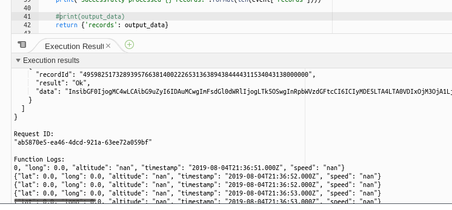

Sample output - using lat/long 0/0 without the filter for privacy reasons

### AWS Kinesis Firehose

Once our function is working, we want to make sure all incoming data from the device is automatically calling this function, runs the ETL, and stores the data to AWS S3.

We can configure our Firehose stream as such:

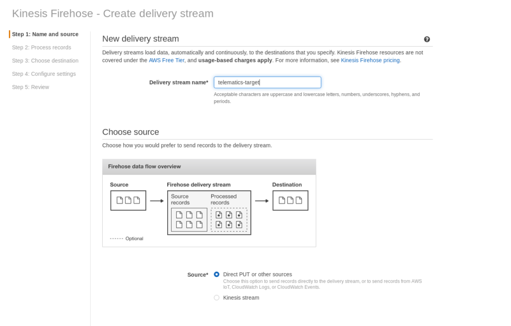

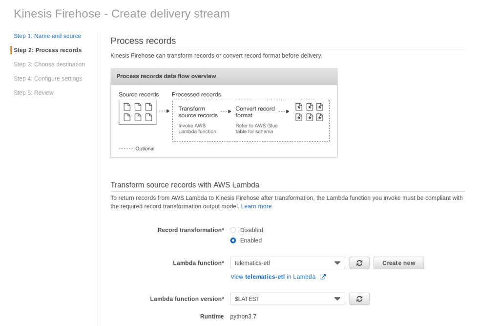

In the 2nd step, we tell the stream to use the telematics-etl Lambda function:

As well as the target as S3.

The following settings define the threshold and delay to push the data to S3; at this point, tuning can be applied to make the pipeline run quicker or more frequently.

### Connect IoT Core and Kinesis Firehose

And in order for it to be triggered automatically, all we need is a IoT Core Action that will send our queue data to Firehose:

## Step 3.5: End-to-end testing

At this point, it is advisable to test the entire pipeline end-to-end by simply starting the **greengrassd** service and checking the output along the way.

Once the service is started, we can ensure that the function is running:

On the [IoT console](https://us-east-1.console.aws.amazon.com/iot/home?region=us-east-1#/test), we can follow along all MQTT messages:

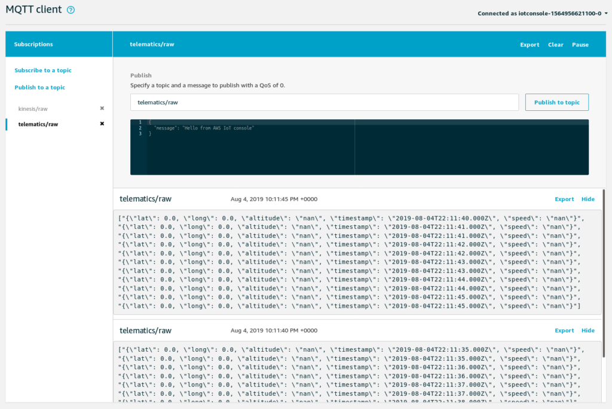

Once we see data here, they should show up in Kinesis Firehose:

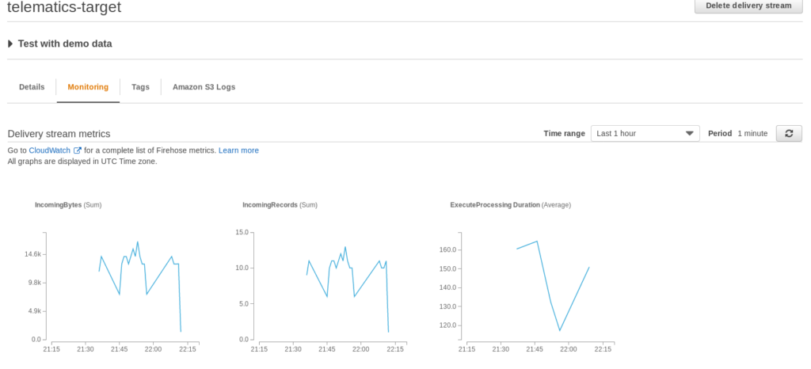

Next, check the CloudWatch logs for the telematics-etl Lambda function and finally, the data on S3. 

### A note on collecting real data

As you can imagine, collecting data can be tricky when using a Laptop - unless you happen to be a police officer, most commercial cars (and traffic laws ;) ) don't account for using a Terminal on the road.

While relying on a headless box is certainly possible (and more realistic for daily use), I do suggest running at least one set of data collection with something that has a screen so you can validate the accuracy of GPS data.

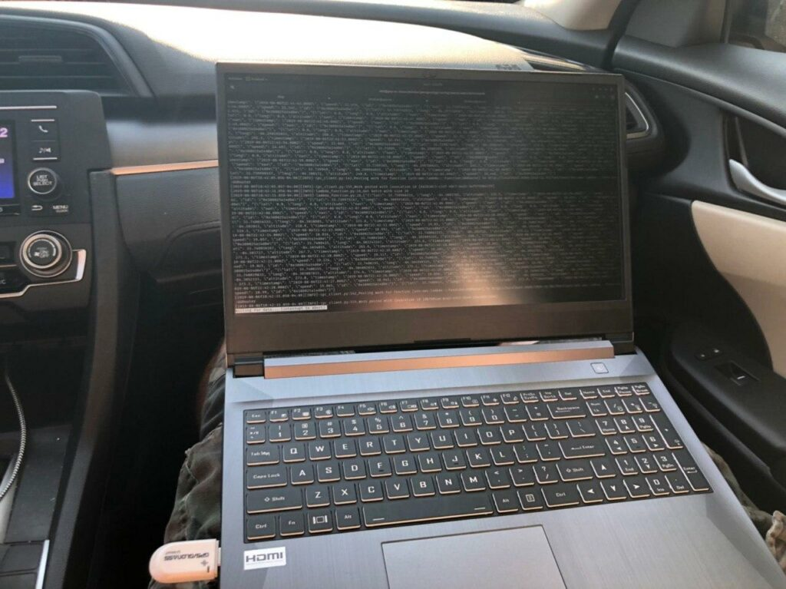

Data collection on Atlanta roads

## Step 4: Analyze & Visualize the Data

Once we collected some data, we can head over to AWS Athena to attach a SQL interface to our JSON files on S3. 
**Athena** is using the **Apache Hive** dialect, but does offer several helpers to make our lives easier. We’ll start by creating a database and mapping a table to our S3 output:


CREATE EXTERNAL TABLE IF NOT EXISTS telematics.trips (
  `id` string,
  `lat` double,
  `long` double,
  `altitude` double,
  `ts` string,
  `speed` double
)
ROW FORMAT SERDE 'org.openx.data.jsonserde.JsonSerDe'
WITH SERDEPROPERTIES (
  'serialization.format' = '1',
  'ignore.malformed.json' = 'true',
  "mapping.ts" = "timestamp"
) LOCATION 's3://$BUCKET/2019/'
TBLPROPERTIES ('has_encrypted_data'='false');


We can now query the data:

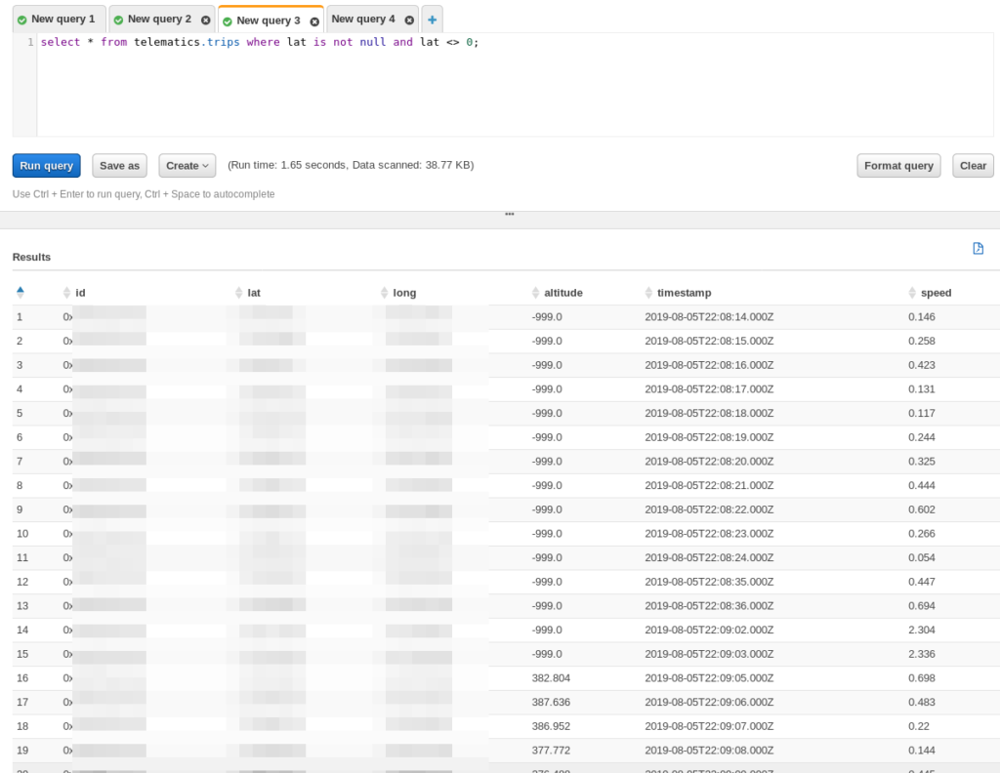

And see our trip output.

As you may have noticed, we are skipping a more complex, SQL based ETL step that would automatically group trips or at least organize the data in a meaningful way. For the sake of a simple process, we skipped this - but it certainly belongs on the "to do" list of things to improve.

### Sample Queries

> "We should be able to see where we went, when we went there, what route we took, and how fast we were going"

As indicated in our goals, we want to know some things. For instance, what was our top speed on a trip on 2019-08-05?

Simple - we multiply the speed (in m/s) with 2.237 to get it in miles per hour, select the max of that speed, and group it by the day:


SELECT MAX(speed*2.237) as speed_mph, cast(from_iso8601_timestamp(ts) as date) as dt from telematics.trips
WHERE ts is not null and trim(ts) <> ''
GROUP BY cast(from_iso8601_timestamp(ts) as date)


Which gives us 58.7 mph, which seems about right for a trip on the interstate.

Max speed on a trip

### Visualizing

Queries are nice. But what about visuals?

As highlighted in the overview, we use **QuickSight** to visualize the data. QuickSight is a simple choice for this use case, as it provides geospatial visualization out of the box and behaves similarly to Tableau and other enterprise visualization toolkits. Do keep in mind that a custom dashboard on e.g. Elastic Beanstalk with d3.js could provide the same value with a quicker data refresh rate - QuickSight Standaed requires manual refreshes, whereas QuickSight Enterprise can refresh the data once per hour automatically.

While this does defeat the purpose of "real time", it makes for a simple, basic analysis out of the box. Refreshing the data on the road yields about a 1 minute delay.

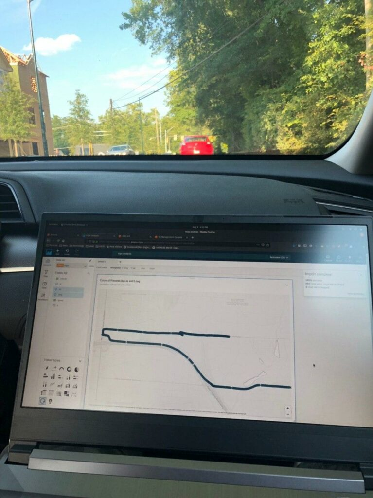

A trip visualized while on said trip

The set up is easy - sign up for QuickSight on the AWS console, add Athena as a data set, and drag-and-drop the fields you want.

Add a data set

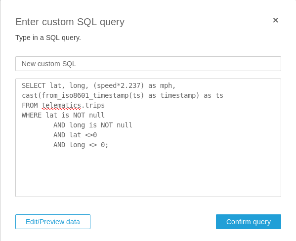

Use a custom query

When editing the data set, you can define double fields as latitude and longitude for geospatial analysis:

And by simply dragging the right fields into some analysis, we get a nifty little map, showing a trip:

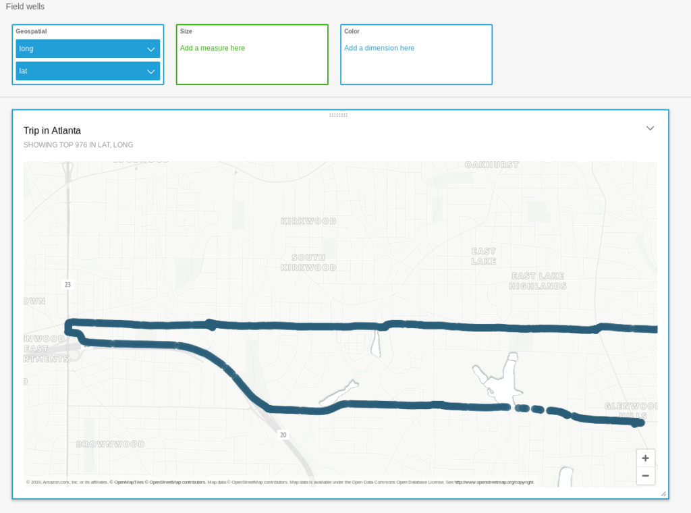

Often times, you don't even need SQL. If we want to show our average speed by the minute, we can build a chart by using the timestamp value with a custom format (HH:mm) and changing the default sum(mph) to average(mph) as such:

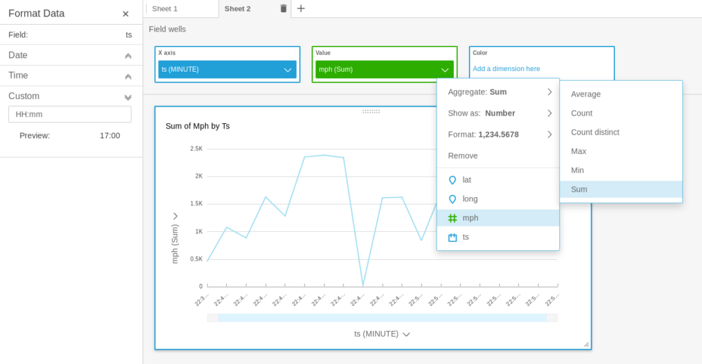

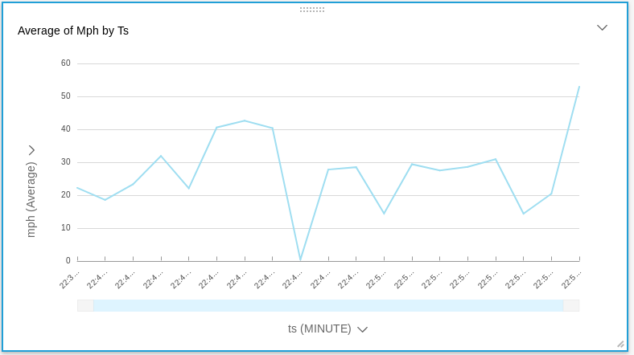

Average speed by the minute

Using more customized SQL to do fancier things is trivial as well. For instance, seeing "high speed" scenarios on the dataset can be done as such:

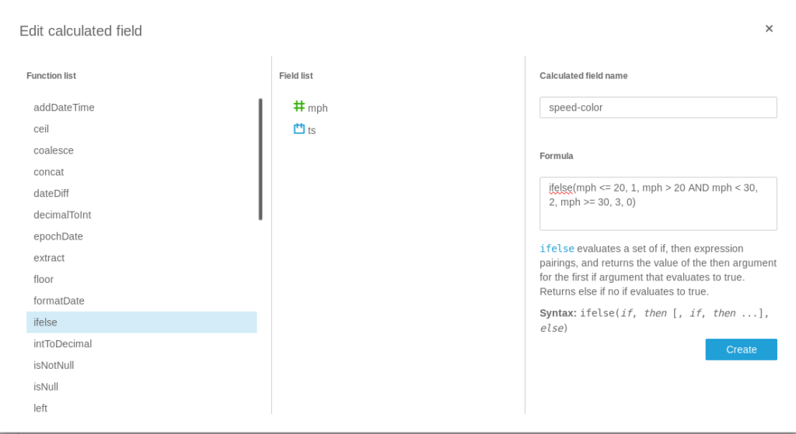

And then added to the data set:

Trip with calculated fields

And all of a sudden, you can almost see all traffic lights on that route through the East of Atlanta.

Do keep in mind that QuickSight is a fairly simple tool that does not compare to the functionality of other "big" BI tools or even a Jupyter Notebook. But, in the spirit of the article, it is easy to use and set up quickly.

## Conclusion

Compared to the "Tiny Telematics" project 2 years ago, this pipeline much simpler, runs in near real-time, can scale much easier, and requires no infrastructure setup. The whole project can be set up within a couple of hours.

Granted, we have skipped a couple of steps - for instance, a more in-depth ETL module that could prepare a much cleaner data set or a more scalable long-term storage architecture, like DynamoDB.

The focus on a "serverless" architecture enabled us to quickly spin up and use the resources we need - no time was spent on architecture management.

However, all that glitters is not gold. While we did make quick progress and have a working solution at hand (granted, driving around with a laptop maybe only qualifies for a "proof of concept" state ;) ), we gave up autonomy over a lot of components. It's not quite a "vendor lockin" - the code is easy enough to port, but would not run out of the box on another system or Cloud proviers.

**IoT Core Greengrass** handled deployment to clients, certificates, code execution, containerization, and message queues.

**Kinesis Firehose** took over the role of a fully-fledged streaming framework like Spark Streaming, Kafka, or Flink; it handled code execution, transfer, scaling, ETL resources through Lambda, and sinks into the storage stage.

**Athena** bridges the gap at little bit - by relying on the Hive dialect and an Open-Source SerDe framework, the table definitions and SQL can be easily ported to a local Hive instance.

**Lambda** can be regarded in similar terms - it's just Python with some additional libraries. Switching out those and use e.g. a Kafka queue would be trivial.

So, **conclusion** - once again, this was a completely and utterly pointless, albeit fun project. It shows how powerful even a small subset of AWS can be and how (relatively) easy it is to set up and how real-world hardware can be used in conjunction with "the Cloud" and how old ideas can be translated to a more hip - a word I prefer over "modern" - infrastructure and architecture.

_All development was done under PopOS! 19.04 on Kernel 5.0.0 with 12 Intel i7-9750H vCores @ 2.6Ghz and 16GB RAM on a 2019 System76 Gazelle Laptop_

_The full source is available on [GitHub](https://github.com/otter-in-a-suit/TinyTelematics)._
