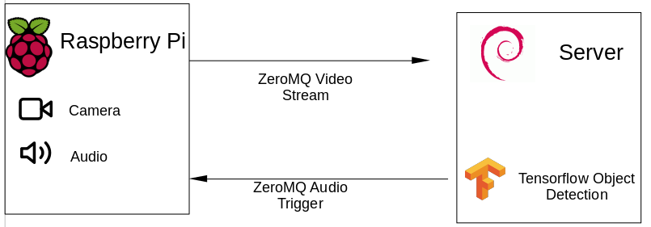
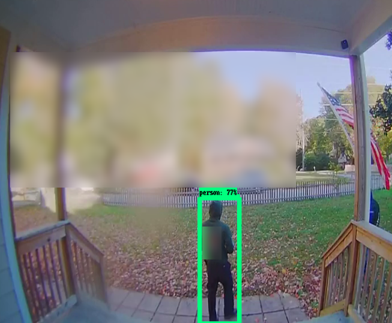
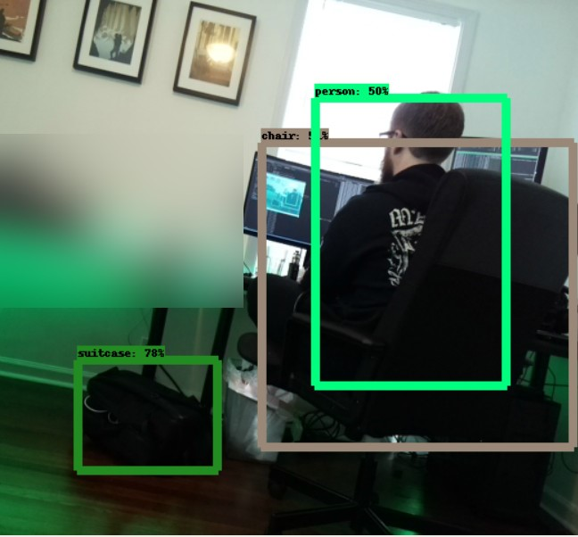
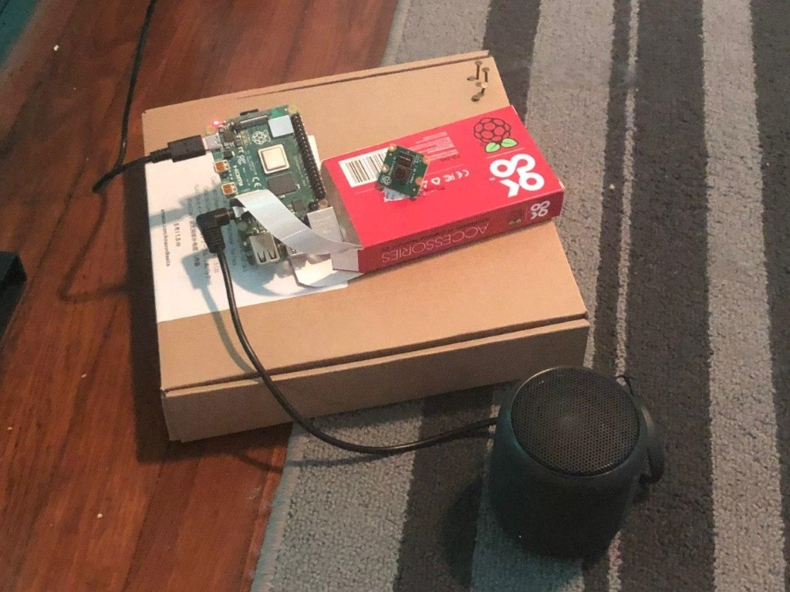

## Introduction

The amount of time my outdoor cameras are being set off by light, wind, cars, or anything other than a human is insane. Overly cautious security cameras might be a feature, but an annoying one at that.  

I needed a solution for this problem, without going completely overboard. Something simple, elegant, yet effective. 

Folks, meet what I lovingly call “**[Scarecrow-Cam](https://github.com/otter-in-a-suit/scarecrow)**”. A **Raspberry Pi** powered camera that detects people with **Tensorflow Object Detection** and greets them with exceptionally loud and harsh music (or a warning sound) the second they step onto my porch. 

Using real-time object detection with Tensorflow, a Raspberry Pi, a camera, a speaker, and Wifi, this ensures quiet evenings. Somewhat. 

## What are we doing? 

On more serious terms, using real-time video streams and machine-learning for object detection is an actual real-world use case. While most use cases are arguably incredibly creepy, I do find some value in detecting objects or people on private security cameras.  

If a network of security cameras at home would be able to detect real, potential threats – humans and squirrels – and would react accordingly (for instance, by sending an alert), this would greatly improve the usefulness of these devices, which mostly rely on either motion detection or continuous video recordings – both either incredibly error-prone or reactive at most (showing you what happened after the fact). 

## On the topic of security cameras

However - Most consumer grade video surveillance systems are awful, plain and simple. Either they require expensive hard-wiring or rely on janky infrared and motion detection that sets of every 10 minutes because a car drives past the house, are dependent on the grace and software updates of 3rd party companies, often come as a subscription model, and are generally inaccessible via an API. 

My unnamed outdoor camera setup usually gets set off by Old Glory waving in the wind, as opposed to by a person. 

## The solution

Here’s what we’re going to do: 

We’ll use a [Raspberry Pi 4](https://www.raspberrypi.org/products/raspberry-pi-4-model-b/) with the [camera module](https://www.raspberrypi.org/products/camera-module-v2/) to detect video. This can run continuously and won’t need to rely on motion sensors to set off.  

In order to detect objects, we’ll use the [Tensor Flow Object Detection API](https://github.com/tensorflow/models/tree/master/research/object_detection) by Google. This library enables us to pretty much use object detection out of the box (more on that later), without the need for manually training and tuning a model or the need for a [cloud deployment](https://chollinger.com/blog/2019/07/a-look-at-apache-hadoop-in-2019/).  

In order to talk to the camera, we’ll rely on [OpenCV](https://opencv.org/). 

Now, here’s an issue for you: My old RasPi runs a 32bit version of Raspbian. Tensorflow does not work with 32bit operating systems (granted, there might be [alternatives](https://www.balena.io/blog/balena-releases-first-fully-functional-64-bit-os-for-the-raspberry-pi-4/)). Furthermore, while the new Raspberry is a powerful little machine, it is not remotely comparable to a modern computer – especially on 3 and earlier revisions. 

In order to mitigate this, we will **stream the video** **over the network** on the Pi to a more powerful machine – a [home server](https://chollinger.com/blog/2019/04/building-a-home-server/), NAS, computer, an old laptop – and process the information there.    

This is a concept called **edge computing**. With this concept, we essentially use less powerful, smaller machines to achieve low-latency communication by doing the heavy lifting on a machine physically close to the edge node – in this case, running the Tensorflow Object detection. By doing so, we avoid roundtrips over the internet, as well as having to pay for Cloud compute on e.g., AWS or GCP.                  

In order to achieve this, we’ll use [VidGear](https://github.com/abhiTronix/vidgear), specifically it’s [NetGear API](https://github.com/abhiTronix/vidgear/wiki/NetGear#netgear-api), an API designed for streaming video over the network, using ZeroMQ. Just be wary of the a [bug,](https://github.com/abhiTronix/vidgear/issues/45) requiring you to use the development branch. 

Once we’ve detected that there’s a human in the stream, we can send a signal to the Raspberry, using ZeroMQ, to play some really loud, annoying **audio** to scare people off.  

_(As some folks on [reddit](https://old.reddit.com/r/raspberry_pi/comments/ea7b1s/tensorflow_on_edge_or_building_a_smart_security/) have called out - there are alternatives to this, namely [esp32cam](https://old.reddit.com/r/raspberry_pi/comments/ea7b1s/tensorflow_on_edge_or_building_a_smart_security/faojfa8/) and [TFLite](https://old.reddit.com/r/raspberry_pi/comments/ea7b1s/tensorflow_on_edge_or_building_a_smart_security/faoicjh/))_

## Setting up a development environment

While arguably not the most fun part, first, we need a development environment. I am using Jupyter Notebooks with Python 3.7 on Linux for this. 

We are going to base the work on the following tutorial: [https://github.com/tensorflow/models/blob/master/research/object\_detection/object\_detection\_tutorial.ipynb](https://github.com/tensorflow/models/blob/master/research/object_detection/object_detection_tutorial.ipynb) 

Side-note: As I’m using the Tensorflow 2.0 beta, I had to hack the API for tf.gfile to tf.io.gfile in  ~/.local/lib/python3.7/site-packages/object\_detection/utils/label\_map\_util.py. 

Clone the notebook, follow the instructions to set up a virtual environment, and install all dependencies. 

## Testing** **Tensorflow** **locally

Once that is done, we do probably want to loop a local video with test data without having to actually connect a live camera just yet. 

All we really need to do here is to change the “while True” loop to bind to the OpenCV session. VideoCapture conveniently accepts either an integer (for a webcam) or a path to a video file. 



(Some parts of the image were manually blurred for privacy – also, those are invited visitors 😊 )  

As soon as you run the notebook, you should see the overlay of the detection model. Wonderful, the model works, and we can fine tune later.  

## Network, network!

As elaborated on before, we won’t rely on our Rasberry Pi to run the detection – so we’ll set up some network communication. I was originally thinking of writing this myself (I’m currently learning go, so that would have been a nice use case), but why bother if there’s a library?\[1\] 

What you’ll need: 

- A [Raspberry Pi](https://www.raspberrypi.org/products/)  
- A R[aspberry power supply](https://www.raspberrypi.org/products/type-c-power-supply/) 
- An SD card 
- The [camera module v2](https://www.raspberrypi.org/products/camera-module-v2/) 
- The [Raspbian Buster Lite image](https://www.raspberrypi.org/downloads/raspbian/) 

Here’s a sample writeup on how I’ve set up my Pi: 



Next, we’ll have to take the development branch of VidGear, as a certain bugfix is not on the master at the time of writing. 



Now, we can test streaming video locally: 



You should see the video playing back. You will notice some use of the multiprocessing library – we use this for ensuring the while loop gets terminated after a defined timeout, for development purposes.  

_\[1\] Jokes aside: Richard Hipp, the creator of SQLite, gives a lot of good reasons as to why that might be a bad idea in_ [_his interview_](https://changelog.com/podcast/201) _on The Changelog Podcast – but for the sake of simplicity, we’ll stick to a library_ 

## Putting 2 and 2 together

Next, let’s actually deploy this onto 2 separate machines – as long as the server that will execute Tensorflow runs a 64-bit flavor of Linux (as in, a Linux kernel), we should be good to go. At home, I have a local gitlab and jenkins instance that does this for me. But realistically, any deployment option works – scp can be your friend. 

We’ll need to make some small adjustments to the code by specifying IP address and port: 


client = NetGear(address = '192.168.1.xxx, port = '5454', protocol = 'tcp', pattern = 0, receive\_mode = True, logging = True) 
server = NetGear(address='192.168.1.xxx, port='5454', protocol='tcp',pattern=0, receive\_mode=False, logging=True)


Now, we can start the sender.py on the server, receiver.py on the client, and there we go: Video over the network. Neat! 

## Integrating** **Tensorflow

The integration of tensorflow is trivial at this point: As we’ve already established how to do the following: 

- Using OpenCV to loop a local video 
- Using Tensorflow Object Detection to run the actual model on a local video 
- Streaming video from one machine to the next 

The last step can simply be achieved by importing our tensorflow\_detector module, casting the received image to a numpy array (as this is what the API expects), and calling “run\_inference\_for\_single\_image(2)”. Easy peasy! 

## Talking to a camera

Now, we can adjust our server code to actually use Tensorflow to detect images coming in from a different machine. But we don’t want canned images – we need a live stream. 

Fortunately, this is pretty straightforward, as we’ve already enabled the camera module during the setup of the Pi: Connect the ribbon cable of the camera to the Pi, boot it up, and run: 


raspistill -o ~/image.jpg 


This should take a picture. 

My highly professional setup

In order to do the same with Python, OpenCV’s API is equally straightforward: By changing the source from a video file to the ID of the camera – 0, as we only have one – on the pi’s end, OpenCV will pick up the camera stream and send it to our server. 

Once we run this, we should see something like this: 

## Triggering audio on the camera

Now, we are able to stream video from the Raspberry to the server and detect a person. The missing link now is to play audio, using the [playsound](https://github.com/TaylorSMarks/playsound) library, with GStreamer under the hood. Other alternatives are using an **os** **subprocess** call or **pygame** – a configuration option can be set to change this behavior. 

(You can set the audio volume on the Pi by using \`alsamixer\`). 

In order to do that, we are going to employ **ZMQ** again by starting a listener thread on the Pi that waits on inputs from the server, setting predefined enum values. Once the client receives those, it triggers an audio signal and plays a sound. 

All of this is blocking the respective threads – meaning, as long as the audio plays, the listener won’t care about new messages and the server won’t be able to send a new message.  

In order to avoid blasting the same message, we can employ a simple sempahore structure. 





## Testing everything

Now that everything is working, here comes the fun part: Setting it up. 

First, let’s position the camera somewhere: 

And start both server and client end and see what happens when we walk into the room! 





As you can see, it takes a second to detect me – partly because of the camera angle, the model we chose, and some network latency. In a real life scenario where a person needs to walk up the door, this is less of an issue.

> The message saying "Warning, you are..." is coming from that little speaker!

## Next Steps

While this already works fairly well – it streams video, detects people, and sends a signal to send audio – there is surely work to be done here. 

However, there are several things we've ignored for the purpose of this project: The model we're using is simply a [pre-trained](https://github.com/tensorflow/models/blob/master/research/object_detection/g3doc/detection_model_zoo.md) one that has neither been tuned for our specific use case, nor does it necessarily offer the best balance for the machines that we're using.

Furthermore, some things in the code could use some improvements - the network latency is decent, but could use some work, the audio gets triggered very quickly in succession, and with our current ZeroMQ pattern, we can only support one client.

While using a cardboard box is almost the definition of perfection, a custom, 3D-printed Raspberry case and slightly better cooling would be probably a good idea.

## Conclusion

In any case - I am happy with this little project, as it illustrates how relatively simple it can be to build your own security camera, connect it to the network, run object detection, and trigger an external factor - in this case audio, but that could easily be a phone notification or else - without using any Public Cloud offering, to save on latency on residential internet as well as cost.

_All development was done under PopOS! 19.04 on Kernel 5.5.1 with 12 Intel i7-9750H vCores @ 2.6Ghz and 16GB RAM on a 2019 System76 Gazelle Laptop_, _as well as a Raspberry Pi 4 4GB on Raspian 10._

_The full source is available on [GitHub](https://github.com/otter-in-a-suit/scarecrow)._
