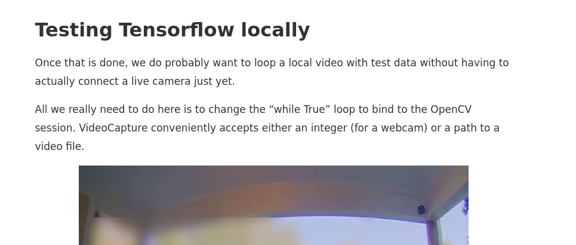
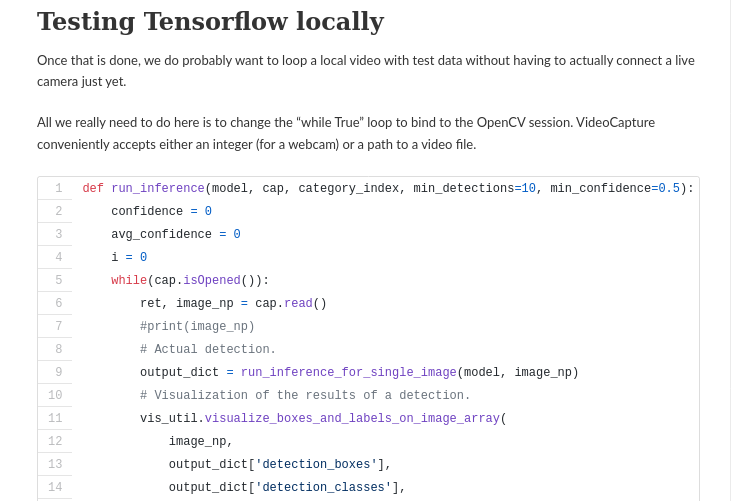
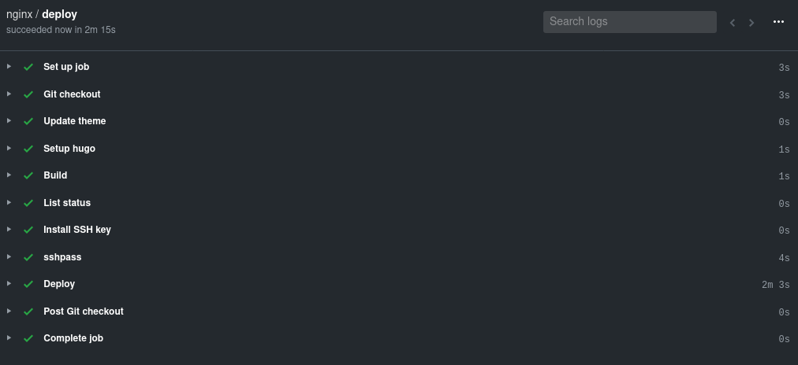

## Introduction 
For the past 4 or so years, I've been using WordPress to push content to this blog. I originally chose it because my knowledge of anything to do with Web and Mobile Development is spotty at best - and because "back in the day"™, it was the only CMS I was somewhat familiar with.

Maybe you've seen the sluggish mess that the blog is - and today, we'll change it.

## Pain Points
The issues I've had with WordPress were numerous, but to name a few:
- You have to be online
- A complicated setup to keep PHP, MariaDB, nginx and other components working
- Several security issues in the past
- A horrible WYSIWYG editor, without any markdown support, save for external plugins
- No `vi` bindings, such as in `VS Code`, or, well, `vim` - everything is mouse-driven
- The entire thing is slow - navigating, updating, preview
- Constant bot-spam in the comments
- No version control
- No decent template model
- No external contributors
- No native syntax highlighting; Plugins have a tendency to mess things up
- 2.5MB transfer and 47 requests / network activity *per page load*
- Up to 40s (!) loading times on slow connections

While I'm sure somebody who is super familiar with WordPress can figure some of those out, but one thing that comes to mind is [this horrifying contraption](https://aws.amazon.com/blogs/architecture/wordpress-best-practices-on-aws/) for running Wordpress.

> For comparison: My actual website, which is plain `HTML` and `CSS`, loads 32KB (most of which is the little Tux `favicon`) and hence in under 0.3s on a similarly horrible connection.


## Workflow 
My **workflow**, however, was the **real** pain point (I accept judgment for this):

1. Write the content locally in Sublime or vim, ignoring formatting, so I don't have to deal with network issues and can work offline
2. Copy-paste the code to WordPress, waiting for it to mess up
3. Manually add the code with an external SyntaxHighlighter plugin
4. Edit the generated HTML to fix any messed up code formatting
5. Cry and drink
6. Repeat this every 3 months

In other words, its worse than writing a Confluence page on dial up.

Accepting feedback and contributions is also difficult - while I have added feedback in the past, it requires me to do it. With a more standardized CI/CD process, it would be trivial to simply accept merge requests. 

But since the only person to blame here is me, I now finally managed to fix it.

## The Idea
> Using a static side generator is a really old idea and I don't claim any intellectual points for it. However, I am documenting this process for the sake of documenting it.

The idea here is to have a workflow that looks like this:
1. Write posts in markdown. Add code in pre-defined blocks/shortcodes.
2. Store images locally
3. Push to Git (GitHub, GitLab)
4. Deploy to the web server using a CI/CD flow

## Hugo
`Hugo` is a simple static-site generator written in `golang`. After thinking about `Jekyll` and the joys of Ruby, I've decided to go with the simpler alternative, as it only requires one binary, has a relatively simply syntax, a decent suite of tools and plugins, nice, open source / MIT licensed templates and has been in my bookmarks since I saw it on HackerNews ages ago. There are other alternatives available, but after playing around with `Hugo` for a bit, it seemed exactly what I want.

### Install Hugo
We just grab the latest binary for a 64-bit Linux from GitHub, unpack it, and store it somewhere on the `$PATH`.

wget https://github.com/gohugoio/hugo/releases/download/v0.70.0/hugo_0.70.0_Linux-64bit.tar.gz
tar xvf hugo_0.70.0_Linux-64bit.tar.gz


We can then set up a page:


hugo new site chollinger-blog



After some small edits to the `config.toml`, we should be good to go and only need content.


baseURL = "https://chollinger.com/blog"
languageCode = "en-us"
title = "Christian Hollinger"
theme = "ananke"


### Exporting all old posts
I want to export all old blog posts to Markdown. There's a great little [tool](https://github.com/lonekorean/wordpress-export-to-markdown) by `lonekorean` on GitHub.

All we need is an export of WordPress and run:

```
git clone https://github.com/lonekorean/wordpress-export-to-markdown
cd wordpress-export-to-markdown
npm install
node index.js
```

After that, we can copy the generated files to the posts directory.

> There are other tools available [here](https://gohugo.io/tools/migrations/), but since I've already customized WordPress quite a bit, the above export was a possible route. Your mileage may wary.

### Testing

Start a dev server that automatically refreshes once we save a file:

hugo server -D



Pretty? Well..


### Themes
We also need a real theme for the page.

My personal decision criteria for a theme were the following:
- No external dependencies to CDNs, googleapis, Google Analytics, trackers...
- Simplistic interface, without omitting information
- Fast load times even on slow connections

I chose [hugo-ink](https://github.com/knadh/hugo-ink) by `knadh`, but customized it quite heavily to match some of my requirements.

Adjustments can be easily made using fairly standard HTML (w/ Hugo's injections) and CSS, which I found easy to figure out, despite being anything but a Web Dev. :)

The **changes** made to that theme were the following:
- Removed all references to Google's font-CDN
- Removed Analytics code, even if it was controlled by a variable
- Modified the CSS to
  - Order all tags inline, as opposed to as a list
  - Change the background color for Syntax Highlighting, otherwise we're looking at grey code on a grey background
  - Added some classes for a Back button
- Added a Back button to all posts
- Added a TOC, controlled by a variable, to all posts
- Added a word count, tags, and an approximate read time to the overview
- Added very serious, random messages at the end of the posts

Most of it was simple HTML and CSS updates, like this update for the Back button:

.tag-li {
    display:inline !important;
}

.back {
    padding-top: 1em;
    font-size: 1em;
}


The last part with the random messages was interesting, as `Hugo` / the underlying `go` Syntax allows you to pipe commands:

<div class="back">
	{{ if isset .Site.Params "footers" }}
		{{ if ne .Type "page" }}
			Next time, we'll talk about <i>"{{ range .Site.Params.footers | shuffle | first 1 }}{{ . }}"</i>{{ end }}
		{{ end }}
	{{ end }}
</div>


And I am reasonably happy with the result:


Feel free to check out the theme's repository here: [https://github.com/otter-in-a-suit/hugo-ink](Github)

### Adjusting exported blog posts
Due to my rather interesting `WordPress` configuration, the exported posts from above need some help.

The issues I've found where the following:
- GitHub Gits are not rendered
- Internal Syntax Formatting caused everything to be escaped with `\`, breaking code
- Headlines are missing
- Tags are missing
- Descriptions are missing

#### Gists
Gists get inserted as such:


And look like that:


Whereas we are expecting:


We can fix that by replacing


<script src="https://gist.github.com/otter-in-a-suit/8dcc79ab16daf5fcdda3df1a4ccc183a.js"></script>


with





But, of course, doing that by hand would be tedious, so we can script that:


grep "gist.github.com" *.md | while read -r line ; do
    guser=$(echo "${line}" | cut -d'/' -f4)
    gist=$(echo "${line}" | cut -d'/' -f5 | sed -E 's/(\.js).+//g')
    echo "$gist"
    repl="{{/* gist "${guser}" "${gist}" */>}}"
    # Get line number
    ln=$(grep -n "$line" *.md | cut -d : -f 1)
    # Replace
    echo "Replace line $ln with ${repl}"
    sed -Ei "$ln s#.*#${repl}#g" *.md
done


### Shortcuts
I've also added a `Visual Studio Code` shortcut in `keybindings.json` to insert Hugo's Syntax Highlighter blocks:



[
    {
        "key": "ctrl+1",
        "command": "editor.action.insertSnippet",
        "when": "editorTextFocus",
        "args": {
            "snippet": "{< highlight bash \"linenos=table\" >}"
        }
    },
    {
        "key": "ctrl+2",
        "command": "editor.action.insertSnippet",
        "when": "editorTextFocus",
        "args": {
            "snippet": "{< / highlight >}"
        }
    }
]

### Permalinks
In order to avoid breaking links, and hence any bit of SEO we might have, we need to make sure that either all posts follow the same naming schema - they do in my case - or add a setting in `config.toml`:


[permalinks]
  posts = "/:year/:month/:title"


In order to ensure this is indeed a 100% match, I wrote this horrible little `go` script to compare both the local (after `hugo` build) and remote `RSS` feeds:

package main

import (
	"os"
	"fmt"

	"github.com/mmcdole/gofeed"
)

func mapToUrl(feed *gofeed.Feed) map[string]string {
	output := map[string]string{}
	for _, post := range feed.Items {
		output[post.Link] = post.Title
	}
	return output
}

func readFeed(path string) *gofeed.Feed {
	fp := gofeed.NewParser()
	//remtoteFeed, _ := fpR.ParseURL("https://chollinger.com/blog/feed")
	file, _ := os.Open(path)
	defer file.Close()
	feed, _ := fp.Parse(file)
	return feed
}

func compareUrls(local, remote map[string]string) bool {
	allFound := true
	for k, _ := range remote {
		fmt.Println(k)
		if title, ok := remote[k]; ok {
			fmt.Printf("Found %s\n", title)
		} else {
			fmt.Printf("Could not find %s locally, url: %s\n", title, k)
			allFound = false
		}
	}
	return allFound
}

func main() {
	// Remote
	remoteFeed := readFeed("./wordpress.xml")
	remote := mapToUrl(remoteFeed)

	// Local
	localFeed := readFeed("../public/index.xml")
	local := mapToUrl(localFeed)

	// Compare
	fmt.Println(compareUrls(local, remote))
}


Which returns `true`.

There were more adjustments that needed to be done - like re-adding videos - but for the most part, everything was working fine. I will spare you the tedious details.

## Deployment
For the deployment, the goal is to deploy the static HTML to the existing webserver over at [chollinger.com](https://chollinger.com), which runs `nginx` and `docker` containers. Externally hosted sites, like `GitHub Pages`, are an option, but I would like to keep as much "in house" as possible.

We have 2 convenient (and free for Open Source) options for CI/build servers: `travis` and `GitHub Actions`. In this case, we'll be using `GitHub Actions`, as it avoids having yet another external dependency. 

Our flow will look like this:
1. Checkout the master branch
2. Update the theme via its submodule
3. Download hugo
4. Build the static HTML/CSS/JS
5. Deploy via SCP to a specific `chroot` jail
6. Do any other action, like updating a `docker` image, on the server (although nothing stops you from doing this in the pipeline)

### `workflow.yml`
We'll create a `.github/workflows/workflow.yml` file as such:


name: nginx
on:
  # Trigger the workflow on push or pull request,
  # but only for the master branch
  push:
    branches:
      - master
  pull_request:
    branches:
      - master
jobs:
  deploy:
    runs-on: ubuntu-18.04
    steps:
      - name: Git checkout
        uses: actions/checkout@v2
        
      - name: Update theme
        # Update themes
        run: git submodule update --init --recursive

      - name: Setup hugo
        uses: peaceiris/actions-hugo@v2
        with:
          hugo-version: "0.70.0"

      - name: Build
        run: hugo --minify -d blog
                
      - name: List status
        working-directory: ${{ github.workspace }}
        run: ls -larth blog
        continue-on-error: true
        
      - name: Install SSH key
        uses: shimataro/ssh-key-action@v2
        with:
          key: ${{ secrets.KEY }}
          name: id_rsa # optional
          known_hosts: ${{ secrets.KNOWN_HOSTS }}
        
      - name: sshpass
        run: sudo apt-get install -y sshpass 
        
      - name: Deploy
        env:
          PASSWORD: ${{ secrets.PASSWORD }}
          USERNAME: ${{ secrets.USERNAME }}
          HOST: ${{ secrets.HOST }}
          TARGET_DIR: ${{ secrets.TARGET_DIR }}
        run: sshpass -p "$PASSWORD" scp -r blog/ "$USERNAME"@"$HOST":"$TARGET_DIR"


> You can use some of the pre-configured SCP Actions instead of using `bash`. I had issues with those and since all Actions I've found either don't support key passphrases or don't supply proper debug logs, I gave up and used a `bash` action for deployment. 

> If you have any idea what "Exit code 1", despite a successful connection on the server (as per `syslosg` anf `auth.log`), means, do let me know!



### `rssh`
We'll deploy via SCP, but only with a specific user that has restricted permissions.

Add the user:

useradd -m -d /home/github github
passwd github
su github


Make the user's home owned by `root`:

sudo chown -R root:github /home/github
sudo chown github:github /home/github/.ssh
# + Any folders the deployment needs


Next, let's compile `rssh`, an `scp`/`sftp` only shell.

wget http://prdownloads.sourceforge.net/rssh/rssh-2.3.4.tar.gz?download
tar -xvf rssh-2.3.4.tar.gz


And build:

# Build from source
./configure
make
sudo make install


We need to allow the user access, so we need to edit `/usr/local/etc/rssh.conf` as such:


user = "github:022:00001:/path/to/chroot"


This translates to:
- `username`: The username of the user for whom the entry provides options
- `umask`: The umask for this user, in octal, just as it would be specified to the shell
- `access bits`: Five binary digits, which indicate whether the user is allowed to use rsync, rdist, cvs, sftp, and scp, in that order. One means the command is allowed, zero means it is not.
- `path`: The directory to which this user should be chrooted (this is not a command, it is a directory name). See chroot_path above for complete details.

Please see the [man page](https://linux.die.net/man/5/rssh.conf).

Especially setting up a `chroot` is a bit more involved than setting a single config file, so be advised to read through the appropriate `man` pages and `CHROOT` in the `rssh` source directory.

Make sure the users exists in `AllowUsers` under `/etc/ssh/sshd_config`

Edit the SSH config:

vim /etc/ssh/sshd_config


> Ensure that the user is in the `AllowUser` directive. At this point, you might want to think about a separate `rssh` and `ssh` group.

And restart the SSH daemon:

service sshd restart


Finally, change the user's shell to `/bin/rssh`:

usermod -s /usr/bin/rssh github


Of course, at this point, you will also need to generate your `ssh` keys (use `PEM` for GitHub Actions, as I'm pretty sure the `Ubuntu` image used by their `bash` action uses a weird `openssh` version), set up whatever flow you need to actually get the HTML served (e.g., `docker`) but I will skip over that part in the interest of time.

## The result
Well, if you're here reading it, judge for yourself! While it is certainly not as flashy as the old WordPress template, it does offer considerable improvements in performance: This blog post should only transfer about ~500KB (the majority of which are inline images), load some minimal Javascript and CSS, and be on your screen in an instant.

## Conclusion
I for one am pretty happy to have made this change. Granted, I don't get a ton of traffic here (but since I don't run Analytics, I don't really know), but for my own sanity, this new workflow is clean, easy, and collaborative. 

But despite few views, **blogging is fun**! Every time I write something, my goal is always to learn something - it doesn't matter if is something complex (like understanding some ML/Statistics theory) or something simple like today, where I had to get back into some minimal web development and "DevOps" (even though I thoroughly hate the term).

Having this new setup allows me to blog more and spend more time on writing both code and posts, and less on headaches through WordPress. Shorter loading times should cause less frustrations for everyone involved and not being locked-in within WordPress (but rather, having version-controlled markdown files) allows for a more open environment.

I can only implore you to try it yourself - blogging, that is - and if you want to use GitHub + Hugo + Nginx (+ Docker), maybe this helps.