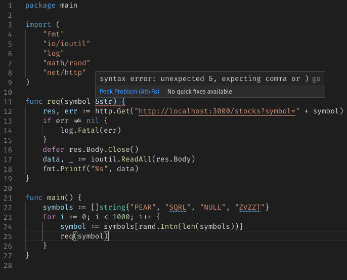
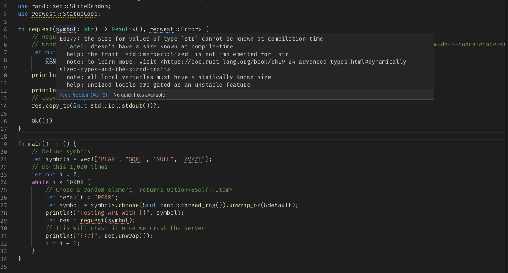

## Throw Away Code
[Michal Vaner](https://github.com/vorner) recently [published an article](https://vorner.github.io/2020/09/20/throw-away-code.html) on using `Rust`, rather than `Python` or `Perl`, for throw away code and prototyping. 

Michal argues that for common throw away scripts, such as testing odd API behavior, testing a hypothesis in a paper, checking for broken unicode in files (things that one should hack together over a lunch break), can be done faster in `Rust`. 

After reading this article on a gloomy Saturday morning, I found myself quite baffled at first. `Rust` would be probably the *last* language I would consider for such use cases. While `Rust` is a fantastic language for what it aims to do, its tendency to be overly correct, the steep learning curve, the memory management (with the help of the friendly compiler, of course), the ownership concept, the complex toolchain, and where I see the language's overall place in a developer's toolbox (as a safe and fast replacement for `C` and `C++` - pardon my ignorance) - all don't strike me as compelling points to use `Rust` for scripting.

At the same time, I do think the author makes some very compelling points. Yes, these use cases do not warrant thinking about every little detail to write production-ready code - and the `Rust` compiler can certainly be a help to find a decent middle ground:

> Allow yourself not to care about warnings. Does clippy complain about `unwrap_or` being slower than `unwrap_or_with`? Let it complain. I still keep the warnings on. In part because I’m lazy to turn them off, but if the thing doesn’t work in the end, warnings are the first thing to check if there’s something fishy. Just mentally tick them off as harmless and move on, don’t spend time refactoring and rewriting the code to silence them.
> https://vorner.github.io/2020/09/20/throw-away-code.html

`Python` certainly never does that - which is great for fast prototyping and writing things that will probably never see a deployment pipeline from the inside. 

But you know what? `go` does that too. And is a lot simpler at that. A point of view. And why it doesn't matter.

**Note**: Michal and I exchanged a couple of emails and I've updated some things below.

## Implementing an Example, three Times
Let's take a look at some of the author's specific points in favor of `Rust` over other languages and actually pick one of his examples and implement it real quick: *"Single-use debugging tools („I need to throw 10k of these weird requests at the server to see if it triggers the bug. It didn’t? Ok, let’s try something else…“)"*.

For that, we follow the advice in the original article: Make it as simple and stupid as possible.

### An API, broken by Design
Let's pretend we have an API endpoint that gives us super-accurate stock data, but for some reason, it doesn't respond well to requests about anything other than a handful of very real stocks. It's almost like it crashes randomly!

Here it is for reference:

package main

import (
	"encoding/json"
	"log"
	"math/rand"
	"net/http"
)

type Stock struct {
	Symbol string  `json:"Symbol"`
	Name   string  `json:"Name"`
	Price  float64 `json:"Price"`
}

func chaosMonkey() {
	max := 1000
	min := 0
	randomNo := rand.Intn(max-min) + min
	if randomNo == 999 {
		log.Fatalf("Oops...")
	}
}

func getPrice(symbol string) (*Stock, int) {
	prices := map[string]*Stock{
		"PEAR":  &Stock{Symbol: "PEAR", Name: "Pear Computers Inc.", Price: 1776.74},
		"SQRL":  &Stock{Symbol: "SQRL", Name: "Squirrel Nut Import/Export LLP", Price: 5.4},
		"NULL":  &Stock{Symbol: "NULL", Name: "Remove this before go-live (Jerry)", Price: .9},
		"ZVZZT": &Stock{Symbol: "ZVZZT", Name: "SuperMontage TEST", Price: 10.0},
	}
	if symbol == "" {
		return nil, 400
	}
	if val, ok := prices[symbol]; ok {
		return val, 200
	}
	return nil, 404
}

func handleStockRequest(w http.ResponseWriter, r *http.Request) {
	w.Header().Set("Content-Type", "application/json")
	symbols, ok := r.URL.Query()["symbol"]
	if !ok || len(symbols) <= 0 {
		w.WriteHeader(500)
		return
	}
	// Crash with a 1 in 1000 chance:
	chaosMonkey()

	symbol := symbols[0]
	log.Printf("Symbol requested %s", string(symbol))

	stock, code := getPrice(symbol)
	w.WriteHeader(code)
	json.NewEncoder(w).Encode(stock)
}

func main() {
	http.HandleFunc("/stocks", handleStockRequest)
	http.ListenAndServe(":3000", nil)
}



And here's what it does:

curl -i "http://localhost:3000/stocks?symbol=PEAR"
HTTP/1.1 200 OK

{"Symbol":"PEAR","Name":"Pear Computers Inc.","Price":1776.74}


And it it's unhappy (or doesn't find a symbol), it'll return an error code.

curl -i "http://localhost:3000/stocks?symbol=APPL"
HTTP/1.1 404 Not Found


And, naturally, it will crash with a 1:1000 chance. What a mystery!

### Rust
Now, let's follow the authors viewpoint and write the test case in `Rust` real quick. I should probably note at this point that my `Rust` knowledge is not exactly production ready. One might say, I'm a little *rusty* at it (I'm not sorry for that).

I'm using `VS Code` on Linux with the `Rust` and `rust-analyzer` plugin, the latter being a recommendation from the article.

First, we need our dependencies ([`reqwest`](https://github.com/seanmonstar/reqwestt)) installed, using `Rust`'s package manager, `cargo`, by using a `Cargo.toml` file:


[package]
name = "api-test"
version = "0.0.1"
authors = ["Christian Hollinger"]

[dependencies]
reqwest = { version = "0.10", features = ["json"] }
tokio = { version = "0.2", features = ["full"] }


While building, my laptop sounds like a jet in takeoff and something tells me, that a simple `go get` or `pip3 install` might have been simpler here. `cargo` required a lot more setup and pre-defined structure.

Next, let's be naive and take the code from `GitHub`:

use std::collections::HashMap;

#[tokio::main]
async fn main() -> Result<(), Box<dyn std::error::Error>> {
    let resp = reqwest::get("https://httpbin.org/ip")
        .await?
        .json::<HashMap<String, String>>()
        .await?;
    println!("{:#?}", resp);
    Ok(())
}


Hm, okay:

christian @ pop-os ➜  rust git:(master) ✗  cargo build
   Compiling api-test v0.0.1 ([...]/rust)
error[E0670]: `async fn` is not permitted in the 2015 edition
 --> src/main.rs:4:1
  |
4 | async fn main() -> Result<(), Box<dyn std::error::Error>> {
  | ^^^^^
  |
  = note: to use `async fn`, switch to Rust 2018
  = help: set `edition = "2018"` in `Cargo.toml`
  = note: for more on editions, read https://doc.rust-lang.org/edition-guide
...


Okay, I accept that - the `Rust` compiler is very helpful in explaining what exactly is wrong here, how to fix it, and generously links an entire *book* to understand the version differences. Python 2->3 migrations certainly had less helpful tools available.

Let's implement our test case real quick. All we want to know is at which point the thing crashes on us.


use rand::seq::SliceRandom;
use reqwest::StatusCode;

fn request(symbol: &str) -> Result<(), reqwest::Error> {
  // Request via GET
  // Wonderful StackOverflow thread about a seemingly simple question: https://stackoverflow.com/questions/30154541/how-do-i-concatenate-strings
  let mut res = reqwest::blocking::get(&["http://localhost:3000/stocks?symbol=", symbol].concat())?;

  println!("Status: {}", res.status());

  println!("Headers:\n{:#?}", res.headers());
  // copy the response body directly to stdout
  res.copy_to(&mut std::io::stdout())?;

  Ok(())
}

fn main() -> (){
    // Define symbols
    let symbols = vec!["PEAR", "SQRL", "NULL", "ZVZZT"];
    // Do this 1,000 times
    let mut i = 0;
    while i < 10000 {
      // Chose a random element, returns Option<&Self::Item>
      let default = "PEAR";
      let symbol = symbols.choose(&mut rand::thread_rng()).unwrap_or(&default);
      println!("Testing API with {}", symbol);
      let res = request(symbol);
      // this will crash it once we crash the server 
      println!("{:?}", res.unwrap());
      i = i + 1;
    }
}


And build:

cargo build
   Compiling libc v0.2.77
   Compiling cfg-if v0.1.10
   ...
Finished dev [unoptimized + debuginfo] target(s) in 28.78s


28.78 seconds. Okay, that's not fair. Let's build it again with everything already cached:

rust git:(master) ✗  cargo build
   Compiling api-test v0.0.1 

Finished dev [unoptimized + debuginfo] target(s) in 1.98s


About 2 seconds to build is not bad, but naturally, this is a tiny program on a decently fast computer. For something that will change every couple of minutes and might be done on a remote box, some part of me prefers to just... run it. 


cargo run
Testing API with NULL
Status?: 200 OK
Headers:
{
    "content-type": "application/json",
    "date": "Sat, 26 Sep 2020 16:11:37 GMT",
    "content-length": "74",
}
{"Symbol":"NULL","Name":"Remove this before go-live (Jerry)","Price":0.9}
()
Testing API with SQRL
thread 'main' panicked at 'called `Result::unwrap()` on an `Err` value: reqwest::Error { kind: Request, url: "http://localhost:3000/stocks?symbol=SQRL", source: hyper::Error(IncompleteMessage) }', src/main.rs:30:24


But yes, it does what I wanted it to - try the API up to 1,000 times and if it crashes, we can iterate over the program and try different approaches and debug the server code. Were this an actual API endpoint, we'd want a more deterministic approach, of course.

So, I've tried to use as few `Rust` specific tropes as possible, but I needed to deal with:
- Set up a fairly complex code structure on the file system to get `cargo` to work
- Install external packages in my `Cargo.toml` (`reqwest`, `rand`), due to the lack of out-of-the-box support 
- Work with `Options`
- Differentiate `&str`, `str`, and `String` types
- Differentiate mutable and immutable variables 
- Figure out memory ownership
- Figure out the `?` operator for error handling
- Compile time, albeit only 2 seconds after the initial build
- A 50MB binary out of the box 

And of course, I needed to make the compiler happy.

Is this a trivial task for somebody who uses `Rust` every day or, at the very least, comes from a `C`/`C++` background? Certainly. Can a lot of this be streamlined and optimized? Of course. But we are looking at simple, one-off programs and scripts (often given to more junior resources to deal with in the first place!) and so one has to ask the question: Is it worth it? 

After all, this is a very simple, standard thing to hack together: Talk to an API. See if you can make it cry. If so, figure out why.

**Update 2020-10-03**: Here's what I should have done in `Rust` to make some of the pain points go away:
- Use `cargo new` to pre-generate everything
- Use `&["http://localhost:3000/stocks?symbol=", symbol].concat() ` for String-building
- Avoid the implicit return (`-> ()`)
- Use a more idiomatic `for` loop:  `for i in 0..10_000`
- Re-use the `rewqest` client
- Build with the `--release` flag

Thanks to Michal for the suggestions.

### Python
Let's do it in Python.


import requests
import random

def req(symbol):
    response = requests.get('http://localhost:3000/stocks?symbol={}'.format(symbol))
    print(response.json())

if __name__ == '__main__':
    symbols = ["PEAR", "SQRL", "NULL", "ZVZZT"]
    for i in range(1000):
        symbol = random.choice(symbols) 
        print('Testing API with {}'.format(symbol))
        req(symbol)


And run it:

python3 api-test.py
Testing API with ZVZZT
{'Symbol': 'ZVZZT', 'Name': 'SuperMontage TEST', 'Price': 10}
Testing API with NULL
{'Symbol': 'NULL', 'Name': 'Remove this before go-live (Jerry)', 'Price': 0.9}
Testing API with ZVZZT
{'Symbol': 'ZVZZT', 'Name': 'SuperMontage TEST', 'Price': 10}
[...]
Traceback (most recent call last):
  File "/usr/lib/python3/dist-packages/urllib3/connectionpool.py", line 665, in urlopen
[...]
requests.exceptions.ConnectionError: ('Connection aborted.', RemoteDisconnected('Remote end closed connection without response'))


That's it. I had to install no modules, had no compile time, had to deal with absolutely no typing, pointers, options, or anything else that `Python` doesn't *really* care about - or at least not until you do. I didn't even bother to set up a virtual environment. I could have even run this on `Jupyter` and give me even less headaches. It also took me less than a minute. 

It isn't exactly blazing fast and if something were wrong with this code, I probably wouldn't know (Fun interview question: What happens if we'd call the method "`requests`", like the package?)

### Go
And, finally, let's do it in `go`:

package main

import (
	"fmt"
	"io/ioutil"
	"log"
	"math/rand"
	"net/http"
)

func req(symbol string) {
	res, err := http.Get("http://localhost:3000/stocks?symbol=" + symbol)
	if err != nil {
		log.Fatal(err)
	}
	defer res.Body.Close()
	data, _ := ioutil.ReadAll(res.Body)
	fmt.Printf("%s", data)
}

func main() {
	symbols := []string{"PEAR", "SQRL", "NULL", "ZVZZT"}
	for i := 0; i < 1000; i++ {
		symbol := symbols[rand.Intn(len(symbols))]
		req(symbol)
	}
}


And compile & run:

go run 01-api-test.go
{"Symbol":"SQRL","Name":"Squirrel Nut Import/Export LLP","Price":5.4}
{"Symbol":"PEAR","Name":"Pear Computers Inc.","Price":1776.74}
2020/09/26 12:22:07 Get http://localhost:3000/stocks?symbol=SQRL: dial tcp [::1]:3000: connect: connection refused
exit status 1


For the record: Compiling takes <1s:

christian @ pop-os ➜  go git:(master) ✗  time go build
go build  0.71s user 0.14s system 208% cpu 0.410 total


## Go can do it 
Now, you might be wondering, why even bring up `go` in the first place if it is that similar to `Python` in terms of code quantity, complexity, and setup? 

*Keep in mind that everything I'm mentioning here is on a brand-new **standard Linux installation** of the respective languages and toolchains - because these types of tools are often run on a machine different to your developer box (think Google Cloud Shell). Of course, you can customize pretty much anything that I'm calling out here.*

### Compiling
The main argument here is that `Rust` compiles slow (compared to `Python`) - *but when it does, it's correct* (and the process can be sped-up with `rust-analyzer` or `cargo check`). `Python` throws errors at run-time. `Python` doesn't care.

`go`, on the other hand, **will** tell you not to do stupid things. You know what happens when we add an unused import, using `VS Code`?


package main

import (
	"fmt"
	"io/ioutil"
	"log"
	"math/rand"
	"net/http"
	"time"
)

(Note how `time` snuck in there)

It automatically removes it once you save. The toolchain does the same with formatting, by the way.

`Rust`, on the other hand, will tell you about it, but won't do anything about it:

christian @ pop-os ➜  rust git:(master) ✗  cargo build
warning: unused import: `reqwest::StatusCode`
 --> src/main.rs:2:5
  |
2 | use reqwest::StatusCode;
  |     ^^^^^^^^^^^^^^^^^^^
  |
  = note: `#[warn(unused_imports)]` on by default


Furthermore, a standard `VS Code` instance also highlights problems with your code:

`rust-analyzer`, as called out in the original article, at least aims to do so, but does involve a bit more setup and is not a standard tool.

See this change from `&str` to `str`:

fn request(symbol: str) -> Result<(), reqwest::Error>


While the compiler is amazing at telling me what's wrong, `go` almost does it for me. `Python`, on the other hand... well, there is `pylint`, I guess?

### Type Checking
Another thing Michal calls out is  the following:
> With Python, I stop to check the documentation, think about what type goes where, etc, exactly because it’s so painful to find out only at runtime. I need to be careful while writing the code. With Rust, I just type the code, get the red squiggly, fix it and move on.
> https://vorner.github.io/2020/09/20/throw-away-code.html

And that is something I've talked about at great length in a previous article [here](https://chollinger.com/blog/2020/06/a-data-engineering-perspective-on-go-vs.-python-part-1/#static-typing).

I actually agree with this statement. While using the "everything is a `dict`, somehow"-Approach from Python (simplification on purpose) is undoubtedly useful, sometimes you want a little type safety in your life.

`go`, once again, makes things a lot simpler. `go` doesn't have the concept of "ownership" that `Rust` does. 

> All programs have to manage the way they use a computer’s memory while running. Some languages have garbage collection that constantly looks for no longer used memory as the program runs; in other languages, the programmer must explicitly allocate and free the memory. Rust uses a third approach: memory is managed through a system of ownership with a set of rules that the compiler checks at compile time. None of the ownership features slow down your program while it’s running.
> https://doc.rust-lang.org/book/ch04-01-what-is-ownership.html

In other words, there is just less *stuff* to deal with if I simply want to test a thing.

### Performance, Concurrency, and other Things that don't matter
Okay, not the best headline, I admit. We all know by know that in terms of performance, `Rust` and `go` will outperform `Python` massively. [Here](https://www.nicolas-hahn.com/python/go/rust/programming/2019/07/01/program-in-python-go-rust/) is a fun article if you are curious.

The biggest point for me, however: We are still talking about throw-away code. Stuff that can run for a while. Nobody cares.

`go` tends to be plain faster out-of-the-box, without too much headaches. `Python` is slow. `Rust` can be fast, if you take the time to do it right. And taking the time is the opposite of this exercise here.

*In case you are curious, our garbage API "test" without the random crashes @1000 iterations took **0.05s** in `go`, **1.05s** in `Python`. `Rust` took **59s**, because I lazily used the blocking `reqwest` call and am pretty sure that I am doing some dumb memory management and expensive prints. At production scale, `Rust` can and will be faster than both `go` and `Python`.*

## Conclusion
There isn't necessarily a conclusion for this. I enjoyed Michal's article and it got me thinking. He is obviously very well-versed at rust and as such, found a tool **that works well for him**.

For me personally, I'll continue to use `Python`, despite everything I've said above. The reason is simple: I use `Python` a lot more at my job than I do `go` (or `Rust`, for that matter) and am simply faster with it. I can find it on virtually any GNU/Linux and macOS box that I have to deal with. It's super easy to write. I can use `Jupyter` and the REPL for quick tests. Junior Devs that might work with me almost universally know it and if not, can easily pick up all important basics in less than a week. I also have a plethora of libraries available to use, despite the package management process being less than stellar.

My personal lesson here is something that I recall one of my professors in college saying: *"Why are schools so obsessed with teaching Java? Students should learn the basics, and not a toolchain. That is something they can do on the job or in their free time!"*. 

And I do believe it boils down to just that: If you work with `Rust` all day, if you have a machine that supports it and is set up for it, by any means, use it. The same can be said about `Scala`, `Haskell`, or whatever obscure language you're currently dealing with. 

Yes, the creature comforts (and fundamental design principles) behind both `go` and `Rust` can be useful to turn your one-time script into something you'd want to use in production. But at the end of the day, how frequently does that happen?

The core metric here, and Michal calls this out as well, is time spend on development, not performance, maintainability, or coolness-factor (remember when everything was Ruby?). `Rust` is cool. I just don't think it's the "one size fits all" solution we're hoping for.

_All development and benchmarking was done under GNU/Linux [PopOS! 20.04 on Kernel 5.4] with 12 Intel i7-9750H vCores @ 4.5Ghz and 16GB RAM on a 2019 System76 Gazelle Laptop_