## Introduction

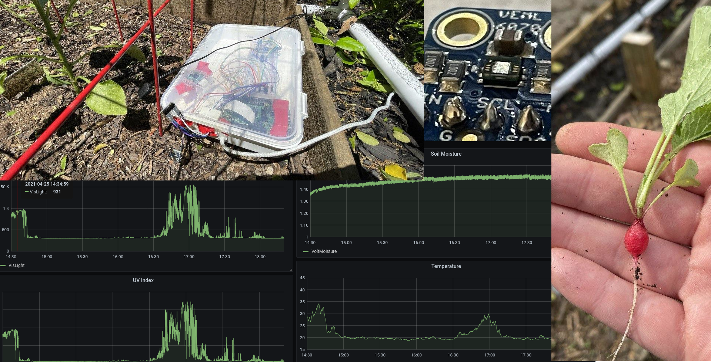
(*A journey through the project*)

Like many others during a certain time period around 2020/2021 (in case you're reading this on holotape, captured in an arctic vault, during your "Ancient American History" class in the year 3000 - I am talking about Covid-19), both my SO and I found joy in gardening and growing vegetables.

While the hobby of growing plants might be a joyful one in theory, I think the best description of gardening I heard was "It's 80% pain, 15% worry, and 5% victory and satisfaction, and 100% waiting". There are simply a lot of things that you need to take into account - sun exposure, pH content of your soil, nutrients in your soil, pests, fungi, squirrels, deer, birds (and all sorts of critters) - and naturally, all of those are different for each type of plant.

Because of this inherent complexity, there have been a lot of struggles with growing things. Radishes that I failed to thin properly and that produced sad little sticks, rather than voluptuous bulbs; cucumbers, tomatoes and pumpkins eaten away by blight, squirrels attacking and digging out seeds, aphids descending upon everything leafy and green like a biblical plague, frost damage where there shouldn't have been any frost damage to a poor aloe, monkey grass (liriope muscari) taking over raised beds, and plants growing in odd shapes before finally dying off due to a lack of sunlight.

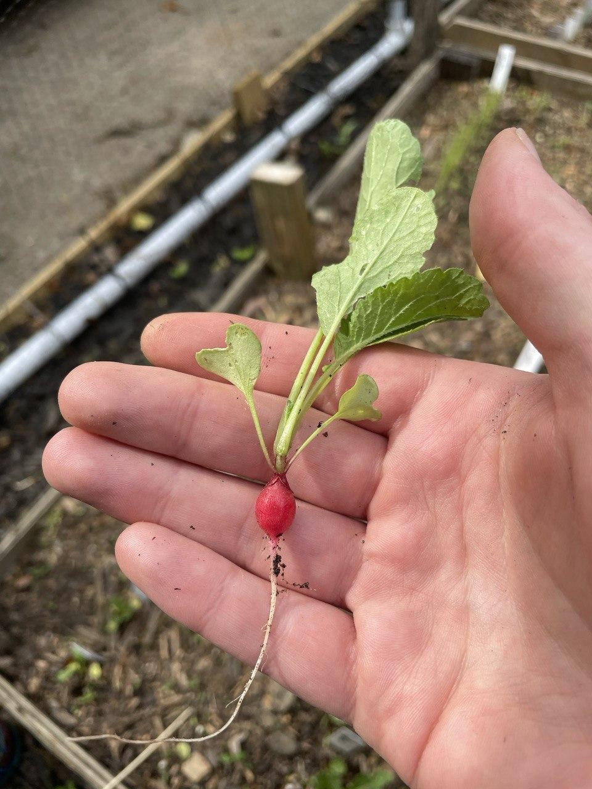
(*Sad bulb*)

For a lot of those problems, we've found analog solutions: A cage of bird netting on a frame of PVC pipes, constructed using cable ties, Alan Jackson songs, and cheap beer against squirrels (believe it or not, it actually works, and you can see it in the "Sad Bulb" picture above). Praying mantis eggs against aphids. Weed barriers against liriope and other weeds. Copper fungicide against fungi. 

Some things, however, are still plaguing me and keep me up at night. Naturally, there is only one solution to this: Using technology where one should not use technology to collect data where one does not need to collect data, and of course doing all of it in the most over-engineered way possible.

## Scope
So what are we going to do?

### Overall Idea
I took this opportunity of a semi-real need to finally gets my hands dirty in the world of physical electronics and micro-controllers. **This is a topic that is entirely new to me**, and given that I am the worst "learning by doing"-type person you could think of, there was no better opportunity than this to haphazardly soldering together some circuits to collect data.

So if you are reading this with at least a bit of experience in the field of electronics, microcontrollers, or gardening, for that matter - my email for complaints can be found on my website.

If you are more like me, though, and haven't dabbled in the *real world* of electronics at all, you might find this interesting.

### Architecture

Anyways, data is what I am after here - data on sun exposure, soil moisture, and temperature. This is actually a bit of an interesting question, because these metrics are hyper-localized and can be entirely different only a couple of feet away.

So we'll be collecting metrics like soil moisture, sun exposure UV, plus metadata like device ID and timestamp, send it to a server on the network using a REST API ([bigiron.local](https://chollinger.com/blog/2019/04/building-a-home-server/), of course), store it in MariaDB, and analyze it using Grafana.
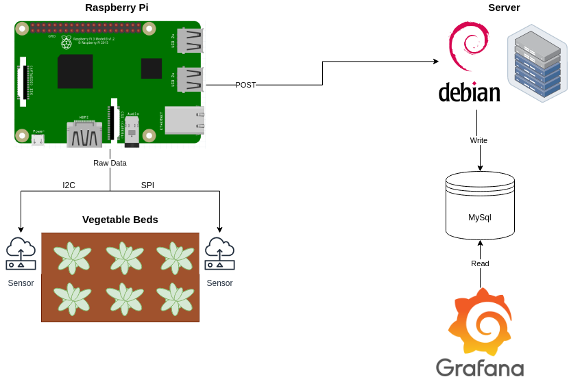

### Data Points
Here's how 3 of our 6 total raised beds are layed out (not at all to scale):

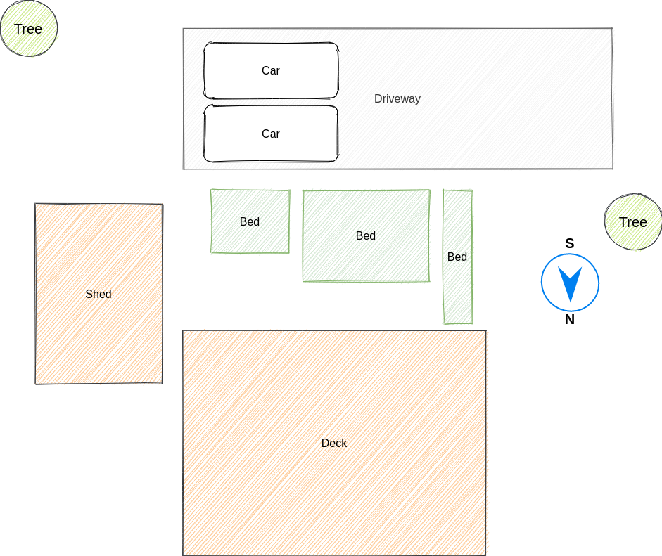

These beds are on the south side, but are also lodged in-between 2 cars, a deck, and a toolshed and flanked by trees. While, in theory, these beds should be getting ample sun, it is hard to estimate how much sun they actually get. Last year, we planted herbs down there that were "part to full sun", such as lavender, that unceremoniously died. You can grow bell peppers though - which, just like their counterparts in the spheres of *capsaicin annum* and *capsicum chinense*, actually do need quite a bit of sun.

Soil moisture is also surprisingly hard to measure: You might stick your finger in the soil, but that doesn't necessarily mean it's actually "young carrot"-wet. It might just be "the citrus tree doesn't care"-wet. Quantifying this as well would be a bonus.

Temperature and humidity are pretty obvious - I've actually built a little thing with the "Shortcuts" app on my iPhone to alert us of cold fronts:

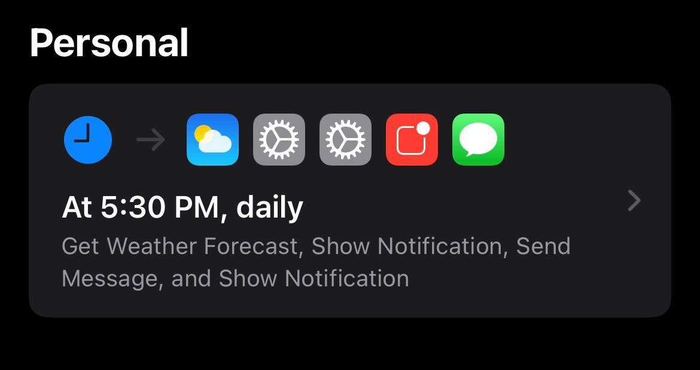

But of course, that is *way too easy*.

## Components
The idea for this is pretty simple: A Raspberry Pi powered (simply because I have several) machine that can capture these metrics and send them to a sever, so we can use the good ole Data Engineering toolbox to learn all there is to know about the far distant, real world out there.

For this, I chose the following components:

- **Temperature**: [MCP9808 High Accuracy I2C Temperature Sensor](https://www.adafruit.com/product/1782) - $4.95
- **UV**: [SI1145 Digital UV Index / IR / Visible Light Sensor](https://www.adafruit.com/product/1777) - $9.95
- or [Adafruit VEML6070 UV Index Sensor Breakout](https://www.adafruit.com/product/2899) - $5.95
- **Light**: [Adafruit VEML7700](https://www.adafruit.com/product/4162) (up to 120k lux) - $4.95
- or [Adafruit TSL2591](https://www.adafruit.com/product/1980) (up to 88k lux) - $6.95
- or the [NOYITO MAX44009](https://smile.amazon.com/NOYITO-MAX44009-Intensity-Interface-Development/dp/B07HFRS8XX) - $5.99
- **Moisture**: [Any resistive humidity sensor](https://smile.amazon.com/gp/product/B076DDWDJK/ref=ppx_yo_dt_b_asin_image_o01_s00?ie=UTF8&psc=1) - $4.99 - $8
- Any Raspberry PI you have lying around, like a [Raspberry Zero](https://www.microcenter.com/product/486498/zero-v13-development-board---camera-ready?storeid=041) or the fancy [Raspberry Pi 4 Model B](https://www.microcenter.com/product/609038/raspberry-pi-4-model-b-4gb-ddr4) - or the tiny [Pico](https://www.raspberrypi.org/products/raspberry-pi-pico/) - $4.99 - $54.99
- A soldering iron, jumper cables, LEDs, breakout boards etc.

There are, naturally, tons of options here - but with a minimal setup, we could build one of those sensors for ~$25 a pop (and less when ordering them in bulk, of course). I'll be covering the different types of sensors below.

I personally do not overly care about cost for this iteration - while it would be fun to have one deployed at all time, that also requires a wired power connection (or lithium batteries), an internet connection, and a waterproof case. All these things might make it worth buying a 3D printer for me (and to squeeze another article out of this), but for the scope of this article, I'll be focussing on actually building it.

## An analog circuit 
But before we do any of this: I personally haven't dabbled in electronic since *middle school* - so it's been a while. 

Naturally, I went "back to basics" and started building a really simple circuit: Powering an LED.

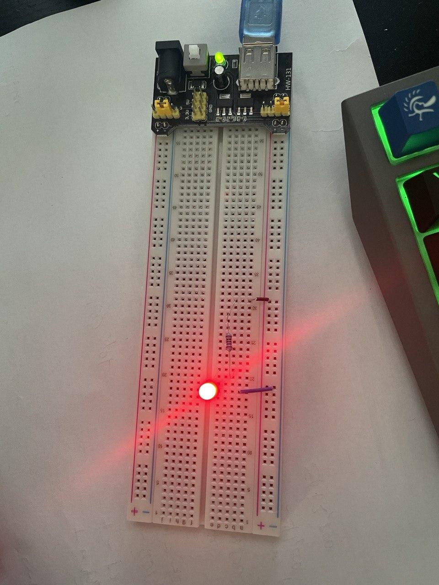

This was a good exercise to remember some fundamentals. An standard LED circuit looks like this:


Because we need to limit the current hitting the LED using a resistor, in order to prevent it from burning out.

In order to find the right resistance, we can use:

`R = (V_power - V_led) / I_led`

where `R` is the resistance in ohms, `V_power` is the power supply voltage in volts, `V_led` is the LED forward voltage drop across the LED in volts, and `I_led` is the desired current of the LED in amps.

For a red LED, we'll be looking at 2-2.2V at a 20mA current, i.e. on a 5V power supply (as shown above), a 93Ω resistor would do the trick (closest one I have was a 100Ω one). For a blue LED, we'd be looking at 3.2-3.4V, so a 54Ω resistor (and so on and so forth).

It's fun to play around with this - but for the record, I've used a 330Ω for most of the pictures you'll see. 

Also, the little power supply you see on the picture is pretty neat (a [HW-131](https://www.cafago.com/en/p-e8575.html) for $2), as it can take 3.3V and 5V and power via a PSU, batteries, or USB.


## Using the Raspberry & GPIO
The real fun begins once we start controlling the thing via the Raspberry. However, before the "controlling" parts start, we can start by simply connecting the a 3.3 or 5V pin to the same circuit.

### Pin Layout
For this [pinout.xyz](https://pinout.xyz/) is a handy resource: It shows you the layout of your respective Raspberry. Generally, it looks as such:

(from [pinout.xyz](https://pinout.xyz/))

Adafruit seels a handy-dandy little connector piece, the [T-Cobbler](https://www.adafruit.com/product/2028), that extends those pins and labels them for use on a breadboard.

Equipped with this knowledge, we can connect pin 1, 2, 4, or 17 as well as a ground of our choice and get pretty lights:

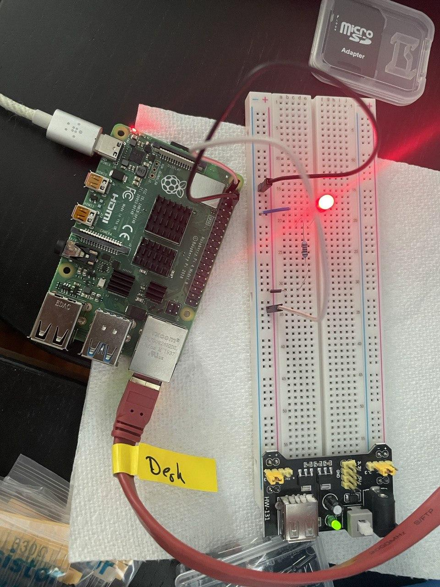

However, this is still analog, just getting a power source from a computer. In order to control it via software, we'll be using GPIO, or "General Purpose Input/Output". The aptly named [`RPi.GPIO`](https://www.raspberrypi.org/documentation/usage/gpio/) library can address all GPIO pins.

The simplest way to address those is to give one of 2 inputs: `GPIO.HIGH` (3.3V) or `GPIO.LOW` (0V).

### Exercise: Morse Code
A fun little exercise I've done to use this knowledge was to write a morse-code sender using GPIO and the following circuit:

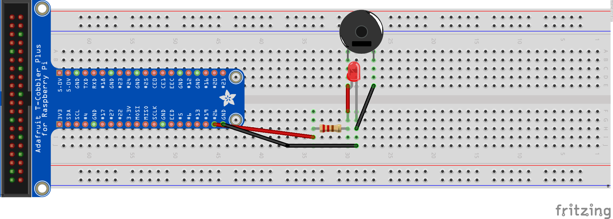

Which is pretty much the same as the LED one, just with an added speaker and a UV LED for indicating a complete "send". The version in the gif below also includes a pointless "done sending" signal LED.

Which works out like this:


Garbage code is here, in case you care:

import RPi.GPIO as GPIO
import time

# Morse morse_cording_durations
# Farnsworth Timing
time_unit = 0.1
morse_cording_durations = {
    '.': time_unit,
    '-': time_unit*3,
    'sleep': time_unit,
    'word_sleep': time_unit*7,
    'done': time_unit*10
}

# Alphabet
morse_cording = {'A': ['.', '-'],               'B': ['-', '.', '.', '.'],      'C': ['-', '.', '-', '.'],
                 'D': ['-', '.', '.'],          'E': ['.'],                     'F': ['.', '.', '-', '.'],
                 'G': ['-', '-', '.'],          'H': ['.', '.', '.', '.'],      'I': ['.', '.'],
                 'J': ['.', '-', '-', '-'],     'K': ['-', '.', '-'],           'L': ['.', '-', '.', '.'],
                 'M': ['-', '-'],               'N': ['-', '.'],                'O': ['-', '-', '-'],
                 'P': ['.', '-', '-', '.'],     'Q': ['-', '-', '.', '-'],      'R': ['.', '-', '.'],
                 'S': ['.', '.', '.'],          'T': ['-'],                     'U': ['.', '.', '-'],
                 'V': ['.', '.', '.', '-'],     'W': ['.', '-', '-'],           'X': ['-', '.', '.', '-'],
                 'Y': ['-', '.', '-', '-'],     'Z': ['-', '-', '.', '.'],

                 '0': ['-', '-', '-', '-', '-'],  '1': ['.', '-', '-', '-', '-'],  '2': ['.', '.', '-', '-', '-'],
                 '3': ['.', '.', '.', '-', '-'],  '4': ['.', '.', '.', '.', '-'],  '5': ['.', '.', '.', '.', '.'],
                 '6': ['-', '.', '.', '.', '.'],  '7': ['-', '-', '.', '.', '.'],  '8': ['-', '-', '-', '.', '.'],
                 '9': ['-', '-', '-', '-', '.']
                 }

# Ports
MAIN_LED = 12
DONE_LED = 26


def translate_morse(msg: str) -> list:
    cmds = []
    for s in msg:
        snd = 0
        slp = 0
        if s == ' ':
            # Word break
            slp = morse_cording_durations['word_sleep']
            cmds.append((0, slp))
            continue

        if s.upper() not in morse_cording:
            print('{} skipped'.format(s))
            continue

        cmd = morse_cording[s.upper()]
        print('{} -> {}'.format(s, cmd))
        for c in cmd:
            snd = morse_cording_durations[c]
            # + Wait
            slp = morse_cording_durations['sleep']
            # Add instruction
            cmds.append((snd, slp))
    return cmds


def setup(*leds):
    for led in leds:
        GPIO.setup(led, GPIO.OUT)


def teardown(*leds):
    for led in leds:
        GPIO.output(led, GPIO.LOW)


def send_msg(data: list, led=12, done_led=26):
    GPIO.setmode(GPIO.BCM)
    setup(led, done_led)
    for i in data:
        snd, slp = i
        print('Sending: {}, Waiting: {}'.format(snd, slp))
        # On
        GPIO.output(led, GPIO.HIGH)
        time.sleep(snd)
        GPIO.output(led, GPIO.LOW)
        # Sleep
        time.sleep(slp)
    print('Done sending message!')
    GPIO.output(done_led, GPIO.HIGH)
    time.sleep(morse_cording_durations['done'])
    GPIO.output(done_led, GPIO.LOW)


GPIO.setwarnings(False)

in_msg = input('Message: ')
msg = translate_morse(in_msg)
send_msg(msg)

# Turn off afterwards
teardown(MAIN_LED, DONE_LED)


It's really pointless, but fun to see it in action - it simply translates the Morse alphabet into defined lengths and breaks and sends an `GPIO.HIGH` signal, followed by a sleep timer, and a `GPIO.LOW` signal to turn it off.

Now, we went from powering an LED to controlling an LED and a speaker via code - pretty neat!

## Breakout boards and I2C
With those basics out of the way, we can finally take a look at the breakout boards - little circuits with digital or analog outputs that we can talk to via software (and do more than say "power on" / "power off"). Here's where things get a little more interesting, software wise.

We'll take a look at the arguably simplest sensor in the bunch, the `MCP9808` temperature sensor.

### Soldering

No matter which board you chose, the first step should be to solder the board onto the (usually supplied) header connector - it'll be impossible to get a stable connection otherwise.

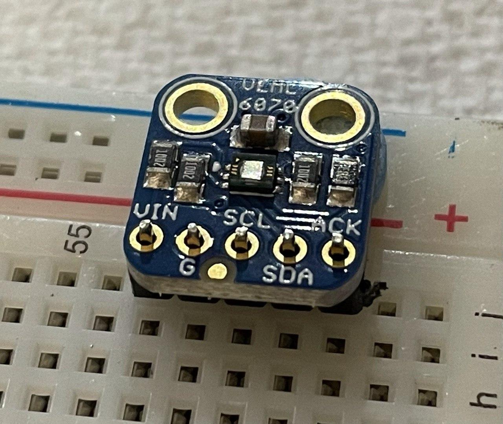


I can give zero advice on this - the best advice I've gotten on the matter is to use more soldering wire than you need and then some, and to make sure the piece sits on a stable base (such as a breadboard). It fits in right with "PVC pipes and bird netting against squirrels"-type approach to life, but it works. 

Adafruit has a great [guide](https://learn.adafruit.com/adafruit-guide-excellent-soldering) on it, however. 

### I2C
From there, we can actually start using `I2C`:

> **I2C** (**Inter-Integrated Circuit**), pronounced I-squared-C, is a synchronous, multi-master, multi-slave, packet switched, single-ended, serial communication bus invented in 1982 by Philips Semiconductor (now NXP Semiconductors). It is widely used for attaching lower-speed peripheral ICs to processors and microcontrollers in short-distance, intra-board communication. Alternatively, I2C is sometimes spelled I2C (pronounced I-two-C) or IIC (pronounced I-I-C). 
>
> https://en.wikipedia.org/wiki/I%C2%B2C

I2C, simply put, can do a lot more than just telling our circuit "power on" and "power off". It's a low-level messaging bus.

I2C uses 2 lines - `SCL` and `SDA`. `SCL` synchronizes data, whereas `SDA` sends and receives data. In addition to that, 2 other wires carry power and ground. I2C, being a messaging bus, also follows a master-slave pattern: We can use many devices connected to a single messaging bus. Devices can use registers, and those registers can be user-addressable.

### Implementing MCP9808 communications from scratch
Physical communication is outlined by the vendors of the respective chips. For instance, the little [MCP9808](https://www.microchip.com/wwwproducts/en/MCP9808) explains exactly how it works down to the last bit in its [specification](https://ww1.microchip.com/downloads/en/DeviceDoc/MCP9808-0.5C-Maximum-Accuracy-Digital-Temperature-Sensor-Data-Sheet-DS20005095B.pdf).

We'll need to connect it first:


(*[Source](https://learn.adafruit.com/assets/58808), Kattni Rembor, CC BY-SA 3.0)

Or physically:

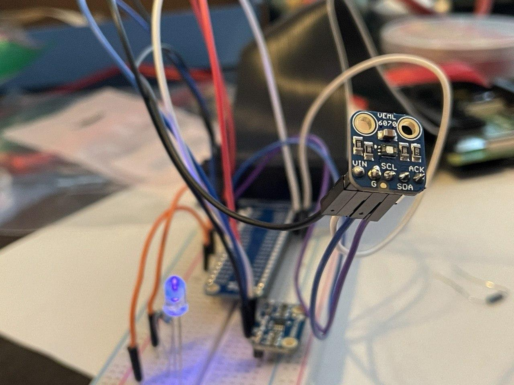

And using `i2cdetect`, we can observe connected i2c devices:

pi @ 4g-raspberrypi ➜  ~  sudo i2cdetect -y 1

     0  1  2  3  4  5  6  7  8  9  a  b  c  d  e  f
00:          -- -- -- -- -- -- -- -- -- -- -- -- -- 
10: -- -- -- -- -- -- -- -- 18 -- -- -- -- -- -- -- 
20: -- -- -- -- -- -- -- -- -- -- -- -- -- -- -- -- 
30: -- -- -- -- -- -- -- -- -- -- -- -- -- -- -- -- 
40: -- -- -- -- -- -- -- -- -- -- -- -- -- -- -- -- 
50: -- -- -- -- -- -- -- -- -- -- -- -- -- -- -- -- 
60: -- -- -- -- -- -- -- -- -- -- -- -- -- -- -- -- 
70: -- -- -- -- -- -- -- -- 


If we now wanted to get the temperature from the we know that the default *address* is `0x18`, and that the registers are mapped as such:

| Address         | Register        |
|-----------------|-----------------|
| 0x01            | Config          |
| 0x02            | TUpper          |
| 0x03            | TLower          |
| 0x04            | TCrit           |
| 0x05            | TA              |
| 0x06            | Manufacturer ID |
| 0x07            | Device ID       |
| 0x08            | Resolution      |

With `TA`, or `0x05`, being the current temperature's registers (and that register is readonly).

Once the circuit is physically connected, we can check the status via software:

If we were to just read them in `Python` using the [smbus2 library](https://pypi.org/project/smbus2/):

from smbus2 import SMBus
import time

registers = {
    'CONFIG': 0x01,
    'TUPPER': 0x02,
    'TLOWERL': 0x03,
    'TCRIT': 0x04,
    'TA': 0x05,
    'MANUFACTURER_ID': 0x06,
    'DEVICE_ID': 0x07,
    'RESOLUTION': 0x08,
}

bus = SMBus(1)
address = 0x18

for k in registers:
    dat = bus.read_word_data(0x18, registers[k])
    print('{} -> {}'.format(k, dat))


We'd see:

CONFIG -> 0
TUPPER -> 0
TLOWERL -> 0
TCRIT -> 0
TA -> 26817
MANUFACTURER_ID -> 21504
DEVICE_ID -> 4
RESOLUTION -> 259


Which are obviously not usable values quite yet.

Now, naturally, we need to parse this data to make sense of it.

> The digital word is loaded to a 16-bit read-only Ambient Temperature register (TA) that contains 13-bit temperature data in two’s complement format
>
> ...
>
> To convert the TA bits to decimal temperature, the upper three boundary bits (TA<15:13>) must bem asked out.
> Then, determine the SIGN bit (bit 12) to check positive or negative temperature, shift the bits accordingly, and combine the upper and lower bytes of the 16-bit register.
>
> The upper byte contains data for temperatures greater than +32°C while the lower byte contains data for temperature less than +32°C, including fractional data. 
>
> When combining the upper and lower bytes, the upper byte must be right-shifted by 4 bits (or multiply by 2^4) and the lower byte must be left-shifted by 4 bits (or multiply by 2^4). 
>
> Adding the results of the shifted values provides the temperature data in decimal format (see Equation 5-1).
>
> (https://ww1.microchip.com/downloads/en/DeviceDoc/MCP9808-0.5C-Maximum-Accuracy-Digital-Temperature-Sensor-Data-Sheet-DS20005095B.pdf)

If we want to keep it simple, all we need to do is follow that documentation:

# Parse temp
v = bus.read_word_data(0x18, 0x05)
# Split in 2-complements
ub=v & 0xFF
lb=(v >> 8) & 0xFF
# Clear flags / take lower 13
ub = ub & 0x1F
# Check for negative values
if (ub & 0x10) == 0x10:
    ub = ub & 0x0F
    t = 256 - (ub * 16 + lb/16)
else:
    t = ub * 16 + lb / 16
print('Current temp: {}C'.format(t))


And we get `22.6875C`, which is 72.8F, which matches the other thermometers in the room.

Now, if you are anything like me, you haven't done a lot of bit-shifting since college, but here's my best attempt at explaining what where doing here and why:

- Raw reading is `27585` in decimal, so `110 1011 1100 0001` in binary
- `v & 0xFF` is a bitmask (`XOR`) against `1111 1111` to get the upper 8 bit (as we get a 16bit register that contains integer and decimal components). A `&` is a logical `XOR` (exclusive or) operation and used for, well, bit masking (extracting bits, if you will).

```
	1	1	0	1	0	1	1	1	1	0	0	0	0	0	1
XOR								1	1	1	1	1	1	1	1
								1	1	0	0	0	0	0	1
```

- `(v >> 8) & 0xFF` shifts the data (to get the lower 8 bits / 1 byte) and applies the same mask (`1101011`), to get the lower 8 bit

```
	    1	1	0	1	0	1	1	1	1	0	0	0	0	0	1
>> 8								0	1	1	0	1	0	1	1
XOR									1	1	1	1	1	1	1	1
									0	1	1	0	1	0	1	1
```

- `ub & 0x1F` is a bit-mask against `11111` to clear the sign
```
								1	1	0	0	0	0	0	1
XOR											1	1	1	1	1
															1
```

Which we can now multiply by 2^4=16 to get a floating point result: `t = ub * 16 + lb / 16`

Or use more bitwise logic and get the result as an integer: `(lb >> 4) + (ub << 4)`

Tadaa! Only took a *bit* of bitwise math to read the board's sensor. Of course, we can also write to the registers, but I digress.

### Using a library
Now, while this was undoubtedly educational for me to understand how vendors implement these chips, how they can be addressed "low level", and write the code for it myself, naturally, there are almost always drivers and/or libraries available.

[Here](https://github.com/adafruit/Adafruit_MCP9808_Library) is one in C++, and [here](https://github.com/adafruit/Adafruit_CircuitPython_MCP9808) is Adafruit's current Python implementation which simplifies this a lot:



from board import *
import busio
import adafruit_mcp9808

# Do one reading
with busio.I2C(SCL, SDA) as i2c:
    t = adafruit_mcp9808.MCP9808(i2c)

    # Finally, read the temperature property and print it out
    print(t.temperature)


So that's what we'll be using going forward.

## Light Sensors
The exercise above covers temperature - whether we do the math ourselves or rely on a library, we can get temps. Sunlight is a different problem.

### UV Index vs. Light Levels & Pyranometers
Since we're looking at plant maintenance, we are looking for the abstract metric of "sun exposure" that every package of seeds and every plant from Home Depot to your local nursery mentions.

The thing about this metric is that it is surprisingly subjective and unscientific, at least for consumer-facing products. Generally speaking, we'd want to look at `W/sqm` of solar irradiance, but we'll get to why that is not straightforward in a second. 

Can we look at UV, something that is frequently measured and reported (and hence available as cheap boards) as a proxy?

> The UV index is a number linearly related to the intensity of sunburn-producing UV radiation at a given point on the earth's surface. 
>
> It cannot be simply related to the irradiance (measured in W/m2) because the UV of greatest concern occupies a spectrum of wavelength from 295 to 325 nm, and shorter wavelengths have already been absorbed a great deal when they arrive at the earth's surface
>
> https://en.wikipedia.org/wiki/Ultraviolet_index

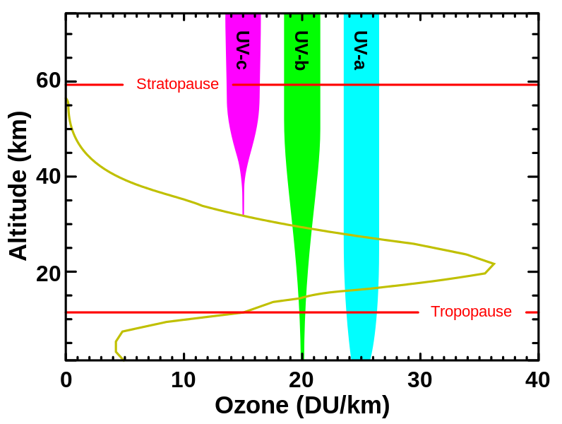

What we do know is the following: Plants *do* react to UV, or ultraviolet radiation, specifically UV-B (280-320nm) and UV-A (320-400nm), the same way humans do - it can cause cellular damage and it has been hypothesized that plants can anticipate UV patterns and react accordingly. [1] [2] [3]

The UV index ranges from 0 to 12 and is really designed to give us an idea on how risky being in the sun is for humans.

With that said, UV is a side-effect (or subset, if you will) of the *sunlight* that plants need to grow - UV-A makes up about 4.9% of solar energy, whereas UV-B makes up about 0.1% and can be barely measurable during the winter months.[4]

What we really want to know about is *solar intensity*. In order to measure solar intensity, one uses a device called a *pyranometer*, an (expensive) machine that uses silicon photocells (think photovoltaics), compensates for solar angles, and yields a deterministic way of determining solar irradiance, usually in W/sqm. [5]

The problem with pyranometers (which by the way, means "sky fire measure", which is pretty metal) is their super-niche use case and hence enormous cost - even the cheapest ones for hobby meteorologists are way above $100. And I just want to grow some peppers.

[1] https://www.frontiersin.org/articles/10.3389/fpls.2014.00474/full
[2] https://www.ncbi.nlm.nih.gov/pmc/articles/PMC160223/pdf/041353.pdf 
[3] https://www.rs-online.com/designspark/the-importance-of-ultraviolet-in-horticultural-lighting
[4] https://www.vishay.com/docs/84310/designingveml6070.pdf
[5] https://www.campbellsci.com/blog/pyranometers-need-to-know

### UV Sensors
As I've eluded to before, for UV sensors, I looked at 2 options: The [SI1145](https://www.adafruit.com/product/1777) or the [VEML6070](https://www.adafruit.com/product/2899), with the former being the more expensive option.

The `VEML6070` contains an actual UV-A sensor.

The `SI1145` on the other hand can calculate the UV index, but *doesn't* contain an actual UV sensor. As per the product description, it uses visible and infrared light to calculate the UV index.

What makes the `SI1145` interesting is the fact that we could use it to bypass its selling point, the UV readings, to get get visible and infrared (IR) light readings.

Using the [library](https://github.com/THP-JOE/Python_SI1145) for it, we can collect [metrics](https://cdn-shop.adafruit.com/datasheets/Si1145-46-47.pdf) as such:


import SI1145.SI1145 as SI1145

sensor = SI1145.SI1145()
vis = sensor.readVisible()
IR = sensor.readIR()
UV = sensor.readUV()
uvIndex = UV / 100.0
print('Visible:  {}'.format(vis))
print('IR:       {}'.format(IR))
print('UV Index: {}'.format(uvIndex))


Sadly, those are relative metrics that don't mean a whole lot on their own - but it's a start for collecting both UV index (mostly for the gardeners) and some sort of visible and infrared light metric.

### Lux Sensors
The "next best thing" to W/sqm for growing plants (at least that I could come up with) would be the SI unit lux:

> [...] It is equal to one lumen per square metre. In photometry, this is used as a measure of the intensity, as perceived by the human eye, of light that hits or passes through a surface. It is analogous to the radiometric unit watt per square metre, but with the power at each wavelength weighted according to the luminosity function, a standardized model of human visual brightness perception. In English, "lux" is used as both the singular and plural form.
> 
> https://en.wikipedia.org/wiki/Lux

While this measures visible light, rather than "raw" energy used for photosynthesis, it can still be a good metric in addition to looking at "relative" visible light and UV. In other words, while it might give us a diluted metrics (as it's aligned to the spectrum of visible light), it still might be useful in combination with out other metrics.

For this, I found 3 sensors: The [Adafruit VEML7700](https://www.adafruit.com/product/4162) (up to 120k lux), the [Adafruit TSL2591](https://www.adafruit.com/product/1980) (up to 88k lux), and the [NOYITO MAX44009](https://smile.amazon.com/NOYITO-MAX44009-Intensity-Interface-Development/dp/B07HFRS8XX) (up to 188k lux). Naturally, there are other options available.

Bright sunlight can reach over 100,000 Lux, so the first and last sensor in that list might be preferable. 

**Note**: *At the time of writing, neither lux sensor has arrived yet. Most of the things you'll read below hence only support relative measurements of visible light from the UV sensor*.

## Analog Sensors & Soil Moisture
The previous sensors we used were all I2C sensors with a *digital* output. But what about analog?

Well, fear not - the resistive soil moisture sensor I bought provides digital and analog output. The Amazon reviews, however, complain that "Manual and digital output are limited, analog works okay". So how does one read analog data?

Well with an ADC, of course! For those of you who are into HiFi, you might own a DAC (Schiit makes great ones starting at $99, by the way) - a Digital to Analog converter. In this use case, however, we need an Analog to Digital converter.

I am using the [MCP3008 8-Channel 10bit ADC With SPI Interface](https://www.adafruit.com/product/856). It uses SPI, or Serial Peripheral Interface, as opposed to I2C. Without being an expert at either, as evidenced by this article, SPI and I2C are similar - but SPI uses more pins:

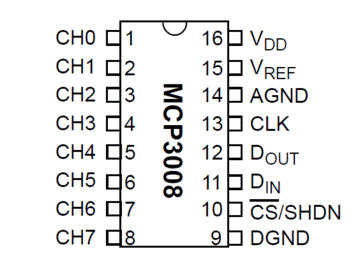
([Source](https://learn.adafruit.com/assets/1222), Michael Sklar, CC BY-SA 3.0)

Which means we can connect it as such:


Connected, it looks like this, using this positively adorable giraffe pot as a subject:
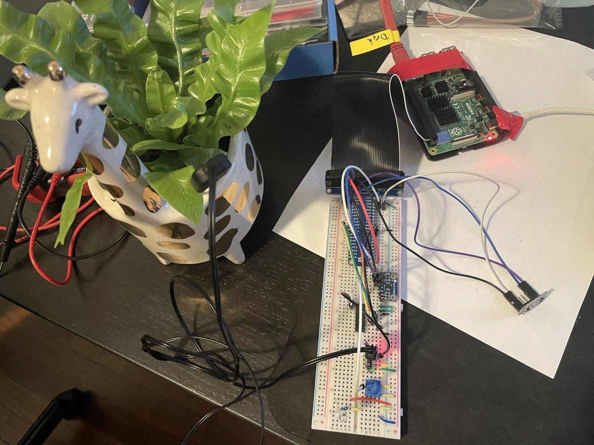
(Please ignore the electrical tape, I operate under highly professional standards)

What we're trying to read is resistance - if the resistance between the two probes rises, the soil is drier. This measure, of course, is somewhat subjective, so we'll have to calibrate it.

For digitally reading raw data from pin 0 on board I/O pin 25 (fot 60 seconds), we can use this little snippet of code:


import busio
import digitalio
import board
import adafruit_mcp3xxx.mcp3008 as MCP
from adafruit_mcp3xxx.analog_in import AnalogIn
 
# create the spi bus
spi = busio.SPI(clock=board.SCK, MISO=board.MISO, MOSI=board.MOSI)
 
# create the cs (chip select)
cs = digitalio.DigitalInOut(board.25)
 
# create the mcp object
mcp = MCP.MCP3008(spi, cs)
 
# create an analog input channel on pin 0
chan0 = AnalogIn(mcp, MCP.P0)

readings = []
i = 0
for x in range(0,60):
    i += 1
    val = chan0.value
    volt = chan0.voltage
    readings.append(volt)
    if int(val) != 0:
        print('Raw ADC Value: {}'.format(val))
        print('ADC Voltage: {} V'.format(chan0.voltage))
    time.sleep(1)

avg = statistics.mean(readings)
print('Avg voltage: {}'.format(avg))


Which gives us one raw reading per second.

In a decently moist giraffe pot, we get a reading of about

Raw ADC Value: 30144
ADC Voltage: 1.5146715495536736 V


Or, on average, 1.5144.

Now, keep in mind that this also gives you readings if you don't connect a thing:


# Reading on an unconnected channel P2
Raw ADC Value: 448
ADC Voltage: 0.0 V
Raw ADC Value: 512
ADC Voltage: 0.0 V
Avg voltage: 0.004619211108567941


*But you can ignore those readings*. I think this is an artifact of the nature of any ADC - natural fluctuations in current + Python's inherent `float` imprecision.

If you connect a potentiometer on a different chanel (you can see it in the picture above!), you can actually see those fluctuations - technically, the voltage should stay exactly the same, but yet it doesn't:

readings = [3.2968276493476765, 3.280714122224765, 3.280714122224765, 3.280714122224765, 3.2839368276493475, 3.280714122224765, 3.280714122224765, 3.2936049439230946, 3.2839368276493475, 3.2839368276493475, 3.277491416800183, 3.280714122224765, 3.280714122224765, 3.277491416800183, 3.2936049439230946, 3.28715953307393, 3.280714122224765, 3.277491416800183, 3.2936049439230946, 3.277491416800183, 3.2839368276493475, 3.28715953307393, 3.280714122224765, 3.280714122224765, 3.2839368276493475, 3.280714122224765, 3.2839368276493475, 3.28715953307393, 3.280714122224765, 3.280714122224765, 3.280714122224765, 3.2839368276493475, 3.280714122224765, 3.277491416800183, 3.2936049439230946, 3.2710460059510185, 3.2839368276493475, 3.280714122224765, 3.290382238498512, 3.280714122224765, 3.277491416800183, 3.280714122224765, 3.28715953307393, 3.2839368276493475, 3.280714122224765, 3.280714122224765, 3.28715953307393, 3.2839368276493475, 3.2839368276493475, 3.2839368276493475, 3.2839368276493475, 3.2839368276493475, 3.2742687113756004, 3.290382238498512, 3.2936049439230946, 3.28715953307393, 3.277491416800183, 3.280714122224765, 3.28715953307393, 3.290382238498512]
statistics.stdev(v)
# 0.0051783580637861605


The stdev is only 0.005178, but it's there. The moisture sensor is just introducing equally strong fluctuations at a stdev of 0.002305.

In any case, the same experiment on a bone dry pot of soil yields a mean voltage of 2.6.

So we can conclude:
- **Dry soil**: 2.6V
- **Damp soil**: 1.5V
- **Glass of water**: 0.77V

## Putting it all together
Final assembly!

### Final Breadboard Layout
With all sensors connected, this is the layout:

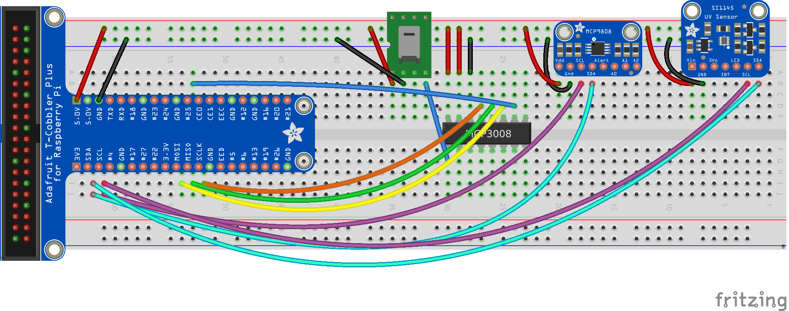

### A Simple REST API can do the trick
We can send the collected data over the network. One could come up with a fancy messaging queue, but I think a simple, localized REST API would do the trick for now - `AWS Greengrass`, Meme-Microservices, `Kafka` and others will have to wait. We just send a packet of data every 10 seconds and store it into a database like this:


CREATE OR REPLACE TABLE `sensors`.`data` (
    `sensorId`	            TEXT,
    `TempC`	                FLOAT,
    `VisLight`	            FLOAT,
    `IrLight`               FLOAT,
    `UvIx`                  FLOAT,
    `RawMoisture`           FLOAT,
    `VoltMoisture`          FLOAT,
    `MeasurementTs`         TIMESTAMP,
    `lastUpdateTimestamp`   TIMESTAMP
);


The REST endpoint is written in `go` and compiled for `x86`, rather than `ARM` and gets deployed on a remote server, so that we can support many small microcontrollers that just need to send data every once in a while.

You can find the full code on [GitHub](https://github.com/chollinger93/raspberry-gardener), as usual, so I'll only talk about some noteworthy points (which are generic `go` topics, but worth a mention).

First of all, the use of [github.com/jmoiron/sqlx](https://github.com/jmoiron/sqlx) and [github.com/Masterminds/squirrel](https://github.com/Masterminds/squirrel) with a `ConnectionPool` setup similar to the type one would use for a large `CloudSQL` instance has been treating me well - `sqlx` extends `go`'s regular `sql` interface wonderfully and `squirrel` can be used to automate some tasks for database I/O away.


type Sensor struct {
	SensorId     string
	TempC        float32
	VisLight     float32
	IrLight      float32
	UvIx         float32
	RawMoisture  float32
	VoltMoisture float32
    MeasurementTs string
}

func (a *App) storeData(sensors []Sensor) error {
	q := squirrel.Insert("data").Columns("sensorId", "tempC", "visLight", "irLight", "uvIx", "rawMoisture", "voltMoisture", "measurementTs", "lastUpdateTimestamp")
	for _, s := range sensors {
        // RFC 3339
		measurementTs, err := time.Parse(time.RFC3339, s.MeasurementTs)
		if err != nil {
			zap.S().Errorf("Cannot parse TS %v to RFC3339", err)
			continue
		}
		q = q.Values(s.SensorId, s.TempC, s.VisLight, s.IrLight, s.UvIx, s.RawMoisture, s.VoltMoisture, measurementTs, time.Now())
	}
	sql, args, err := q.ToSql()
	if err != nil {
		return err
	}

	res := a.DB.MustExec(sql, args...)
	zap.S().Info(res)
	return nil
}


I've also started using [go.uber.org/zap](https://github.com/uber-go/zap) more and more, as `go`'s standard logging interface leaves *a lot* to be desired.


	// Logger
	logger, _ := zap.NewDevelopment()
	defer logger.Sync() // flushes buffer, if any
	zap.ReplaceGlobals(logger)


Other than that, the code is a pretty standard REST API - an `App` struct keeps a pointer to the DB connection pool (shared across threads), and secrets are handled via environment variables, rather than having to implement config files and `viper` (maybe in the future).


type App struct {
	Router *mux.Router
	DB     *sqlx.DB
}

func initTCPConnectionPool() (*sqlx.DB, error) {
	var (
		dbUser    = mustGetenv("DB_USER")
		dbPwd     = mustGetenv("DB_PASS")
		dbTCPHost = mustGetenv("DB_HOST")
		dbPort    = mustGetenv("DB_PORT")
		dbName    = mustGetenv("DB_NAME")
	)

	var dbURI string
	dbURI = fmt.Sprintf("%s:%s@tcp(%s:%s)/%s?parseTime=true", dbUser, dbPwd, dbTCPHost, dbPort, dbName)

	dbPool, err := sqlx.Open("mysql", dbURI)
	if err != nil {
		return nil, fmt.Errorf("sql.Open: %v", err)
	}

	configureConnectionPool(dbPool)
	return dbPool, nil
}


Build as such:

# For x86
GOARCH=amd64 GOOS=linux go build -o /tmp/sensor-server *.go 
sudo mkdir -p /opt/raspberry-gardener
sudo cp /tmp/sensor-server /opt/raspberry-gardener
sudo cp ./.env.sh /opt/raspberry-gardener/
sudo sed -i 's/export //g' /opt/raspberry-gardener/.env.sh


We can then install a `systemd` service:

[Unit]
After=network.target
Wants=network-online.target

[Service]
Restart=always
EnvironmentFile=/opt/raspberry-gardener/.env.sh
WorkingDirectory=/opt/raspberry-gardener
ExecStart=/opt/raspberry-gardener/sensor-server 

[Install]
WantedBy=multi-user.target 


And deploy:

# Install `systemd` service:
sudo cp raspberry-gardener.service /etc/systemd/system/
sudo systemctl start raspberry-gardener
sudo systemctl enable raspberry-gardener # Autostart


And check:

christian @ bigiron ➜  raspberry-gardener  sudo systemctl status raspberry-gardener
   Loaded: loaded (/etc/systemd/system/raspberry-gardener.service; disabled; vendor preset: enabled)
   Active: active (running) since Sat 2021-04-24 14:12:56 EDT; 17min ago
 Main PID: 12312 (sensor-server)
    Tasks: 7 (limit: 4915)
   Memory: 3.0M



We'll do the same for the sensor client below - see GitHub for details.

### One Script to Rule Them All
For putting the sending part together, all we need to do is combine all individual scripts for each sensor, wildly mix SPI and I2C, and send the data.

Imports and collecting data is pretty straightforward:


from board import *
import busio
import adafruit_mcp9808
import SI1145.SI1145 as SI1145
import os
import time
import busio
import digitalio
import board
import adafruit_mcp3xxx.mcp3008 as MCP
from adafruit_mcp3xxx.analog_in import AnalogIn
import platform
import getmac
import requests
import logging
import json
import argparse

# mcp9808
def read_temp() -> int:
    with busio.I2C(SCL, SDA) as i2c:
        t = adafruit_mcp9808.MCP9808(i2c)
        return t.temperature

# SI1145
def read_uv(sensor: object) -> set:
    vis = sensor.readVisible()
    IR = sensor.readIR()
    UV = sensor.readUV() 
    uvIndex = UV / 100.0
    return (vis, IR, uvIndex)

# HD-38 (Aliexpress/Amazon)
def read_moisture(spi_chan: object) -> tuple:
    val = spi_chan.value
    volt = spi_chan.voltage
    return (val, volt)


Since we want a unique ID per sensor (if we deploy multiple), we're combining hostname and network MAC address into one string:

def get_machine_id():
    return '{}-{}'.format(platform.uname().node, getmac.get_mac_address())


The collecting loop creates all access objects, buffers the data, filters invalid data, and sends it to the REST API:

def main(rest_endpoint: str, frequency_s=1, buffer_max=10, spi_in=0x0):
    buffer=[]
    ## UV
    uv_sensor = SI1145.SI1145()

    ## SPI
    # create the spi bus
    spi = busio.SPI(clock=board.SCK, MISO=board.MISO, MOSI=board.MOSI)
    # create the cs (chip select)
    cs = digitalio.DigitalInOut(board.CE0)
    # create the mcp object
    mcp = MCP.MCP3008(spi, cs)
    # create an analog input channel on pin 0
    chan0 = AnalogIn(mcp, spi_in)

    while True:
        try:
            # Read
            temp_c = read_temp()
            vis, ir, uv_ix = read_uv(uv_sensor)
            raw_moisture, volt_moisture = read_moisture(chan0)

            # Write
            # temp_c,vis_light,ir_light,uv_ix,raw_moisture,volt_moisture
            reading = {
                'sensorId': get_machine_id(),
                'tempC': temp_c,
                'visLight': vis,
                'irLight': ir,
                'uvIx': uv_ix,
                'rawMoisture': raw_moisture,
                'voltMoisture': volt_moisture,
                'measurementTs': datetime.now(timezone.utc).isoformat() # RFC 333
            }

            # Only send if we have all 
            # UV sensor sometimes doesn't play along
            if int(vis) == 0 or int(ir) == 0 or int(volt_moisture) == 0:
                logger.warning('No measurements: {}'.format(reading))
                continue

            buffer.append(reading)
            logger.debug(reading)
            if len(buffer) >= buffer_max:
                logger.debug('Flushing buffer')
                # Send
                logger.debug('Sending: {}'.format(json.dumps(buffer)))
                response = requests.post(rest_endpoint, json=buffer)
                logger.debug(response)
                # Reset
                buffer = []
        except Exception as e:
            logger.exception(e)
        finally:
            time.sleep(frequency_s)


It uses about 16MB of memory despite the buffer, so we should be good to go!

## Physical Deployment
Usually, when I write software, it ends here: I wrote the software. Now run it. Go away.

In this little experiment, however, there is also a component of actually physically deploying it involed. Since it had to be outside, the housing for the PI and boards would need to be at least semi-protected against water, and even if its just ambient moisture from the ground.

### Stupid Problems Require a Dremel
Since I don't own a 3D printer (or even a smaller breadboard), but do own old Ikea plastic boxes and a dremel, the solution was obvious: Remove the Pi Cobbler, connect some dupont cables directly, put them in a plastic box, drill holes, use electrical tape to "seal" it, and change over from ethernet to WiFi. Simple, yet elegant (citation needed). I've also connected the camera for good measure - even though I haven't programmed it yet.


### First Outdoor Test: The Deck
I then moved it outside on a sunny day to the deck (after a bad storm) for its first big day in the field:

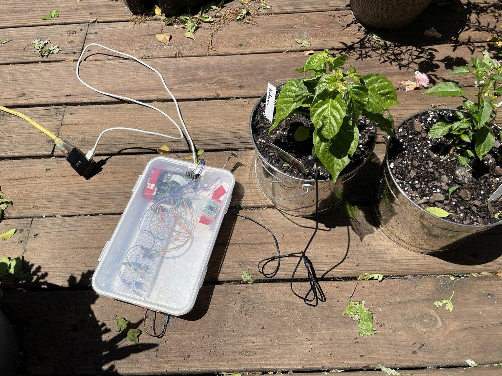
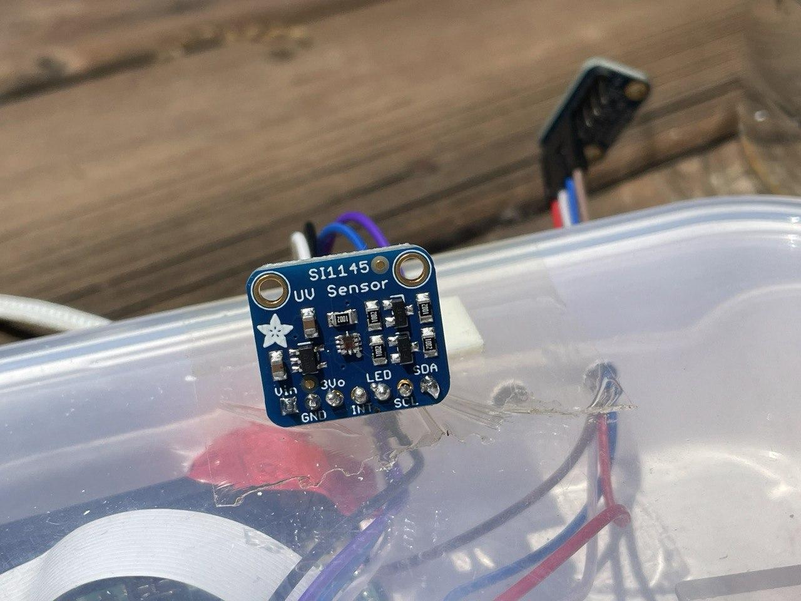

And for the pictures the camera takes (I triggered this one via SSH):


Then I started both `systemd` services and waited for a bit. 

### Analyzing the Preliminary Data
As this really only ran for a short time, the following query must suffice:


SELECT *, TIMESTAMPDIFF(MINUTE, startTS, endTs) as totalMinMeasured,
CASE WHEN avgVoltMoisture <= 0.90 THEN "wet" 
WHEN avgVoltMoisture > 0.9 AND avgVoltMoisture <= 1.7 THEN "moist"
ELSE "dry"  END AS avgWetness
FROM (
	SELECT AVG(TempC) AS avgTemp, AVG(VisLight) AS avgVisLight, AVG(UvIx) as avgUvIx, AVG(VoltMoisture) as avgVoltMoisture,
	MAX(MeasurementTs) as endTS, MIN(MeasurementTs) as startTs
	FROM `sensors`.`data` as d
	WHERE d.MeasurementTs <= TIMESTAMP('2021-04-25 18:25:00')
) e


Which yields the unsurprising results:

| avgTemp | avgVisLight | avgUvIx | avgVoltMoisture | totalMinMeasured | avgWetness |
|---------|-------------|---------|-----------------|------------------|------------|
| 37.3977 | 1337.5186   | 5.7897  | 1.1099          | 40               | wet        |

That at around 2pm, the deck is sunny, and that after a heavy storm the night before, the plants are wet.

But this was just to make sure it works!

### Second Outdoor Test: The Flower Beds
Once confirmed that everything works, it's time for the garden bed.


The camera now also has a much more interesting point of view:


### Analysis: Part 2 (w/ Grafana)
To be fair, analysis of this dataset isn't going to look much different - letting it run a little longer gives us the ability to visualize it using Grafana:

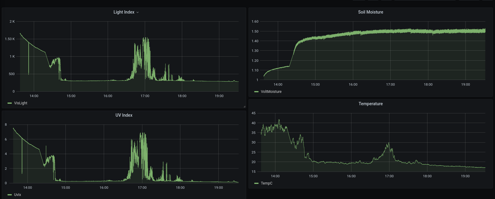
(*Sensor was moved from the sunny deck to the garden beds at around 1420hrs*)

I've also manually taken pictures over SSH:


This picture was taken at the tail-end of the Grafana graphs (around 1800hrs), whereas the one above was taken at about 1430. You can undoubtedly spot that pattern on the graphs.

Another peak in both light index and UV (and by proxy, temperature) can be oberved around 1700hrs - that is when the sun is not obscured by trees. 

And another picture taken at 1930 hrs - you can see the angle of the sun changing on the plant in the bottom left of the picture, but not much change in any other metric in the graphs above.
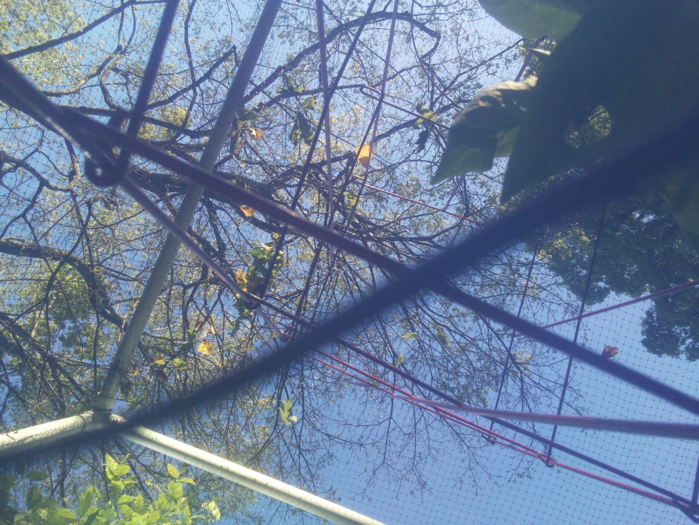


Despite the lack of Lux sensor, we can also make some informed guesses on "Part Shade" vs. "Full Sun" here - comparing Light and UV index here:

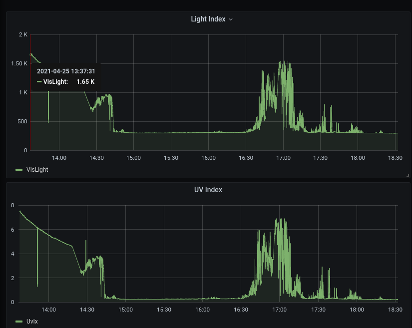

Knowing that the sensor was moved at around 1420hrs, we can compare the peaks between the obviously super-sunny deck and the beds - both peak at 1.65 - 1.5k "light units ("visible light" from the sensor).

This correlates with temperature as well:


You can see peaks up to ~29C (84.2F) during the "high sun" period in the late afternoon, with the peaks on the deck reaching 40C (104F).

Interestingly enough, the temperature doesn't match the recorded temperatures as per the iPhone weather app - that should have been a constant 72F (or 22.2C), whereas during non-high intensity periods, the beds are hovering around 18-19.C (64.4 - 67F)!

I think it is fair to say: At least this particular garden bed qualifies as "part shade" and doesn't get the same intense sun that other parts of the house are getting.

Of course, ideally, you'd want to observe this for several full days in different conditions - but I, surprisingly, don't trust my tupperware-electrical-tape-dremel-box *too much* just yet. But it's a start!

## Next Steps & Conclusion
This is part 1 - while it was super interesting for me (and seeing the graphs at the end is just delightful), I won't even pretend that this project is overly useful, economical, or even *necessary* (my office window faces the garden...), there are still a ton of things we can do better!

- Use a much cheaper board, e.g. a Raspberry Zero
- Solder the connections and build one compact package
- 3D print a proper enclosure that could actually be watertight
- Deploy several of those and collect data for a week or so
- Implement the camera code
- Implement the Lux sensor (see above)
- Deploy it for much longer periods of time to collect a lot more data
- Fine tune some collection parameters - it's currently collecting 3,600 datapoints / hour, which is probably unncessary 
- Run some form of ML model on the sturctured + unstructured data from the camera

So a part 2 might be in order - but I feel part 1 is long enough as it is.

In any case, I hope you enjoyed this little journey from a refresher on middle school physics, to basics on I2C and SPI, to bit-shifting by hand for no good reason, to writing a REST API and SQL queries, to moving a plastic box with holes on the side into the yard, and finally using some more normal data wrangling toolsets to look at it. I know I had fun!


_All code is available on [GitHub](https://github.com/chollinger93/raspberry-gardener)._


_All development and benchmarking was done under GNU/Linux [PopOS! 20.04 on Kernel 5.8] with 12 Intel i7-9750H vCores @ 4.5Ghz and 16GB RAM on a 2019 System76 Gazelle Laptop, as well as a Raspberry Pi 4 Model B, using [bigiron.local](https://chollinger.com/blog/2019/04/building-a-home-server/) as endpoint_