## Introduction

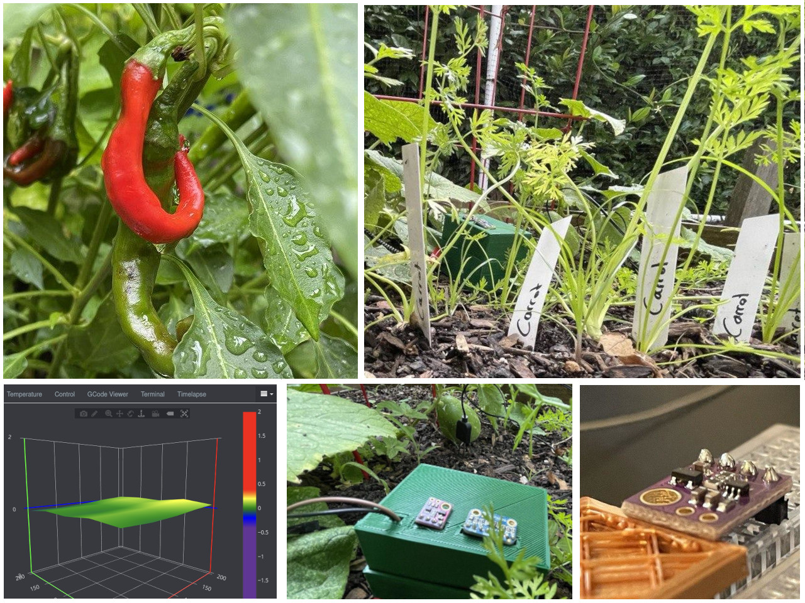

In the [last iteration](https://chollinger.com/blog/2021/04/raspberry-pi-gardening-monitoring-a-vegetable-garden-using-a-raspberry-pi-part-1) of this project, I walked you through my journey of throwing a Raspberry Pi into my garden beds to monitor sun and water exposure. In this article, we'll improve the prototype into something that can feasibly used both indoors and outdoors.

Just as the previous article, this here part 2 will go over all the steps I went through and documents some of the learning experiences I've had.

## Version 1's Issues
Version 1 was fun - and it worked! But it wasn't without its problems. Let's do a quick retrospective as to what all needs to improve here.

### Cost
One fairly prohibitive thing was cost - as a prototype, it used a beefy Raspberry Pi 4 (4GB), a machine that retails for a solid [$55](https://www.adafruit.com/product/4296). Realistically, however, we'd want to build the same box for maybe $30 all in (at consumer prices!), so we can deploy multiple of them inside and out.

This is an easy fix - [Raspberry Pi Zero W](https://www.raspberrypi.org/products/raspberry-pi-zero-w/) comes with WiFi (which will be cheaper and more ubiquitous than [PoE] Ethernet *[0]*) and can be had for $10 (if you can find one for that price). Cheap micro-SD cards retail for $3, and so do cheap micro-usb cables and power bricks, but I assume everyone has multiple piles of cables and adapters anyways. We'll be using small breadboards, but you can also just solder copper together if you're down for a fun ride of short circuits. Add about $2 for a solderable breadboard - and continue reading to see why that might be a good idea.

Back to the `Zero W`: It's a magical little stick: 1Ghz, one core, 512MB memory, 40 PIN GPIO headers, camera connector, BLE / Bluetooth 4.1 and 802.11 b/g/n WiFi. For $10. $5 without WiFi. That's about ~7.7x the CPU capabilities of my first PC, in about 1/1,000 the volume!

It's fair to say that it's tiny, about half the size of a spacebar (if that's a unit of measurement?):
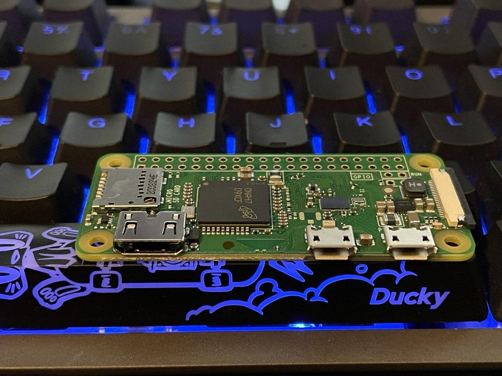

Sure - some ESP32's might come cheaper - but Raspberries also have the distinct advantage of not being a microcontroller, but rather a fully-fledged computer. And for somebody who isn't exactly an Embedded Engineer, the learning curve is a lot less steep. The little RasPis also support USB, which is neat!

*[0]* [This here](https://buzzert.net/posts/2021-05-09-doorbell) is a fun read that relies on PoE and can use a simpler design because of it.

### Power Consumption
Using a `Raspberry` vs. an `ESP32` does have its disadvantages, though - power consumption being one of them. Assuming we'd want to collect data wireless for 48 hrs:

The previously used `Raspberry Pi 4` will consume around *500 - 600mA* at idle. On a 5V power supply, we're looking at ~3W or ~144Wh for 48hrs.

Reminder:
> Power (as **W**att **h**our) = Voltage (as **V**olts) / Current (as **A**mps)
>
> W = Voltage * Amps * Hours 

A `Raspberry Pi Zero W` on WiFi should be around *150 - 180 mA* on 3.3V, with a voltage regulator on-board to support 5V PSUs - so about 0.55W or 26.64Wh for 48hrs (about *18.5% the power consumption* of a Pi 4!).

However, an [ESP32-WROOM-32](https://www.espressif.com/sites/default/files/documentation/esp32-wroom-32_datasheet_en.pdf), on the other hand, would range around *100 mA* at 2.2 to 3.6V (as little as 10.5Wh for 48hrs) when actively sending data, and barely nothing when idle:

To put it into perspective, a single AA Lithium battery clocks in at about *~3,000mA*, albeit at 3.7V. Powerbanks, of course, come with power converters - with `Pi Zero W`'s estimated consumption and a minimum runtime of 48hrs, a tiny powerbank at 10,000mAh (10A) and 3.7V (which would be typical for lithium) could power a Pi, in an ideal world without conversion loss and inefficiencies, for about **67hrs** (37Wh/0.55Wh). Assuming 50% efficiency, 10Ah would get us to about 1 1/2 days, which isn't amazing.

Cost is also a prohibitive factor - even cheap(ish) power bank or straight up lithium batteries would almost double the cost of one unit, for ultimately little benefit. The [PiSugar](https://www.pisugar.com/) project, for instance, clocks in at $39.99 for a 1,200mAh battery, with an estimated runtime of 5-6hrs - which is in line with the calculations above (`1.2A*3.7V=4.44Wh`, `4.44/0.55Wh*.5=4.3hrs`, with 50% efficiency).

So, despite this being not ideal, we'll take the efficiency gain, but forego the battery topic for now.

### Sensors & New Parts List
The last project also used a lot of different sensors to figure out which ones work best - this time around, we already know the ones we need.

So, here's an updated part list:

- **Board**: [Raspberry Pi Zero W](https://www.raspberrypi.org/products/raspberry-pi-zero-w/) - $10 
- **SD Card**: Any cheap, 8-16GB card will do - $3
- **Moisture**: [Any resistive humidity sensor](https://smile.amazon.com/gp/product/B076DDWDJK/ref=ppx_yo_dt_b_asin_image_o01_s00?ie=UTF8&psc=1) - $5
- **Temperature**: [MCP9808 High Accuracy I2C Temperature Sensor](https://www.adafruit.com/product/1782) - $4.95
- **Light**: [NOYITO MAX44009](https://smile.amazon.com/NOYITO-MAX44009-Intensity-Interface-Development/dp/B07HFRS8XX) (up to 188k lux) - $4.95 (*price increased at time of writing*)
- **ADC**: [MCP3008 8-Channel 10bit ADC With SPI Interface](https://www.adafruit.com/product/856) - $3.75

Which brings our total from almost $100 for a development board to about **$31.60**. Add ~$2 for a solderable breadboard and maybe $0.10 for some jumper wires, if you want a more sturdy design.

I'll call this a win, simply because I'd be able to get all parts (sans the Pi) from Aliexpress for about half the price, like a MCP3008 for $1.50. But even domestically, from places like Adafruit, Microcenter, and Amazon, the total cost per unit seems reasonable.

### Size, Enclosure, and Layout
The bigger and more obvious limitation of the previous iteration, however, was size: Due to my genius plan of using a Dremel to drill holes into a massive (albeit flimsy) box from Ikea, the resulting box was both huge *and* impractical. A classic lose-lose situation, just how I like it.

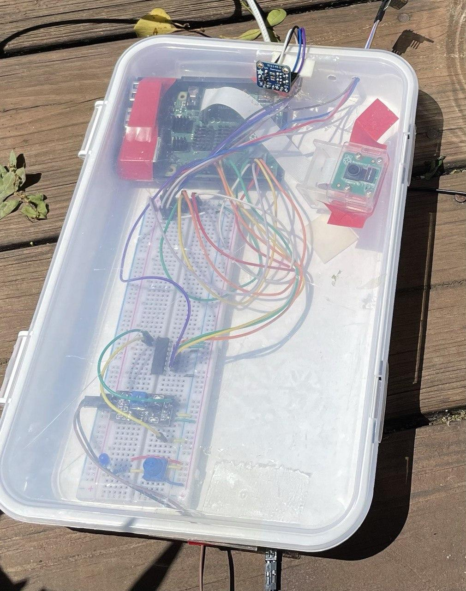

It also relied on a breadboard, lots of dupont cables, and was generally not very well thought out - everything in it should have fit onto a much smaller footprint.

Improving the layout should be a relatively simple task: Since we know the sensors we need, we can optimize for space. We'll do that further [down](#a-new-component-layout).

The enclosure for that, however... that is a different topic. We'll get to that now.

## Introducing: The 3D Printer
I've mentioned it last time, I'm using this as an opportunity to buy a 3D printer. I chose the [Creality Ender 3 V2](https://www.creality.com/goods-detail/ender-3-v2-3d-printer), which is probably the most recommended budget 3D printer for PLA and ABS at around $250.

This being my first 3D printer, it was an interesting learning experience to say the least. 

*You will find the background of all photos changing quite the bit, as we moved this ~19x19" thing around the house a lot - I wound up buying a ~22x22" IKEA Lack table for it, in case you were curious.*

### Building a 3D Printer
Creality's own website (!) offers the following advice:

> Sure, it's far from perfect. 
>
> But at this lower price, it offers a decent print volume, is easy to assemble and improve, and can produce high-quality prints.
>
> (https://www.creality.com/goods-detail/ender-3-v2-3d-printer)

So, reading up online, it was clear to my that a "standard" Ender 3 v2 won't cut it - too many reports of people struggling with basic functionality. So, I installed some updates before starting my first print. That wasn't an overly smart move - I should have started with a test-print first.

#### Aluminum extruder, 0.4mm Nozzle, and Capricorn PTFE Bowden Tubing
The first number of updates fell under "preventative maintenance", i.e. things I probably wouldn't notice until I used the printer a bunch, but it seemed like a good thing to replace, since the printer doesn't come assembled anyways. I soon learned that that was a mistake.

The first upgrade was an aluminum extruder: A simply sturdier version to move filament into the hot end (the part melting the filament), compared to the plastic default, with a stronger spring to keep better tension during the extruding process. This ensures that filament will always flow evenly. It's also simply much less likely to break.

What I didn't realize, however, was that this process might mess up the calibration of the printer, where the length of filament requested and the length of filament extruded are out of sync, causing pooling on the hotbed and misshapen prints:

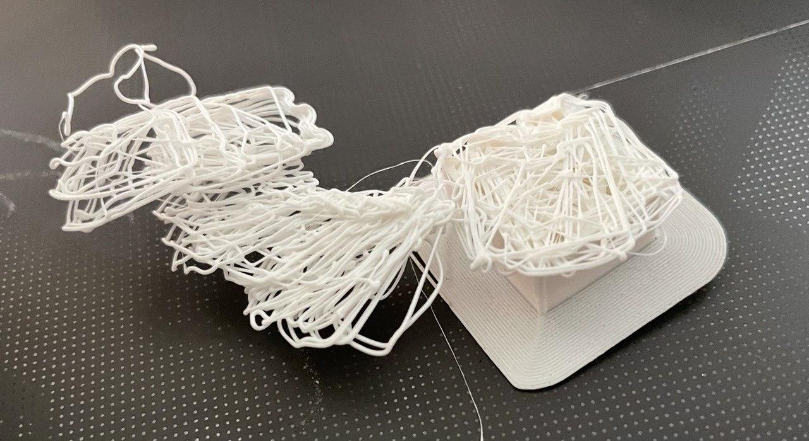

Thanks to a friend who actually knows stuff about 3D printing (for I am but a humble novice), we were able to follow the steps on [this wonderful website](https://teachingtechyt.github.io/calibration.html#esteps) to re-calibrate it. This happened after many a failed print, though - even though it wasn't the only root cause. In any case, heed his advice and bookmark [this](https://teachingtechyt.github.io/) website - it'll save you a lot of time.

I also installed updated tubing, nozzles, and connectors the same reasons - don't believe I'd run into issues any time soon, but those upgrades were easiest to do while everything else was taken apart already.

#### Auto-Leveling
One of the most important things about 3D printing is leveling - one of the main problems with messed-up prints like the one above - and leveling something manually, especially in a house from 1949 (level floors weren't invented until 1972, fun fact) was bound to be a pain, if not outright impossible. 

So, the [Creality BLTouch V3.1](https://smile.amazon.com/Creality-BLTouch-Upgraded-Leveling-Mainboard/dp/B08L9DHP5R) for about $40 is a terrific little invention: Instead of relying on a human to manually move the Z-Axis every on practically inch of the printing bed, it probes the surface for you.

Installing it was relatively straightforward: You replace the regular Z-Limiter's cable with the BLTouch (which requires you to remove the mainboard cover), route the cable alongside the tubing, and bolt it to the print head.

At this point, it is advised to note down the mainboard version, as we'll need that for the firmware upgrade in the next step:

Once installed, it looks like this:
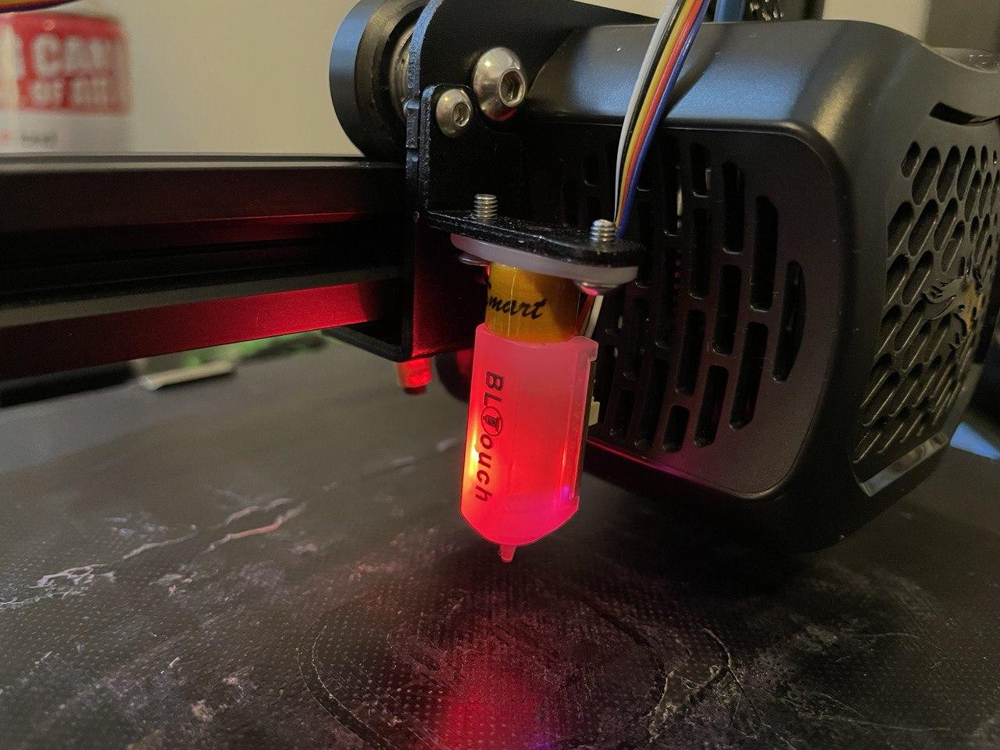

The other thing I installed was a set of [updated springs](https://smile.amazon.com/Marketty-Printer-Compression-Actually-Perfectly/dp/B07MTGXYLW), so the bed stays level once it is leveled once.

#### New Firmware
After those updates were installed, the next journey was to get firmware installed - otherwise, the BLTouch won't do a thing. The Ender 3 v2 has an *interesting* process for this - you place a `.bin` file onto an otherwise empty SD card and it'll install it. 

I used a pre-compiled [Marlin](https://github.com/mriscoc/Marlin_Ender3v2) firmware for this task. 

If you, however, chose a wrong firmware, the display will just stay black or the machine will beep horribly loud. 

Part of my wonders how it validates authenticity, of if it just executes random code. I have that theory that it's the latter.

#### OctoPrint
While all these improvements were great, the process of printing anything on an Ender 3 is as follows:

1. Find or design a CAD model
2. Use a slicer, such as [Cura](https://ultimaker.com/software/ultimaker-cura), to turn your CAD into sliced G-code that your printer understands
3. Move it onto an SD-card
4. Plug the SD-card into the printer
5. Print, run into the room with the printer every 10 minutes to check for inevitable failures

However, a wonderful piece of software exists, called [Octoprint](https://octoprint.org/) that can be used to control your printer remotely (or, rather, from the local network) via a Raspberry Pi!

First off, I printed enclosures for a Raspberry Pi (using charming "rainbow filament", which explains the, uh, *interesting* color combinations):
- [Ender 3 Dual Rail Raspberry Pi 4 case](https://www.thingiverse.com/thing:4192636)
- [Ender 3 Pi cam Boom w/ Swivel/Tilt](https://www.thingiverse.com/thing:3417079)

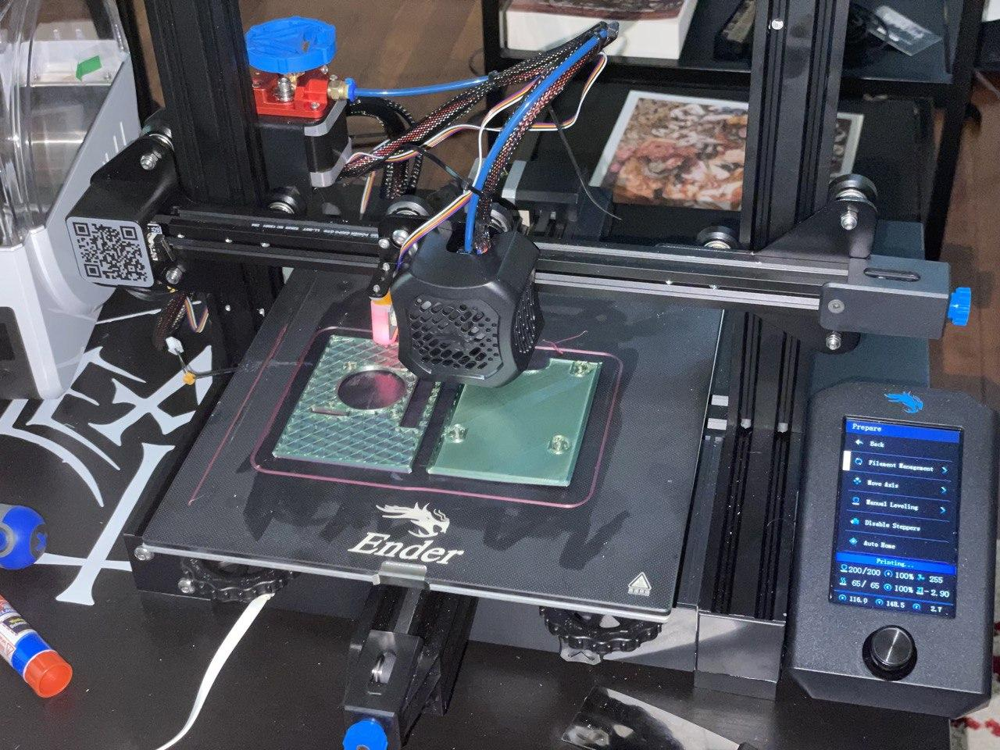

And installed it:
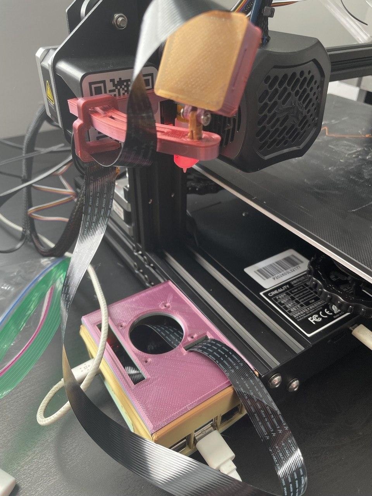

And then installed Octoprint using `docker-compose`, after telling the DHCP server and the Pi to keep a static IP over WiFi:

version: '2.4'

services:
  octoprint:
    image: octoprint/octoprint
    restart: always
    ports:
      - "80:80"
    devices:
      - /dev/ttyUSB0:/dev/ttyACM0
      - /dev/video0:/dev/video0
    volumes:
     - octoprint:/octoprint
    # uncomment the lines below to ensure camera streaming is enabled when
    # you add a video device
    environment:
      - ENABLE_MJPG_STREAMER=true
  
volumes:
  octoprint:


(All you really need to check here is your `dev`ices - the container thinks its talking to a serial port, whereas in reality, it's the first USB device).

And once it was up and running, it was possible to upload G-Code and monitor prints in real-time:

You can also see a print's individual steps in real-time:
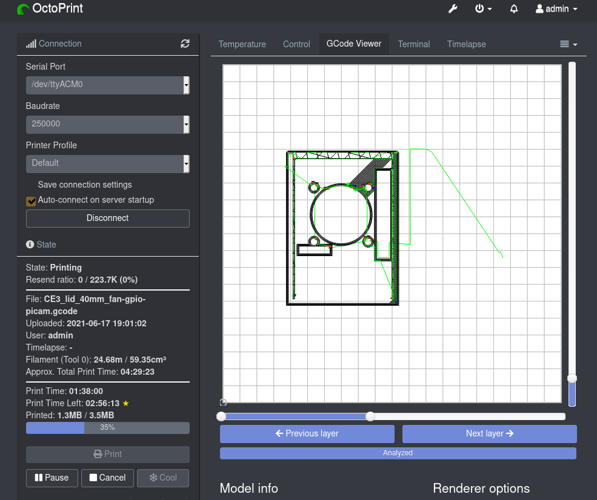

#### Leveling and Elmer's Glue
Earlier, I mentioned that leveling is one of the key things that need doing - otherwise, they'll produce spaghetti:
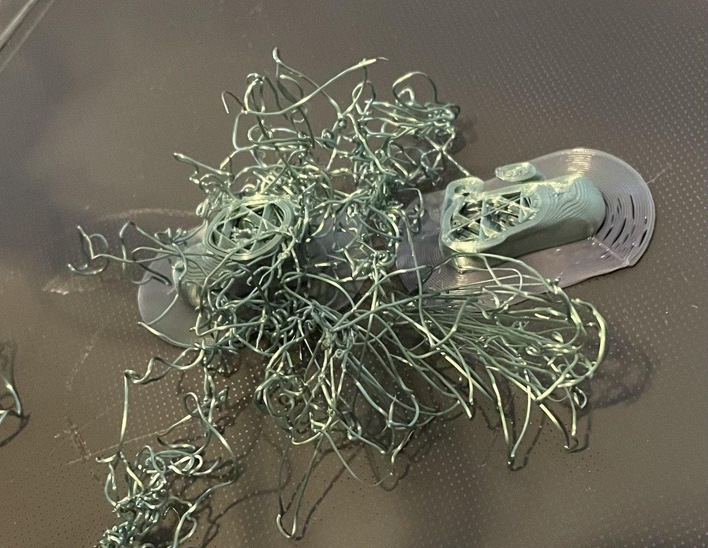

Fortunately, Octoprint has a [plugin](https://plugins.octoprint.org/plugins/bedlevelvisualizer/) we can use to support this.

I've used the following GCODE:

G28
M155 S30
@ BEDLEVELVISUALIZER
G29 T
M155 S3


And here's the result, after manually leveling it before:

This process, however, took me a long time - and for some prints you see on the pictures above, I used Elmer's glue to increase adhesion to avoid the print from moving. I'm not saying I recommend it - it does, however, make prints stick without supports on less-than-perfectly leveled beds.

### Test Prints and Progress
This was the first print:
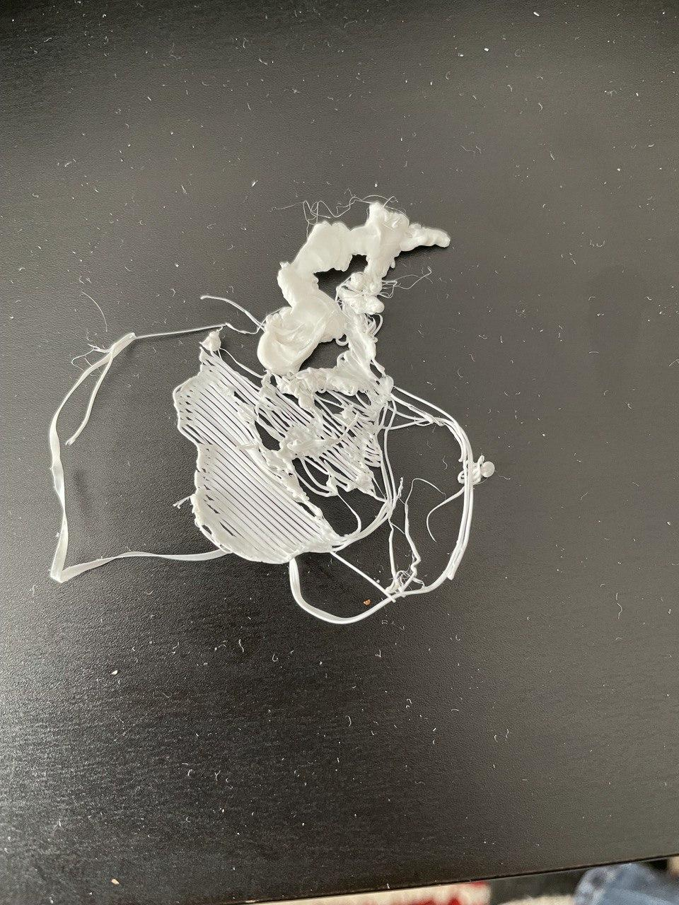

And here's one of the later models - you can see the imperfections as I was trying to figure out - but it's quite a bit better than the mess in the first attempt:
 / [Thingverse 4515916)")

So far, so good! 

## A New Component Layout
Now that we can print anything from test cubes over anime figurines to enclosures, let's also re-visit the layout of the initial prototype.

### Designing a new Layout
This layout, naturally, wasted a ton of space. Using the same wiring as before, but using a 20-pin breadboard (as I won't be etching a PCB, so much is for certain) as opposed to a 60-pin one and dropping the cobbler, we're left with this tiny 9x6.5cm layout:

I will accept that it isn't super easy to maintain on that form-factor and that splicing the 5V channel might not be super-duper-smart - just don't overload it. `I2C` can have issues with many devices in series (due to resistance on the same bus), but ultimately, I don't think this will be a problem here. It isn't super elegant, but it should work.

In any case, the layout is 2-dimensional in this Fritzing drawing - once we design an enclosure for a `Pi Zero W`, we can start stacking components and save even more space. We'll see to that below.

")

### New Components
We've also replaced the UV with a new Lux sensor, the tiny ` NOYITO MAX44009`. This sensor hooks up to I2C as usual (Power, GND, SCL, SDA), which is why we're re-using the same lanes on the board. It's also positively *tiny*, which is nice for a compact design.

## Software Updates
The next thing to re-visit is software.

### `MAX44009` and the Quest for `0x4B`
Naturally, we'll need to integrate the new sensor somehow. The documentation for this thing is available [here](https://www.maximintegrated.com/en/products/interface/sensor-interface/MAX44009.html), but there is no ready-to-use `pip3` dependency. 

People took the documentation and figured out the conversion math [here](https://github.com/ControlEverythingCommunity/MAX44009/blob/master/Python/MAX44009.py) and [here](https://github.com/rcolistete/MicroPython_MAX44009_driver/blob/master/max44009.py) - if you're interested in doing this from scratch, please [take a look at Part 1](https://chollinger.com/blog/2021/04/raspberry-pi-gardening-monitoring-a-vegetable-garden-using-a-raspberry-pi-part-1/#implementing-mcp9808-communications-from-scratch).

This sensor has one disadvantage, though - every documentation mentions that it uses the I2C address `0x4A`, but in my case, it used `0x4B`, *but not consistently*:

sudo i2cdetect -y 1
     0  1  2  3  4  5  6  7  8  9  a  b  c  d  e  f
00:          -- -- -- -- -- -- -- -- -- -- -- -- -- 
10: -- -- -- -- -- -- -- -- 18 -- -- -- -- -- -- -- 
20: -- -- -- -- -- -- -- -- -- -- -- -- -- -- -- -- 
30: -- -- -- -- -- -- -- -- -- -- -- -- -- -- -- -- 
40: -- -- -- -- -- -- -- -- -- -- -- 4b -- -- -- -- 
50: -- -- -- -- -- -- -- -- -- -- -- -- -- -- -- -- 
60: -- -- -- -- -- -- -- -- -- -- -- -- -- -- -- -- 
70: -- -- -- -- -- -- -- --   


And Amazon review said as such:
> These have a selectable I2C address 0x4a or 0x4b. But note that the address on the modules I received was NOT set by the manufacturer. 
>
> So you'll need to solder the jumper pads on the board one way or another or the address will not be deterministic and may change on you between uses. (I found out the hard way).

CTRL+F on the official docs yields no results for `0x4B` and the sample code also defaults to 0x4A:

class MAX44009 : public i2cSensor
{

    /** ######### Register-Map ################################################################# */

#define MAX_ADDRESS 				0x4a

#define INT_STATUS_REG				0x00
#define INT_ENABLE_REG              0x01
#define CONFIGURATION_REG           0x02
#define   CONFIG_CONT_MASK          (bit(7))  // CONTINOUS MODE
#define     CONFIG_CONT_ON          (1<<7)
#define     CONFIG_CONT_OFF         (0)
#define   CONFIG_MANUAL_MASK        (bit(6))  // MANUAL Set CDR and TIME


Isn't that *fun*?! (╯°□°）╯︵ ┻━┻

Anyways, I've simply created a customized version that worked with the existing code base from the first iteration and my odd address masking:


from smbus2 import SMBus
import time

class MAX44009:
    # Thanks to https://github.com/rcolistete/MicroPython_MAX44009_driver/blob/master/max44009.py
    # With slight adjustments by chollinger93 for Python3 etc.
    MAX44009_I2C_DEFAULT_ADDRESS = 0x4A
    MAX44009_I2C_FALLBACK_ADDRESS = 0x4B

    MAX44009_REG_CONFIGURATION = 0x02
    MAX44009_REG_LUX_HIGH_BYTE = 0x03
    MAX44009_REG_LUX_LOW_BYTE  = 0x04
    
    MAX44009_REG_CONFIG_CONTMODE_DEFAULT     = 0x00    # Default mode, low power, measures only once every 800ms regardless of integration time
    MAX44009_REG_CONFIG_CONTMODE_CONTINUOUS  = 0x80    # Continuous mode, readings are taken every integration time
    MAX44009_REG_CONFIG_MANUAL_OFF           = 0x00    # Automatic mode with CDR and Integration Time are are automatically determined by autoranging
    MAX44009_REG_CONFIG_MANUAL_ON            = 0x40    # Manual mode and range with CDR and Integration Time programmed by the user
    MAX44009_REG_CONFIG_CDR_NODIVIDED        = 0x00    # CDR (Current Division Ratio) not divided, all of the photodiode current goes to the ADC
    MAX44009_REG_CONFIG_CDR_DIVIDED          = 0x08    # CDR (Current Division Ratio) divided by 8, used in high-brightness situations
    MAX44009_REG_CONFIG_INTRTIMER_800        = 0x00    # Integration Time = 800ms, preferred mode for boosting low-light sensitivity
    MAX44009_REG_CONFIG_INTRTIMER_400        = 0x01    # Integration Time = 400ms
    MAX44009_REG_CONFIG_INTRTIMER_200        = 0x02    # Integration Time = 200ms
    MAX44009_REG_CONFIG_INTRTIMER_100        = 0x03    # Integration Time = 100ms, preferred mode for high-brightness applications
    MAX44009_REG_CONFIG_INTRTIMER_50         = 0x04    # Integration Time = 50ms, manual mode only
    MAX44009_REG_CONFIG_INTRTIMER_25         = 0x05    # Integration Time = 25ms, manual mode only
    MAX44009_REG_CONFIG_INTRTIMER_12_5       = 0x06    # Integration Time = 12.5ms, manual mode only
    MAX44009_REG_CONFIG_INTRTIMER_6_25       = 0x07    # Integration Time = 6.25ms, manual mode only

    def __init__(self, bus=None) -> None:
        if not bus:
            bus = SMBus(1)
        self.bus = bus
        self.addr = self.MAX44009_I2C_DEFAULT_ADDRESS
        self.configure()

    def configure(self):
        try:
            self.bus.write_byte_data(self.addr, 
                self.MAX44009_REG_CONFIGURATION, 
                self.MAX44009_REG_CONFIG_MANUAL_ON)
        except Exception as e:
            print(e)

    def _convert_lumen(self, raw) -> float:
        exponent = (raw[0] & 0xF0) >> 4
        mantissa = ((raw[0] & 0x0F) << 4) | (raw[1] & 0x0F)
        return ((2 ** exponent) * mantissa) * 0.045

    def read_lumen(self)-> float:
        data = self.bus.read_i2c_block_data(self.addr,
            self.MAX44009_REG_LUX_HIGH_BYTE, 2)
        return self._convert_lumen(data)
    
    def _switch_addr(self):
        if self.addr == self.MAX44009_I2C_DEFAULT_ADDRESS:
            self.addr = self.MAX44009_I2C_FALLBACK_ADDRESS
        else:
            self.addr = self.MAX44009_I2C_DEFAULT_ADDRESS

    def read_lumen_with_retry(self):
        # To avoid 121 I/O error
        # Sometimes, the sensor listens on 0x4A,
        # sometimes, on 0x4B (ಠ.ಠ)
        try:
            return self.read_lumen()
        except Exception as e:
            print(f'Error reading lumen on {self.addr}, retrying')
            self._switch_addr()
            self.configure()
            return self.read_lumen_with_retry()

if __name__ == '__main__':
    # Get I2C bus
    bus = SMBus(1)
    # Let I2C settle
    time.sleep(0.5)
    MAX44009 = MAX44009(bus)
    # Convert the data to lux
    luminance = MAX44009.read_lumen_with_retry()

    # Output data to screen
    print(f'Ambient Light luminance : {luminance} lux')


### Re-Writing the Client
Other than that, I updated the main code a bit to be a bit more flexible, by using a class hierarchy that allows the various sensor implementations from libraries, custom code, SPI etc.

It's not exactly a marvel of engineering - but it is better than it was before. The full code, as usual, is on [GitHub](https://github.com/chollinger93/raspberry-gardener).


from board import *
# ...

class Sensor():
    def __init__(self, sensor: object) -> None:
        self.sensor = sensor

    def read_metric(self) -> dict:
        """Implemented in each sensor

        Returns a `dict` of readings, mapping to the SQL schema.

        Return None if no reading. Equals NULL in DB.

        Returns:
            dict: Column -> Reading
        """
        pass

# Temp
class MCP9808_S(Sensor):
    def read_metric(self):
        with busio.I2C(SCL, SDA) as i2c:
            t = adafruit_mcp9808.MCP9808(i2c)
            return {
                'tempC': t.temperature
            }

# UV
class SI1145_S(Sensor):
    def read_metric(self):
        vis = self.sensor.readVisible()
        IR = self.sensor.readIR()
        UV = self.sensor.readUV() 
        uvIndex = UV / 100.0
        # UV sensor sometimes doesn't play along
        if int(vis) == 0 or int(IR) == 0:
            return None

        return {
            'visLight': vis,
            'irLight': IR,
            'uvIx': uvIndex
        }

# Moisture: HD-38 (Aliexpress/Amazon)
# pass spi_chan
class HD38_S(Sensor):
    def read_metric(self):
        raw_moisture = self.sensor.value
        volt_moisture = self.sensor.voltage
        if int(raw_moisture) == 0:
            return None
        return {
            'rawMoisture': raw_moisture, 
            'voltMoisture': volt_moisture
        }

# Lumen: pass MAX44009
class MAX44009_S(Sensor):
    def read_metric(self):
        return {
            'lumen': self.sensor.read_lumen_with_retry()
            }

__sensor_map__ = {
    'uv': SI1145_S,
    'temp': MCP9808_S,
    'lumen': MAX44009_S,
    'moisture': HD38_S
}

def get_machine_id():
    return '{}-{}'.format(platform.uname().node, getmac.get_mac_address())

def main(rest_endpoint: str, frequency_s=1, buffer_max=10, spi_in=0x0, disable_rest=False, *sensor_keys):
    if disable_rest:
        logger.warning('Rest endpoint disabled')
    buffer=[]

    # Create sensor objects
    sensors =  {}
    for k in sensor_keys:
        if k == 'uv':     
            # UV
            sensor = SI1145.SI1145()
        elif k == 'temp':
            # TODO: library behaves oddly
            sensor = None 
        elif k == 'lumen':
            sensor = m4.MAX44009(SMBus(1))
        elif k == 'moisture':
            ## SPI
            # create the spi bus
            spi = busio.SPI(clock=board.SCK, MISO=board.MISO, MOSI=board.MOSI)
            # create the cs (chip select)
            cs = digitalio.DigitalInOut(board.CE0)
            # create the mcp object
            mcp = MCP.MCP3008(spi, cs)
            # create an analog input channel on pin 0
            sensor = AnalogIn(mcp, spi_in)
        else:
            logger.error(f'Unknown sensor key {k}')
            continue
        # Create
        sensors[k] = __sensor_map__[k](sensor=sensor)
    
    while True:
        try:
            # Target JSON
            reading = {
                'sensorId': get_machine_id(),
                # Metrics will come from Sensor object
                'tempC': None,
                'visLight': None,
                'irLight': None,
                'uvIx': None,
                'rawMoisture': None,
                'voltMoisture': None,
                'lumen': None,
                'measurementTs': datetime.now(timezone.utc).isoformat() # RFC 3339
            }

            # Read all
            for k in sensors:
                try:
                    sensor = sensors[k]
                    logger.debug(f'Reading {sensor}')
                    metrics = sensor.read_metric()
                    if not metrics:
                        logger.error(f'No data for sensor {k}')
                        continue
                except Exception as e:
                    logger.error(f'Error reading sensor {k}: {e}')
                    continue
                # Combine 
                reading = {**reading, **metrics}

    
            # Only send if its not disabled       
            if not disable_rest:
                buffer.append(reading)
                logger.debug(reading)
                if len(buffer) >= buffer_max:
                    logger.debug('Flushing buffer')
                    # Send
                    logger.debug('Sending: {}'.format(json.dumps(buffer)))
                    response = requests.post(rest_endpoint, json=buffer)
                    logger.debug(response)
                    # Reset
                    buffer = []
            else:
                logger.info(reading)
        except Exception as e:
            logger.exception(e)
        finally:
            time.sleep(frequency_s)

if __name__ == '__main__':
    # Args
    parser = argparse.ArgumentParser(description='Collect sensor data')
    # ...

    # Start
    logger.warning('Starting')
    main(args.rest_endpoint, args.frequency_s, args.buffer_max, args.spi_in, args.disable_rest, *args.sensors)


The whole `if`/`else` switch can of course be avoided, for instance with a plugin model like I [wrote here for `scarecrow-cam`](https://github.com/chollinger93/scarecrow/tree/master/scarecrow_core/plugins), another RasPi project. But that's a bit more effort than I'm willing to spend right now.

Anyways, we can test locally with:

python3 monitor.py --disable_rest --rest_endpoint na --sensors temp lumen moisture


And update the `systemd` service.

### Updating the Backend 
Of course, the addition of the sensor requires schema updates, which is easy in `go`, because `go` has `structs` and doesn't hate you:

type Sensor struct {
	SensorId      string
	TempC         float32
	VisLight      int32
	IrLight       int32
	UvIx          float32
	RawMoisture   int32
	VoltMoisture  float32
	Lumen         float32
	MeasurementTs string
}

func (a *App) storeData(sensors []Sensor) error {
	q := squirrel.Insert("data").Columns("sensorId", "tempC", "visLight", "irLight", "uvIx", "rawMoisture", "voltMoisture", "lumen", "measurementTs", "lastUpdateTimestamp")
	for _, s := range sensors {
		// RFC 3339
		measurementTs, err := time.Parse(time.RFC3339, s.MeasurementTs)
		if err != nil {
			zap.S().Errorf("Cannot parse TS %v to RFC3339", err)
			continue
		}
		q = q.Values(s.SensorId, s.TempC, s.VisLight, s.IrLight, s.UvIx, s.RawMoisture, s.VoltMoisture, s.Lumen, measurementTs, time.Now())
	}
	sql, args, err := q.ToSql()
	if err != nil {
		return err
	}

	res := a.DB.MustExec(sql, args...)
	zap.S().Info(res)
	return nil
}


The same goes for the `SQL` interface/DDL - a fairly standard exercise.

### Adding new Features
Another useful feature, apart from collecting data, would be to notify the gardener of any issues. For that, I implemented a simple notification system in `go`, i.e. on the server.

The implementation is straightforward - we define constants for thresholds:

// Hard coded alert values for now
const MIN_TEMP_C = 5
const MAX_TEMP_C = 40
const LOW_MOISTURE_THRESHOLD_V = 2.2

func (a *App) checkSensorThresholds(sensor *Sensor) bool {
	if sensor.VoltMoisture >= LOW_MOISTURE_THRESHOLD_V || sensor.TempC <= MIN_TEMP_C || sensor.TempC >= MAX_TEMP_C {
		return true
	}
	return false
}


*Using thresholds as `const`ants is, to be fair, like re-compiling your Kernel for a `ulimit` adjustment - but I'm trying to avoid `config` files.*

An in order not to send notifications every time the sensor triggers, we also implement a timer, which for the sake of simplicity uses a global `map` and a `mutex`:

// Simple mutex pattern to avoid race conditions
var mu sync.Mutex
var notificationTimeouts = map[string]time.Time{}

const NOTIFICATION_TIMEOUT = time.Duration(12 * time.Hour)

func (a *App) validateSensor(sensor *Sensor) error {
	// Check the values first
	if !a.checkSensorThresholds(sensor) {
		zap.S().Debugf("Values for %s are below thresholds", sensor.SensorId)
		return nil
	}
	// Otherwise, notify
	mu.Lock()
	// If we already have the sensor stored in-memory, check whether its time to notify again
	if lastCheckedTime, ok := notificationTimeouts[sensor.SensorId]; ok {
		if time.Now().Sub(lastCheckedTime) < NOTIFICATION_TIMEOUT {
			// Not time yet
			zap.S().Debug("Timeout not reached")
			return nil
		}
	}
	// Reset the timer
	notificationTimeouts[sensor.SensorId] = time.Now()
	// Otherwise, notify
	err := a.notifyUser(sensor)
	// Release the mutex late
	mu.Unlock()
	return err
}


Sending the notifications happens via `smtp`, and similar to the previous iteration, we keep secrets in environment variables, rather than a config file - for simplicity's sake, once again:

type SmtpConfig struct {
	smtpUser              string
	smtpPassword          string
	smtpAuthHost          string
	smtpSendHost          string
	notificationRecipient string
}

func NewSmtpConfig() *SmtpConfig {
	return &SmtpConfig{
		smtpUser:              mustGetenv("SMTP_USER"),
		smtpPassword:          mustGetenv("SMTP_PASSWORD"),
		smtpAuthHost:          mustGetenv("SMTP_AUTH_HOST"),
		smtpSendHost:          mustGetenv("SMTP_SEND_HOST"),
		notificationRecipient: mustGetenv("SMTP_NOTIFICATION_RECIPIENT"),
	}
}


And the sending part can be done natively in `go`:

func (a *App) notifyUser(sensor *Sensor) error {
	header := fmt.Sprintf("To: %s \r\n", a.SmtpCfg.notificationRecipient) +
		fmt.Sprintf("Subject: Sensor %v reached thresholds! \r\n", sensor.SensorId) +
		"\r\n"
	msg := header + fmt.Sprintf(`Sensor %s encountered the following threshold failure at %v:
	Temperature: %v (Thresholds: Min: %v / Max: %v)
	Moisture: %v (Thresholds: Min: %v / Max: N/A)`, sensor.SensorId, sensor.MeasurementTs,
		sensor.TempC, MIN_TEMP_C, MAX_TEMP_C, sensor.VoltMoisture, LOW_MOISTURE_THRESHOLD_V)
	zap.S().Warn(msg)
	// Get config
	// Auth to mail server
	auth := smtp.PlainAuth("", a.SmtpCfg.smtpUser, a.SmtpCfg.smtpPassword, a.SmtpCfg.smtpAuthHost)
	err := smtp.SendMail(a.SmtpCfg.smtpSendHost, auth, a.SmtpCfg.smtpUser,
		[]string{a.SmtpCfg.notificationRecipient}, []byte(msg))
	if err != nil {
		zap.S().Errorf("Error sending notification email: %v", err)
		return err
	}
	return nil
}


Which will send a message like this:
 
> Sensor unit_test encountered the following threshold failure at  2021-07-01T10:00:00:
>        Temperature: 4 (Thresholds: Min: 5 / Max: 40)
>        Moisture: 1.5 (Thresholds: Min: 2.2 / Max: N/A)

Useful! As we'll see below, 40C is pretty low, but that can always be adjusted.

## Re-Deploying the `Pi Zero W`
Now that we have all software up-to-date, it's time to set up a new `Raspberry Pi Zero W`.

### Physical Assembly
This one's simple: I slapped an aluminum heatsink on it (potentially pointless, but I do have those lying around - I have no idea how hot it'll get outside) and soldered the I2C headers onto some pins.

Part of the reason the `Pi Zero` is so cheap is the fact that you need to solder the pins yourself - which I did "upside down" (as if to put the `Pi` onto a breadboard) in order to save space for the final design. The idea here is to slap the breadboard onto the back of the board, without obstructing the APU and hence, without creating a thermal nightmare for the little Pi.

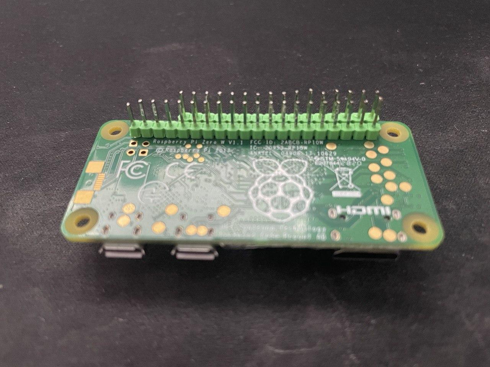

Of course, one could solder the cables on the Pi directly, but I wanted to leave room for potential adjustments down the road. As you'll see in a bit, that was a wise choice.

### Software Deployment
Now, of course, I was thinking about writing an actual deployment pipeline, or even to build Docker images - but when faced with a conflict between "fishing on the lake and doing nothing" and "configuring CI/CD from scratch", the former (fortunately) wins.

First, use [Raspi Imager](https://www.raspberrypi.org/blog/raspberry-pi-imager-imaging-utility/) to install a `Raspbian` OS. This should mount `boot` and `root` onto your PC.

Now, if you don't have a monitor for the `Pi`, we can enable `ssh` headlessly and then `chroot` the entire SD card. 

*`chroot`, in case you're not familiar, is like `docker`, just not as hipster. :)*

First, enable ssh by doing a `touch ssh` onto the mount point of `boot`. 

Then, to enable WiFi, copy your existing `/etc/wpa_supplicant/wpa_supplicant.conf` onto the same partition. If you don't have one or use macOS/Windows customize this:


ctrl_interface=DIR=/var/run/wpa_supplicant GROUP=netdev
update_config=1
country=US

network={
       ssid="YourNetworkSSID"
       psk="Password"
       key_mgmt=WPA-PSK
    }


Then, `chroot` the main partition:


sudo proot -q qemu-arm -S /media/$USER/rootfs


And run this setup script:


#!/bin/bash

if [[ $EUID -ne 0 ]]; then 
    echo "This script must be run as root"
    exit 1
fi

if [[ -z "${PI_IP}" || -z ${PI_DNS} || -z ${REST_ENDPOINT} || -z ${PI_ROUTER} ]]; then 
    echo "Usage: PI_IP=192.168.1.2 PI_ROUTER=192.168.1.1 PI_DNS=8.8.8.8 REST_ENDPOINT=http://server.local:7777 ./setup_pi_zero.sh"
fi 

# Install dependencies
apt-get update
apt-get install git python3 python3-pip python3-venv i2c-tools vim ntpdate

# Enable I2C, SPI
echo "Enable I2C and SPI manually by running raspi-config over ssh"
#raspi-config 

# Static IP
echo "interface wlan0" >> /etc/dhcpcd.conf
echo "static ip_address=${PI_IP}/24" >> /etc/dhcpcd.conf
echo "static routers=${PI_ROUTER}" >> /etc/dhcpcd.conf
echo "static domain_name_servers=${PI_DNS} 1.1.1.1 fd51:42f8:caae:d92e::1" >> /etc/dhcpcd.conf
echo "nameserver ${PI_DNS}" >> /etc/resolv.conf 

# Time
timedatectl set-timezone America/New_York
timedatectl set-ntp True

# Clone code 
cd /home/pi
mkdir -p /home/pi/workspace
cd /home/pi/workspace
git clone https://github.com/chollinger93/raspberry-gardener
cd raspberry-gardener/client
SENSORS="temp lumen moisture" # Customize

# Install 
mkdir -p /opt/raspberry-gardener
touch /opt/raspberry-gardener/.env.sensor.sh
echo "REST_ENDPOINT=$REST_ENDPOINT" > /opt/raspberry-gardener/.env.sensor.sh
echo "SENSORS=$SENSORS" >> /opt/raspberry-gardener/.env.sensor.sh
cp monitor.py /opt/raspberry-gardener/
cp -r max44009/ /opt/raspberry-gardener/

# Install packages as sudo if the sensor runs as sudo
pip3 install -r requirements.txt

# Systemd
mkdir -p /var/log/raspberry-gardener/
cp garden-sensor.service /etc/systemd/system/
systemctl start garden-sensor
systemctl enable garden-sensor # Autostart

# logrotate.d
cat > /etc/logrotate.d/raspberry-gardener.conf << EOF
/var/log/raspberry-gardener/* {
    daily
    rotate 1
    size 10M
    compress
    delaycompress
}
EOF


And run:

export PI_IP=192.168.1.2 
export PI_DNS=8.8.8.8 
export REST_ENDPOINT=http://server.local:7777 
./setup_pi_zero.sh

Of course, you could do that over SSH as well - which would be easier, but slower. `raspi-config`, however, must be run on an actual device, as it loads Kernel modules.

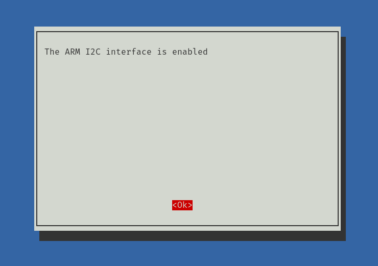

You might also want to customize the `logrotate` config in `/etc/logrotate.d`:

/var/log/raspberry-gardener/* {
    daily
    rotate 1
    size 10M
    compress
    delaycompress
}


We only need to run this once and `dd` the entire SD card to another `Pi`, or run it on each `Pi` - it doesn't really make a difference.

If you want to `dd`, I suggest you do that after booting the `Pi` and running `sudo raspi-config`:

sudo umount /media/$USER/rootfs
sudo umount /media/$USER/boot

sudo dd of=$HOME/$(date --iso)_raspberry_rootfs.img if=/dev/mmcblk0p2 bs=4M
sudo dd of=$HOME/$(date --iso)_raspberry_boot.img if=/dev/mmcblk0p1 bs=4M


Having an image is useful, so you might want to do this once it's working.

### A Quick Test
At this point, it would be advised to test the entire setup, for instance looking at the load:

And maybe check out Grafana, as the service will start running once you enable `I2C` and `SPI` via `raspi-config`.

## Building a new Enclosure
Let's get to building a new case! 

Originally, I wanted to "remix" (fork) an existing Pi Zero enclosure, like [this](https://www.thingiverse.com/thing:2171313
) one, but quickly learned that my CAD skills are way too fresh to work on actually functional models. So I started from scratch.

### Test Assembly
Before anything else, we must assemble the whole thing without a case to get a feel for how everything will fit together:

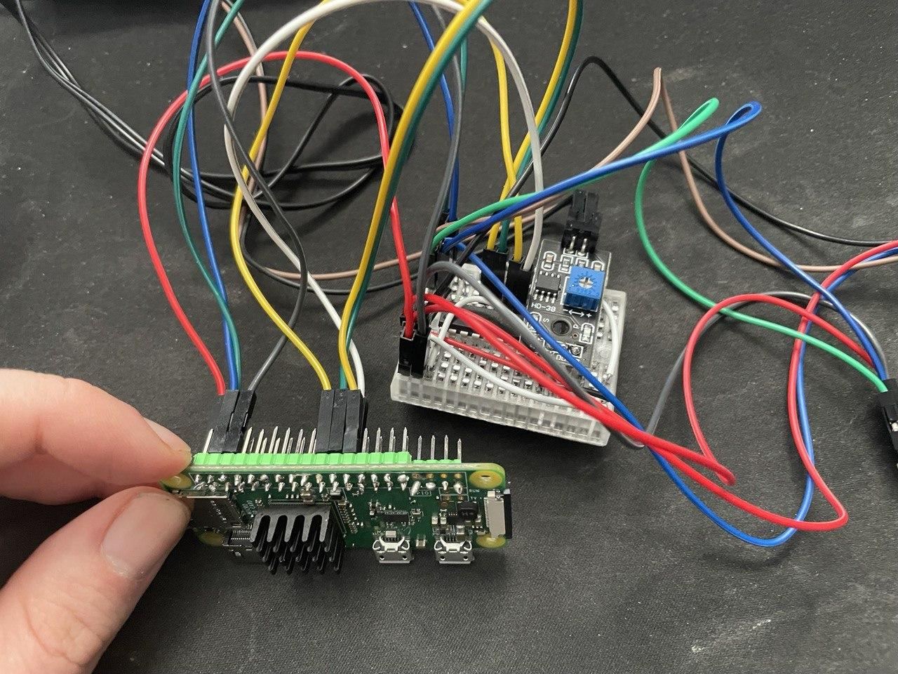

### Take Measurements
Next, I used some decently accurate calipers to measure all dimensions and drew some rough ideas on paper. 

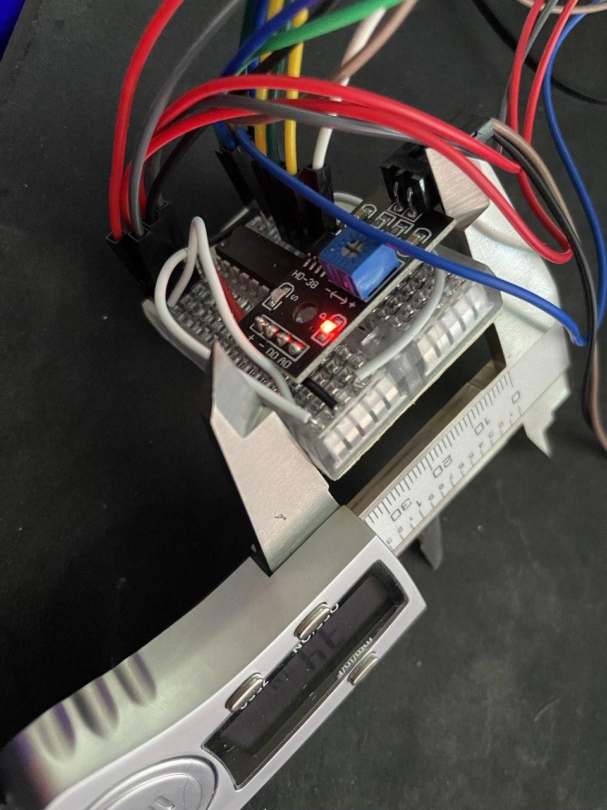

I will spare you from seeing the rough sketches.

### Foray into CAD
There are a lot of options available when it comes to CAD - but I chose Autodesk's free [Tinkercad](https://www.tinkercad.com), because it's pretty simple. Fusion 360 does have a free version for personal use, but it doesn't run on Linux. 

While I can't *stand* browser-based tools (eLeCtrOn wEb aPpS), they are sometimes easier than trying to force other software to play nice with Linux. It is what it is, as they say. 

Anyways, Tinkercad is aimed at hobbyists and students and comes with a colorful tutorial, which even I understood.

### The Design (v.1.0)
My design was very, very simple - but that might be because it was my first CAD design I've ever built - I am usually the type to measure once, cut twice. 

Fun Fact: There's a little piece of 2x4 in my shed with measurements written on it in sharpie. They do not match the 2x4's dimensions at all. That's all you should know - but, it usually works out. I did build all the raised beds on this property, after all!

Well, turns out, CAD needs more prevision than a circular saw. The idea behind the design isn't much different to other, commercial cases: 4 Pins stick together to hold the case together. Small cutouts support the exact placement of cables I need - just less cutouts than commercial cases. Also, the case has a lot more wasted space than it needs to, to support dupont cables without the need to solder things directly onto the headers.

Once I had something resembling a model based on these ideas and measurements, I exported the `.stl` file, loaded it into Cura and got to printing.

Naturally, I messed up the print settings and over-estimated the capabilities of the printer (which, ultimately, are dependent on the slicer settings) - the little support beams turned to spaghetti. 

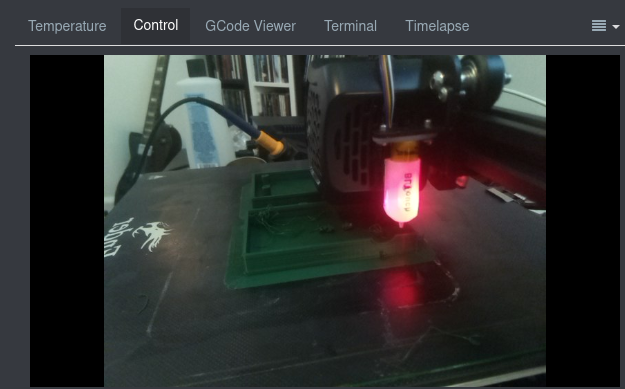

I also realized that the tolerances that I measured were a little too detailed for the print settings I set up in Cura, and I messed up other measurements altogether - in other words, the design wasn't very good.

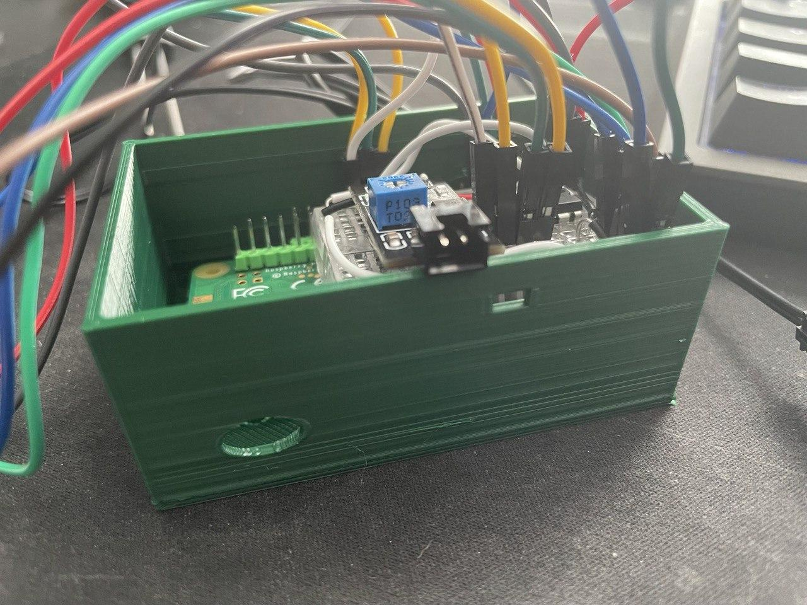

### Design (v2.0)
The second design followed a different philosophy: Larger tolerances that can be filled in later.

It also avoided flimsy support beams and relied on a top piece that was ever so slightly smaller than the bottom. It also moved the cutout for the moisture sensor to the top, giving the fit more play.

Last but not least, it added 2 support pyramids for the Pi itself, so it could sit safely on the bottom of the enclosure.

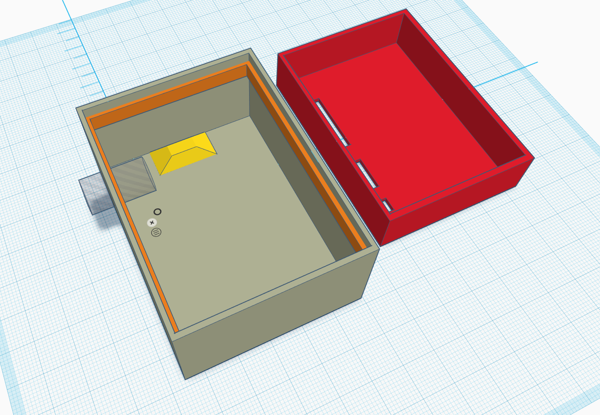

### The Waterproofing Issue
One thing was unfortunately not solved by this design: Water (or weather) proofing.

Now, while a purpose-built case will undoubtedly be a better fit than any commercial case (if you'd be able to find that that fits all the components), designing and printing something that takes seals and has very little tolerances is not within my current CAD skillset.

There are alternatives, however - namely *nail polish* and electrical tape, which I already used liberally last time. Nail polish is not electrically conductive, creates a good seal, but isn't particularly heat safe - supposedly until about 120C (248F). Given that this will only be applied to the 2 external sensors, I am not terribly worried about that part - I don't think my peppers are that heat-safe. 

While I don't plan to douse the entire Pi in nail polish, we can somewhat weather-proof the sensors, which **have* to be outside the case for accurate measurements. The connection between the sensors and the case are precise enough to be sealed with, you guessed it!, electrical tape.

There have been a lot of smart experiments conducted, regarding nail polish as a conformal coating alternative - from what I can tell, it works, but since there is no standard nail polish formula (as I found out at my local Kroger), some additives might mess with the plastic on the PCB.

Of course, if you foresee never having to access the Pi again, one could douse the entire thing in resin or silicone as well - but we'll stick to nail polish for now.

### Assembly
With the 2nd design printed, assembly was relatively straightforward: Just throw everything in, accept some design flaws for now and use more electrical tape for keeping it in place, and place the sensors into the top cutouts.

Naturally, everything being on a breadboard caused an issue everybody who built a desktop PC before knows to well - cable management. It was tight with standard-length cables, to say the least:

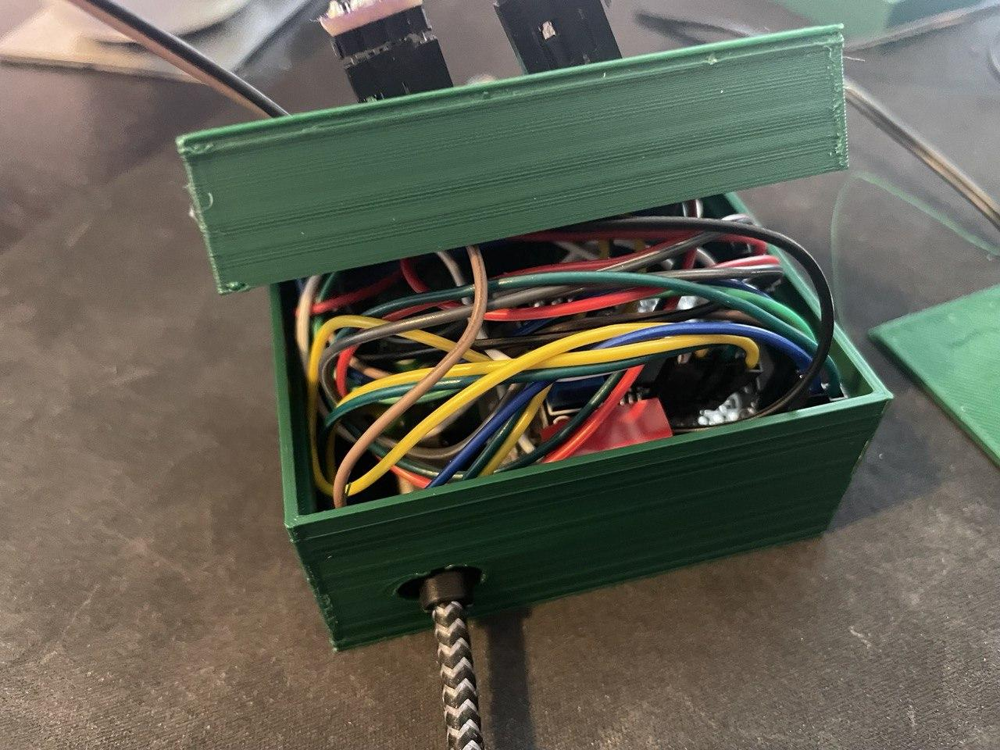

Options here include crimping some tiny cables myself or buying smaller cables. Or, of course, the school of redneck engineering always helps: De-sleeve a cable and tin the end with a soldering iron until it fits into the breadboard's slot (believe it or not, this works). A roll of 24AWG wiring would work too.

While I'm not trying to tell you how to live your life, I may be able to offer a word of advice: It is not worth spending an hour trying to frankenstein cables together and inhaling a lot of bad fumes while doing so, just to save $10 for a handful of wires. Or so I heard. Version 3.0 down below heeds some of that advice.

One related issue were the moisture sensors - I didn't account for long dupont end pieces in that spot. So I did what any sane person would do and just de-sleeved some cables and soldered them onto the PC directly, rather than doing another 4+hr print for ~5mm. 

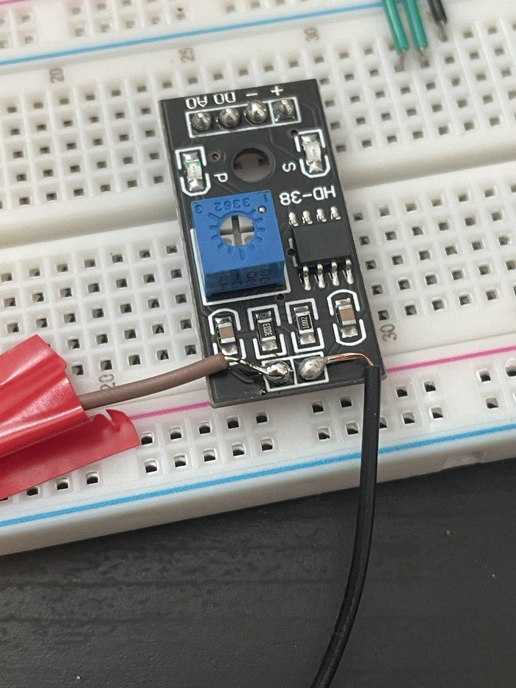

## Beta Testing Outdoors
With all that out of the way and the new backend service deployed (stop the `systemd` service, re-compile from `git`, copy the new binary over, and re-start the service - adjust the `.env.sh` file if you want emails), we are ready to test!

### Finding a spot
For this test, I moved the little box onto the deck first to keep watch over some of our pepper plants, namely a tremendously happy Capsicum Chinense "Habanero" (also just known as "Habanero Pepper" if you're a normal human being).

The only issue left is still the one of power delivery - I don't own an waterproof USB power brick. 

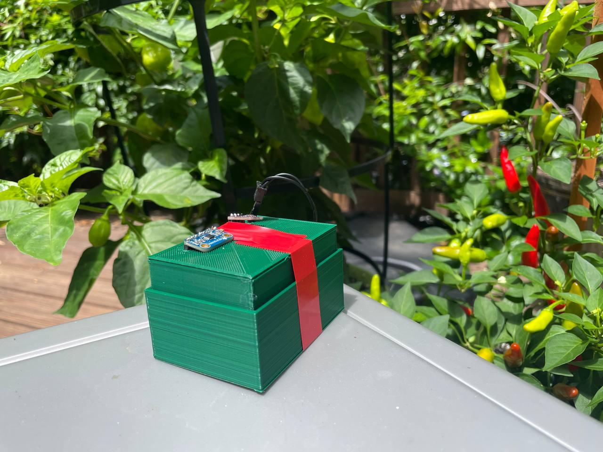

*(Ignore the tape - see the cable comment above - the next iteration won't need it)*

In any case, I threw the box out there at about noon before heading off to buy pesticides to try and save about 30 cauliflower plants from pests, as well 10 cu-ft of mulch, because obviously, the garden-ride never stops. 

Before leaving though, a quick peak at the database shows that the little box starts collecting data as soon as it gets power, thanks to the `systemd` service (I'd call that "plug and play").

And after about 2 hours, we can find good data for Light and Temp:

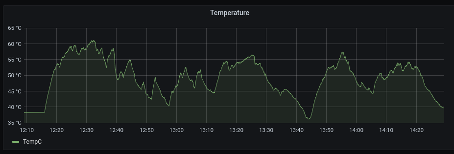

We can see some seriously impressive peaks here - over 60C (140F) in direct sunlight (much higher than the 40C peak we configured in the backend!). This isn't overly surprising - cars parked in the sun can reach similar temperatures (in hindsight, that would explain why my truck seemingly tries to boil my sunglasses practically every day).

However, we can see that the ADC didn't collect data:

Which, turns out, was an invalid pin wiring on the `MCP3008` - so we get voltage fluctuations reading as data. Please see [Part 1](https://chollinger.com/blog/2021/04/raspberry-pi-gardening-monitoring-a-vegetable-garden-using-a-raspberry-pi-part-1/#analog-sensors--soil-moisture) for a deep dive on that - the summary is, an ADC will always report values, even if they're not really based on anything.

### Fine-Tuning and Troubleshooting
After fixing that mistake, I also printed the top case another 10mm taller, although that didn't solve all problems - the case was still a very tight fit and some printing imperfections made fitting both parts together not easier.

It also happened way too often that some of the dupont cables fell out during assembly - something you'd only realize once the whole thing is sending data. 

I2C and  SPI are also especially charming in that regard, because once there is current on the data or sync line, they show up as connected, despite there maybe being no power on the sensor (because the cable decided to fall out). The sheer size of the 10-20cm cables got in the way too often.

This won't do.

## Version 3.0 and Deployment
This would be the final version for the purpose of this article.

### Assembly
The only way I could use to optimize this was to actually solder everything together with regular standard 24 AWG wire directly, as well as using some 50mm dupont cables - reducing the wire length and density around all connections that are not on the breadboard itself (as it's easy to use jumper wires here). 

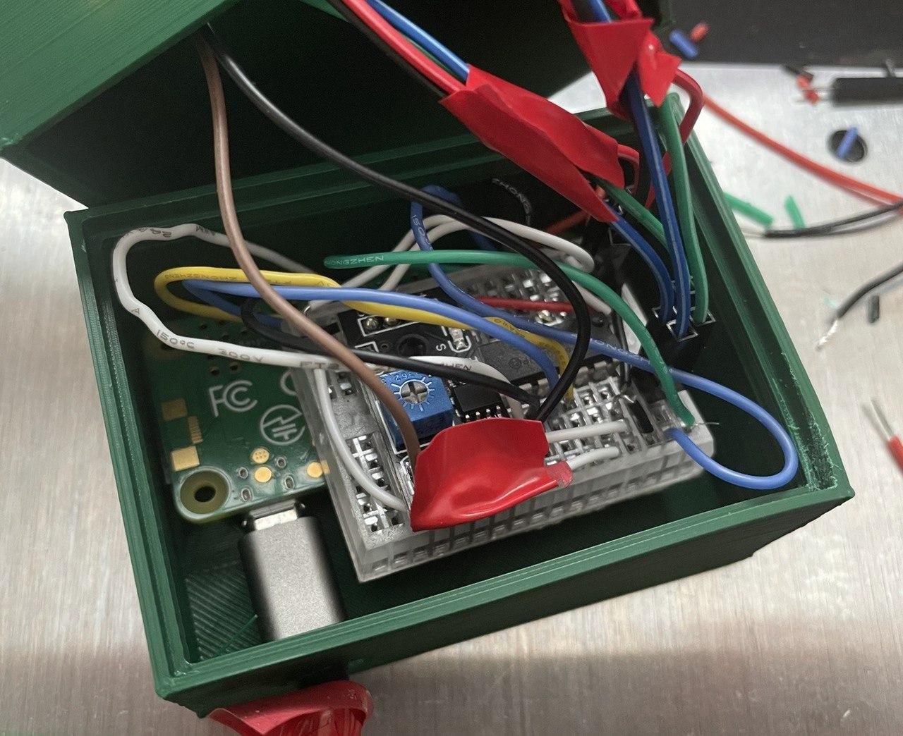

More on that later.

### A Final Test Indoors 
Finally, the little box was ready for its deployment in the (literal) field. Before doing that, though, I left it run over night hooked up to a low-light plant in the kitchen, to make sure everything worked properly for the last time:

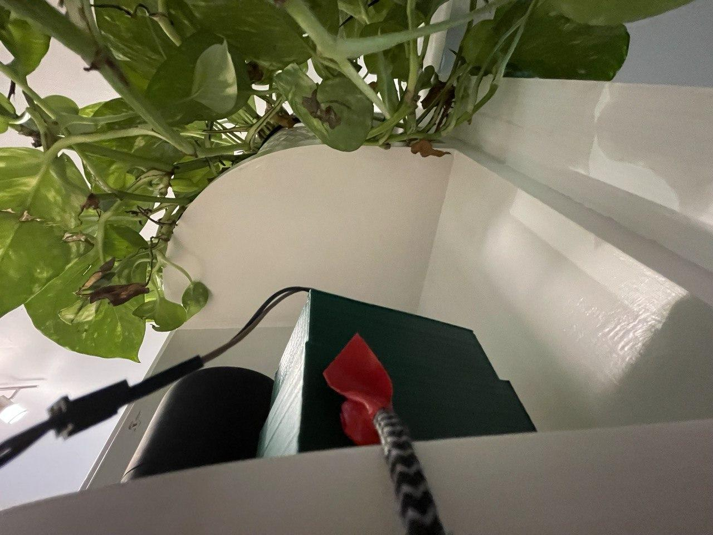

Which I'm sure glad I did, because if you short `SDA` and `SCL`, this is what `i2detect` does:


pi@raspberrypi:/var/log/raspberry-gardener $ sudo i2cdetect -y 1
     0  1  2  3  4  5  6  7  8  9  a  b  c  d  e  f
00:          03 04 05 06 07 08 09 0a 0b 0c 0d 0e 0f 
10: 10 11 12 13 14 15 16 17 18 19 1a 1b 1c 1d 1e 1f 
20: 20 21 22 23 24 25 26 27 28 29 2a 2b 2c 2d 2e 2f 
30: 30 31 32 33 34 35 36 37 38 39 3a 3b 3c 3d 3e 3f 
40: 40 41 42 43 44 45 46 47 48 49 4a 4b 4c 4d 4e 4f 
50: 50 51 52 53 54 55 56 57 58 59 5a 5b 5c 5d 5e 5f 
60: 60 61 62 63 64 65 66 67 68 69 6a 6b 6c 6d 6e 6f 
70: 70 71 72 73 74 75 76 77  


Oh well. ヽ(´ー` )┌

Indoors, especially at night, the only somewhat relevant metrics are temperature - 25C/77F seems reasonable with the AC off at night - and soil moisture, which won't change that quickly. As we remember from the last article, 1.5V is "damp soil". It works!

Lumen is constantly at zero, however - please see [below](#data-analysis--reminders) for an attempt at explaining that.

### Outdoor Deployment & Data Collection
The next morning around 8:30am, I finally deployed the little green box inbetween my carrots and cucumbers:

Godspeed, little one!

### Data Analysis & Reminders
And what a day it had! I turned off the RasPi at around 10:30pm, after a gorgeous evening with many a magical firefly:

So let's take a look at all the metrics throughout the day!

#### Lumen/Light

This one is really interesting - you can see the peak at about 900 Lux.

Now, looking at Wiki, 900 lux is roughly an "Overcast day".

The whole scale is logarithmic, so looking at values <= 0 is a bit of a challenge with Grafana - we can, however, find those values on the database. However, looking at the sensor's [spec sheet](https://datasheets.maximintegrated.com/en/ds/MAX44009.pdf), I don't think values <= 0 should be regarded as valid (as the `python` program on the `Pi` is running with fairly standard settings).

Also - 

> The illuminance provided by a light source on a surface perpendicular to the direction to the source is a measure of the strength of that source as perceived from that location. 
>
> For instance, a star of apparent magnitude 0 provides 2.08 microlux (μlx) at the Earth's surface.
>
> A barely perceptible magnitude 6 star provides 8 nanolux (nlx). The unobscured Sun provides an illumination of up to 100 kilolux (klx) on the Earth's surface, the exact value depending on time of year and atmospheric conditions.
>
> This direct normal illuminance is related to the solar illuminance constant Esc, equal to 128000 lux (see Sunlight and Solar constant). 

So the angle - that being parallel to the ground - might have played quite a big role. As any measurement of a I2C sensor is relative by nature, let's take a look at...

#### Temperature
... the temperature and see if we can correlate the two to compensate for less-than-ideal calibrations. The iOS weather app said 84-86F during the day (29-30C), which is a pretty average summer day around here.

Looking at the sensor's metric, we'll find peaks of up to 50C (122F), which correlate to the peaks in lumen, but are not nearly as strong as they were on the deck (which is, if you recall from part 1, right above the observed raised bed):

So we can reasonably conclude: The carrots, cucumbers, and bell peppers under observation do *not* get 6 hours of full sunlight a day (the common metric for "full sun"), but closer to ~3hrs, which would qualify as "part sun". All the hot peppers, however, get to deal with 60C+ and ~1.5k lumen - which probably explains why they're growing at the rate they are, mere feet away from the other plants.

#### Moisture
This one is rather boring - while I did water the beds at around 5:30pm, given the sheer volume of top soil (they are raised beds, after all), a couple of gallons across ~50sqft probably didn't make a difference:

Unless you water the specific spot where the prongs are, the measurement won't change too much, unless the entire bed is dried out, at which point you probably shouldn't be looking at Grafana, but be out there with a watering can or a hose in your hand.

They do work well on small pots, however - in raised beds, maybe a different method might be in order.

### Criticism and next Steps
Let's to another retrospective after all those improvements - or at least, something of the sort.

The new enclosure turned out to be a bit of a Frankenstein - I do have some solderable mini breadboards on the way, but at the time of writing, I did not - so it's a mix of soldered cables, semi-fixed connections, and electrical tape. Connections to get lose and cause issues, and it's hard to figure out why, as a single strand of copper can short it. The `i2c` lanes especially are loose all the time.

But the box does finally close and due to the lack of precision (0.2/0.4mm print with PLA @ 210C), sticks together really, really tight (which is good!). It is impossible to tell whether it's on, though - a status LED would be a good addition.

I also only have one `MCP9808` here, so short of de-soldering the pins or soldering wires onto them, I had to use more DuPont cables here. It does work fairly well though, as they keep the sensor in place without a special enclosure.

Besides the mix of cables, the (new) Pi also flops around a bit, needing to be held in place with tape, as my little pyramid-spacers only apply pressure from the bottom, and my precision measuring, designing, and printing skills leave too much to be desired to do anything complicated. Folks with a lot more experience under their belt have built some amazing cases, however - so there's something to strive towards.

All things considered, it's far from perfect, but still pretty a-OK, considering my starting position. But like so many things, one can always optimize away further and further. 

In this *case* (heh), I'll probably try and work on a version 4.0, but mostly for my own enjoyment. In terms of functionality, it's already there: It fits together, it works, it's small at 75.8x54.7x57.5mm, and with a bit of sealant around the sensor spots, I'm pretty sure its decently weather-proof.

When it comes to software, I actually have nothing to complain about (apart from code quality, which wasn't the focus of this project). The base image on the SD card we built earlier works like a charm (I tested it by using a fresh Pi for the soldered version), and the Pi starts the service on boot, doesn't run hot, therefore doesn't use a ton of resources, and just does what it's told.

So, in summary, an eventual version 4.0 should - 
- Have a little status LED
- Don't rely on DuPont connectors, anywhere
- Use soldered connections and no breadboards
- Keep the `Pi` safely in place
- Maybe provide more purpose-built enclosures for the sensors themselves
- And be  a lot more sturdy overall

## Conclusion
Well, I must say, I enjoyed this project quite a bit, and probably more than previous ones. Granted (and I've said it before), I wouldn't exactly describe it as *necessary* - but I'd also wager that growing that many vegetables and then turning them into pickles (because 2 people can't eat that much) or lacto-fermenting peppers into hot sauce (for the same reason), or smoking and curing my own bacon (for the reasons of store-bought bacon being rather lackluster) is *necessary*, especially if you have a grocery store 10 minutes away from the house.

However, if we ignore the time and money spent on it, the resulting green box is actually pretty useful: It does take a lof of guesswork out of the gardening work. Sure, it doesn't solve many of the other problems, like the poor Sugar Snap Peas that succumbed to a fungus - but it does supply interesting data.

Take a look at those guys, for instance:

*Daucus carota* should have matured, i.e. be around 5" long and 1 1/2" across, 10-20 days before this picture was taken. Carrots enjoy full sun - and where they're sowed, presumably, they won't get full sun. With the power of technology, I probably won't plant them down there again, because I now know, that they don't get the ~6hrs of full sun they need.

On a more broader level, however, this was also an amazing learning experience throughout. If you spend your day job as a Software Engineer (or anything vaguely related), be it Junior or Principal, you might be in the same position I found myself in: You have no idea how electronics, computer aided design, soldering, middle school physics, I2C/SPI, or any of the above really work. It's simply not part of the daily job, albeit technically pretty closely related to that.

However, as the last few sections of this article demonstrate, the whole process is also very (and I hate myself for using the word) *agile*. The product is never finished, but at a certain point (in my case, near the end of my staycation), an MVP must be delivered - even though I have a lot to complain about (i.e., a lot to improve). Having this particular mindset is a core attribute of a good engineer, at least in my opinion.

You will probably notice this iterative approach while reading the article, as I wrote sections shortly after I worked on the thing, as opposed to supplying a summary at the end - so you can follow this journey along, if you are so inclined.

Going through a project like this, meaning starting from scratch and figuring things out as they come along, all the way to integrating it with known technologies (from a Data Engineering perspective, specifically `go`, `SQL`, `python`) is just... *neat*. It's a fun way of using existing skills, enhancing them, and learning a lot of completely new things along the way, and much more so than "just" a software project (unless it's `TempleOS`, maybe).

In any case - I hope you learned something as well or, at the very least, found this journey as entertaining to read as I found building it.

And if you want to build one yourself: All code is available on [GitHub](https://github.com/chollinger93/raspberry-gardener). You can also find all [CAD](https://github.com/chollinger93/raspberry-gardener/tree/master/cad) files there.

_All development and benchmarking was done under GNU/Linux [PopOS! 20.10 on Kernel 5.11] with 12 Intel i7-9750H vCores @ 4.5Ghz and 16GB RAM on a 2019 System76 Gazelle Laptop, as well as a Raspberry Pi Zero W, using [bigiron.local](https://chollinger.com/blog/2019/04/building-a-home-server/) as endpoint_