## Introduction
I'm not exactly known as the most straightforward person when it comes to using tech at home to solve problems nobody ever had. [Writing a Telegram Bot to control a Raspberry Pi from afar (to observe Guinea Pigs)](https://chollinger.com/blog/2021/08/writing-a-telegram-bot-to-control-a-raspberry-pi-from-afar-to-observe-guinea-pigs/) might give you an idea with regards to what I'm talking about.


### Background
So, when my SO and I started looking to move out of the city into a different, albeit somewhat undefined area, the first question was: Where do we even look? We knew that we wanted more space and more greenery and the general direction, but that was about it.

See, the thing is, this country - the US, that is - is pretty big. Our search area was roughly 1,400sqmi, which is  larger than the entire country of Luxembourg. The entire Atlanta Metro area is about 8,400sqmi, which is larger than the entirety of Slovenia. 

In order to narrow that search area down, the first thing that came to mind was not "I should call our realtor!", but rather "Hey, has the 2020 Census data ever been released?".

So I build a **Mini Data Lake** to query demographic and geographic data for finding a new neighborhood to buy a house in, using `Spark` and `Apache Iceberg`. As you do. 

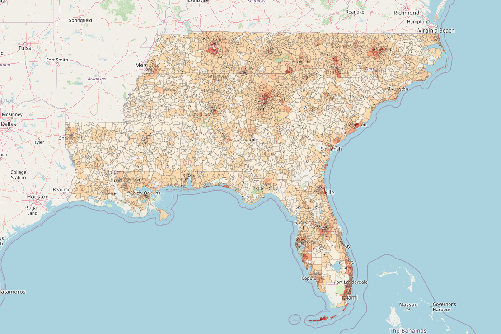

We'll be talking about **data** and the joys of geospatial inconsistencies in the US, about **tech** and why setting up `Spark` and companions is still a nightmare, and a little bit about **architecture and systems design**, i.e. how to roughly design a Data Lake. 

Join me on this journey of pain and suffering, because we'll be setting up an entire cluster locally to do something a web search can probably achieve much faster!

### On Data Lakes
I'll refer to the team over at AWS to explain what a Data Lake is and why I need one at home:

> **What is a data lake?**
>
> A data lake is a centralized repository that allows you to store all your structured and unstructured data at any scale. You can store your data as-is, without having to first structure the data, and run different types of analytics—from dashboards and visualizations to big data processing, real-time analytics, and machine learning to guide better decisions.
> 
> ...
>
> A data lake is different [than a data warehouse], because it stores relational data from line of business applications, and non-relational data from mobile apps, IoT devices, and social media. The structure of the data or schema is not defined when data is captured. This means you can store all of your data without careful design or the need to know what questions you might need answers for in the future. Different types of analytics on your data like SQL queries, big data analytics, full text search, real-time analytics, and machine learning can be used to uncover insights.
> 
> https://aws.amazon.com/big-data/datalakes-and-analytics/what-is-a-data-lake/



### Approach
In order to make this happen, here's what we'll talk about:

1. First, we'll talk about the end goal: [Rating neighborhoods](#rating--goal) using a deterministic approach
1. Then, we explore potential [Data Sources](#data-sources) that can help us get there
1. Once we understand the data, we can [design a Data Lake](#designing-a-mini-data-lake) with logical and physical layers and the [tech](#technology) for it
1. We then go through the build phases: [1) Infrastructure](#the-1st-build-phase-setting-up-infrastructure), [2) Ingestion](#the-2nd-build-phase-ingestion), [3) Transformations with Spark](#the-3rd-build-phase-transformations), and finally, the [4) Analysis & Rating](#the-4th-build-phase-analysis)

Let's go!

## Rating & Goal
The overarching goal for the Data Lake we're about to build is to find a new neighborhood that matches our criteria, and those criteria will be more detailed than e.g. a Zillow search can provide. 

So, one thing even a normal person might do is to establish deterministic criteria and their *relative importance* for comparing different options.

### Selection Criteria
This, of course, is a very subjective process; for the purpose of this article, I'll refrain from listing our specific criteria, and rather talk about high level categories, such as:

- Travel Time & Distance to work/gym/family
- Median Home Value
- Population Trends 
- Crime Levels

For instance, the most beautiful and affordable neighborhood in the state wouldn't do me any good if it means driving 4hrs one way to any point of interest that I frequent (such as Savannah, GA - one of the most gorgeous places in the state in my book, but a solid 4hr drive from Atlanta). At the same time, an area that is close to everything, but has an average price of $500/sqft isn't desireable for me neither.



However your specific criteria look like, the logic I used to determine the relative score of an area is based on the following script:


class RatingCriteria:
    def __init__(self, min_v, max_v, weight=1, order='asc'):
        self.min_v = min_v
        self.max_v = max_v
        if weight < 0 or weight > 10:
            raise Exception()
        self.weight = weight
        if order not in ['asc', 'desc']:
            raise Exception()
        self.order = order
        
    def rate(self, val) -> int:
        if not val:
            return 0
        if self.order == 'asc':
            vals = list(np.linspace(self.min_v, self.max_v,5))
        else:
            vals = list(np.linspace(self.max_v, self.min_v, 5))
        return vals.index(min(vals, key=lambda x:abs(x-val))) * self.weight

# ...

def score(self, r, ratings):
    total_rating = 0
    max_rating = len(ratings) * 5
    for k in ratings:
        rating = ratings[k].rate(r[k])
        total_rating += rating


So, in other words: Each criteria has a `min` and `max` score, as well as a `weight` to set importance. The highest a single criteria can score is 5, but this can be multiplied by the weight, for a theoretical max of 50 each.

### An Example
_For example_: Potential neighborhoods are between 0 and 50 miles from your favorite coffee shop, and you really like that coffee shop, so it's twice as important as others.

We wind up with the following:

```
min=0, max=50, weight: 2, descending order (lower is better)
[50.0, 37.5, 25.0, 12.5, 0.0]
```

Now, a potential candidate that is 25mi away from that coffee shop would score a 2/5, since the closest index in the set is 2 (so the worst option, `index 0` scores a flat 0). However, with our factor of 2, this criteria now scores a __4/5__.

Rinse and repeat with a rating engine tuned to your liking and you get a super-simple, but data-driven rating engine for potential neighborhoods. This is also the key driving force for going the homebrew route, rather than just... you know, looking at one of the million websites that already do this.


### Means to an End
*This is the end goal of this "Data Lake"*. Where commercial (i.e., real), productionized self-service data environments are usually open for Data Scientists and Analysts to answer questions, for this article, all I want to do is to run the rating algorithm described above - without having to re-write code each time I want to add or change rating criteria.

## Data Sources
With that established, let's talk data before. While the above would certainly work by maintaining an Excel list and doing it by hand (one might argue that is more... reasonable?), a lot of that data can be extracted from the internet.

### Census Data & ACS
The first obvious data source that comes to mind is the US Census. Every 10 years, the US government asks every household to fill out a form (online, these days) with some very basic questions - basics demographics, number of people living in the household, and whether the place is owned or rented. 

While this data is critically important for the US government, it doesn't contain any really useful information to datamine for the purpose of rating potential neighborhoods. 



And that's where the __American Community Survey__, ACS for short, comes in. This survey is much more detailed, but only answered by about 1% of the US population per year. The Census Bureau then aggregates that data into geographic summaries - we'll get to why that's more complicated than it has any right to in a minute - and makes it available [online](https://www.census.gov/programs-surveys/acs/news/data-releases.html).

Many a website, both for and not-for profit, then aggregate this data. The one I found most pleasant to work with is [censusreporter.org](https://censusreporter.org/).

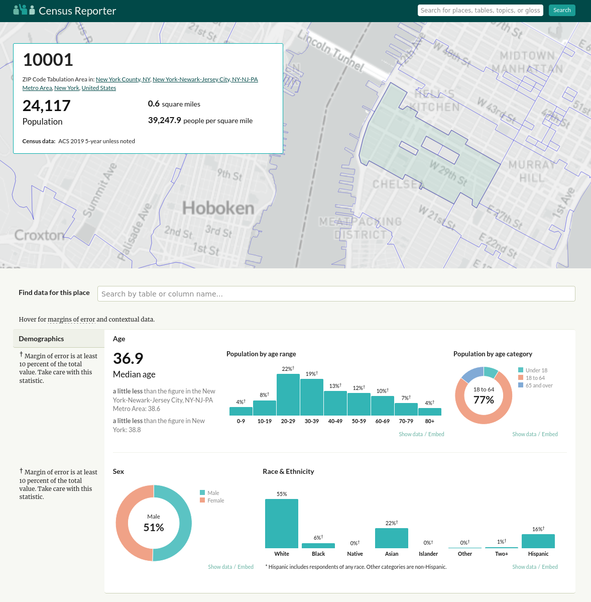

This gives us almost all demographic data one could ask for - median age, income, home values, population density, single-family vs. multi-unit buildings, vacancies, population migration etc.


### FBI Crime Data 
Crime Reporting is non very standardized, but local police departments have the opportunity to participate in the FBI's Uniform Crime Reporting (UCR) program. 

>The UCR Program includes data from more than 18,000 city, university and college, county, state, tribal, and federal law enforcement agencies.
> Agencies participate voluntarily and submit their crime data either through a state UCR program or directly to the FBI's UCR Program.
> 
> https://www.fbi.gov/services/cjis/ucr

This data contains number of incidents, offenses, active duty officers and civilian employees in the respective agencies, all organized in a neat, relational database that gets shipped as `csv` files, complete with `sql` scripts to import them, as well as full data dictionaries. It's pretty great. 

This system of standards is called NIBRS, and about 48.9% of all law enforcement agencies participate. [1] 

In other words, the data is incomplete, since it's voluntary to contribute and agencies need to follow the standards set by the FBI. Why the spotty coverage here might wind up a problem: More on that later.

At this point, one could have a debate on the pros and cons of super-heavy data standardization, and why it doesn't save you from having garbage data in your system at the end of the day, but I'll refrain from doing that for now (let's just say that "unknown" can be a 2-figure percentage for a group by on this data on many aggregate columns).

[1] [https://en.wikipedia.org/wiki/National_Incident-Based_Reporting_System#cite_note-4](https://en.wikipedia.org/wiki/National_Incident-Based_Reporting_System#cite_note-4)

### Geocoding & Travel Times  
Last but not least, there's also the one thing that no online system will tell us out of the box: Travel times!

For this, [Mapbox](https://docs.mapbox.com/api/navigation/matrix/) has a neat API with a generous free quota that allows us to calculate travel times in a `N*N` matrix with a single REST call.


# Request a symmetric 3x3 matrix for cars with a curbside approach for each destination

curl "https://api.mapbox.com/directions-matrix/v1/mapbox/driving/-122.42,37.78;-122.45,37.91;-122.48,37.73?approaches=curb;curb;curb&access_token=pk.eyJ1IjoiY2hvbGxpbmdlciIsImEiOiJja3cyYmE1NjgxZ2Q5MzFsdDBiZ2YzMzVoIn0.cWAHk9E_W10N5UxKdaH1Rw"
# From: https://docs.mapbox.com/api/navigation/matrix/


For this, we need coordinate pairs for each location. Fortunately, Mapbox also allows us to do reverse geocoding (to get lat/long values for a location query), which I've [explained before](https://chollinger.com/blog/2018/03/analyzing-twitter-location-data-with-heron-machine-learning-googles-nlp-and-bigquery/#reverse-geocoding--clustering-indecisive-answers).


### A Word on Geography
Before we look at the implementation, here's a word on geography: Nothing matches and everything is horrible.

Here's how the ACS is organized:
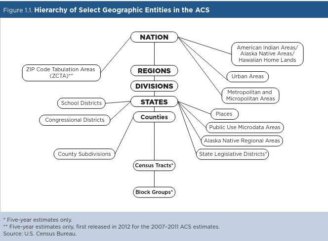

I'd like to focus your attention onto the lower part of this tree, where you might find very little data regarding ZIP codes or neighborhoods, so exactly the type of data that we're looking for here. Why's that?

Well - take a look at this (data from [here](https://github.com/OpenDataDE/State-zip-code-GeoJSON)):
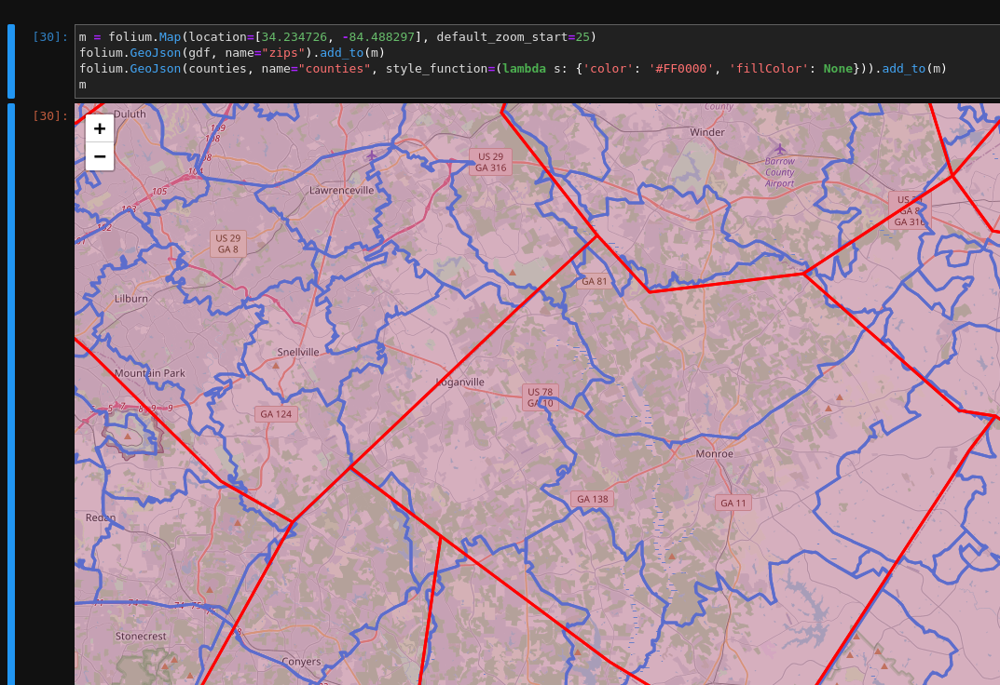

Loganville, GA has the ZIP code 30052 (highlighted in blue), but is right on the county border of Walton and Gwinnett county. 

But, wait, it gets better: ZCTAs and ZIP codes are *not the same*. While they *mostly* match, ZCTAs are regarded to be more stable than ZIP codes. [This article](http://gis.washington.edu/phurvitz/zip_or_zcta/) from the University of Washington explains this better than I could, so I'll refer you there.

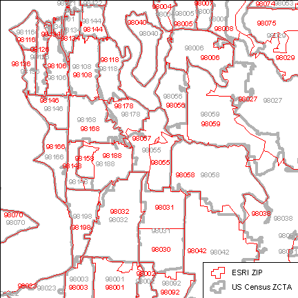

*In addition to this*, the FBI also has its own system for geographies.

> Each city and town will be associated with the appropriate UCR ORI number. 
> These data can be converted by the federal agency into a database, thereby providing an automated means of determining the ORI number based upon the name of the town within the state.
> The suggested data elements are:  Town/City Name, State Abbreviation, ORI Number, County Name, and Source (as mentioned above). 
>
> **The Zip Code is not being included in order to avoid problems associated with Zip Code changes and Zip Codes covering more than one county.**
>
> https://ucr.fbi.gov/nibrs/nibrs_dataspec.pdf, pg. 75

(╯°□°)╯︵ ┻━┻

Oh, and one more thing:

> There are 13 multi-state US Census' ZIP Code Tabulation Areas (ZCTAs): 02861, 42223, 59221, 63673, 71749, 73949, 81137, 84536, 86044, 86515, 88063, 89439 & 97635.
> 
> https://gis.stackexchange.com/questions/53918/determining-which-us-zipcodes-map-to-more-than-one-state-or-more-than-one-city/223445

In case that wasn't enough.

### Data Summary
In summary, to make this work, we need the following:
- ACS/Demographic data for a chosen geography that we can break down into roughly demographics, social, geography, economics, family, and housing data (the rough categories one can structure the ACS surveys into)
- NIBRS FBI Crime Data for a given state, and, if applicable, other geography
- Geospatial data for all this (given the less-than-optimal geography data and because I just miss point-in-polygon algorithms way too much)


## Designing a (Mini) Data Lake
With this out of the way, let's come up with a somewhat general-purpose data model.

### Data Exploration
The way I explored the data outlined above was by throwing together some `Jupyter` notebooks and just playing around with `pandas`, `numpy`, and `folium` to explore the data. Since this is very boring and I, unfortunately, won't be open sourcing the code for this (since it contains my *actual* search area), I'll spare you the details. I've called out the most important findings in their respective sections in this article, though.


### The Logical Layout
At this point we understand the data, the goal, and the constraints; we can now design a rough layout for the overall Lake. Despite this happening at home, it's modelled after many a large, real-world Data Lake use case.


The idea is fairly simple: We first collect all raw sources we can get our hands on and store them "as is" on a **raw landing layer**; this is a data ingestion step that would usually be a scheduled (or real-time process).

In this case, we simply acquire the data once and store it, as we get it, on disk (or, of course, `S3`/`GCS`/`hdfs`/...). This data is *immutable*, we will only read it and make it accessible, but not alter the raw layer [1]. 

This data can be in different formats; the most important thing here are *standards* and *structure*. We should be able to ask a question and get an answer via following a ruleset of naming conventions (e.g., "all zips in Georgia" would lead to `data/states/GA/zips.csv`, and their respective `GeoJson` polygon boundaries to `data/states/GA/zips.geo.json`) [2].

After that, we'll use `Spark` and `Iceberg` (more on that in a second) to transform and enrich the data and build out the cleaned and standardized `Data Lake` itself, in something I'll call the **Cleaned Data**. This is the baseline for the **Analysis** portion that'll run the rating algorithm.

This layer is more complicated and will actually depend on `Iceberg` - here, tables can depend on one another (e.g., travel times can depend on geographies), and everything in this layer should be *enriched* in some way, shape, or form. "Enriched" can mean many things, but in this case, the focus will be *structured data*, i.e. having everything available in a single format within `Iceberg` tables, optionally indexed via `Hive` if so desired.


Lastly, I'd like to mention one thing: For a larger, enterprise-scale (aka: "Not just built by one guy on free evenings"), **I'd always advocate in favor of a three layer system**: *Raw* data (as we have it), *Cleaned data* (similar to what we have it, but closer to the source, e.g. by importing all FBI data "as is" - which we won't do, as you'll find below), and an *Access Layer* that combines datasets for specific use cases.

Other use cases might warrant a truly chaotic Lake, where you don't define specific layers at all; in my experience, reality usually falls somewhere in between strict layer separation and wild growth.

Here, we're sort of **combining the middle and last layer for the sake of brevity** - in the real world, having this abstraction and isolation makes adding specific use cases on the right hand side of the diagram so much easier down the line.

[1] We will make *some* minor adjustments to allow for partitions and the like - but without changing any content or adding any information.

[2] In a real-world case, you'd obviously have a metadata layer that contains this information, as well as boring old documentation that says as much. 

### The Physical Layout
The paragraphs above build what one might refer to as the "logical" layout, at least high-level; the **physical** layout is how the data is actually structured. We'll be calling out some real paths below, but for an overview, I refer you to the following diagram:

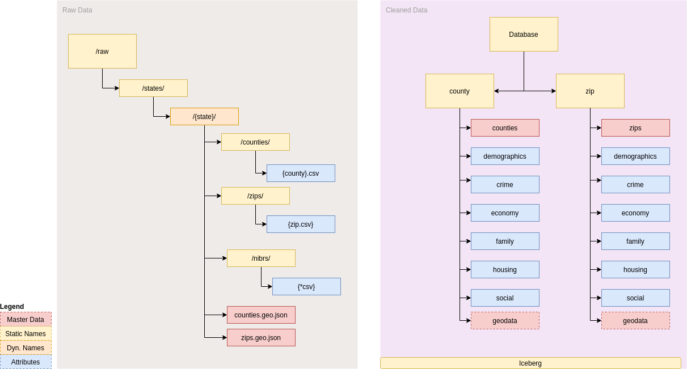

The way to read this is straightforward: Left hand are files, right hand is mostly iceberg. Everything marked "Master Data" is regarded as the source of truth, e.g. there is a definitive list of counties. Everything in blue is an individual attribute or, in more Data Warehouse terms, maybe a "Fact".

Curly brackets means variables, so e.g. `/raw/states/GA/counties/Gwinnett.csv` would be a full path. On the right hand side, we'll combine all states into one view, with set standards, such as that each table should contain a `state` row.

The format and names are arbitrary here, but important to set the stage for the implementation and explain the rough lineage of the data once it hits the Lake.

### Setting Data Rules & Standards
We'll set some implicit standards during the implementation below that I won't call out in detail here - for instance, each table that references a county should call that column `county`, but as a summary, here are some overall standards we'll use:

- We'll use metric, for better of for worse, instead of imperial
- Column should use a `Pythonic` style naming convention, using `lowercase_with_underscores`
- Common columns, such as `land_area_sqm`, should always be called that
- Each geographic entity should contain a `geo_id`, `timezone`, `lat`, and `long` values, where available/applicable; this allows for proper geospatial analysis
- The column `state` refers to the postal abbreviation, e.g. "DE" -> "Delaware" (and not "DE" -> "Deutschland" -> "Germany")
- County names should *not* contain "$NAME County, $STATE", but just the name (i.e., not "Laramie County, Wyoming", but rather just "Laramie", alongside a `state` column as "WY")
- Column names should indicate their unit where ambigious, e.g. `_percent`
- Each table should have a time dimension (e.g., just a `year` column)
- Each table should have metadata, such as a `last_updated_timestamp`
- Each timestamp should be UTC and stored as `DATETIME` (fight me on this - EPOCH is worse to deal with)

All these standards, as well as all schemas, would be documented in a real Data Lake project; here, we're just imply a whole lot by means of comments in the code.

## Technology
Let's pick some tech we can use to build this project.

### The Original Project: What to avoid
The original, `Jupyter` based version I used stored local `feather` files, which were representations of `pandas` Dataframes, that were then rendered into a set of `html` files and maps that you access via the `nginx` server on [bigiron.lan](https://chollinger.com/blog/2019/04/building-a-home-server/). A little `REST` server allowed me to just re-trigger that process for new ZIPs.

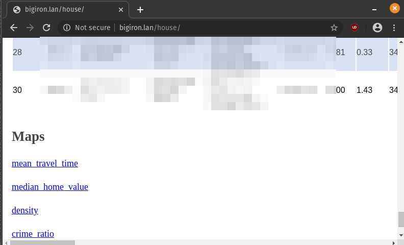

This was... not great. Adding attributes was a big of a nightmare, and asking different questions was a matter of re-writing half a notebook. It was a classic case of a quick analysis question - where `pandas` is of course fantastic - turning into something bigger that benefits from a solid architecture.

### Apache Iceberg
So, it took this as an opportunity to finally take [Apache Iceberg](https://iceberg.apache.org/) for a spin.

> Apache Iceberg is a new table format for storing large, slow-moving tabular data. It is designed to improve on the de-facto standard table layout built into Hive, Trino, and Spark.
> 
> https://github.com/apache/iceberg

`Iceberg` supports schema evolution, snapshots/versioning, heavy concurrency, `Spark` integration, and provides concise documentation. Under the hood, it's using either `Parquet` or `ORC`, alongside metadata files - here's an example:


christian @ pop-os ➜  db git:(master) ✗  tree
.
└── states
    ├── data
    │   └── 00000-1-b66828d8-a8be-46a6-9f39-e3de1099dc3c-00001.parquet
    └── metadata
        ├── 95a21b37-6518-45cb-aa83-c443844df7e9-m0.avro
        ├── snap-7752287268855677455-1-95a21b37-6518-45cb-aa83-c443844df7e9.avro
        ├── v1.metadata.json
        ├── v2.metadata.json
        └── version-hint.text


When it comes to actually using it (and why you might want to), `Iceberg` has this concept of ["hidden partitioning"](https://iceberg.apache.org/#partitioning/), which simply means that `Iceberg` doesn't rely on user-supplied partitions and hence abstracts the *physical* layout (e.g., `hdfs:///data/2021/11/file`) from the *logical* layout. I found this to be a very promising feature, since it should (in theory) avoid endless discussions about "What's the exact use case/query schema for this data?" and horror-queries that take much longer than they have any right to.

Schema evolution as a feature isn't new per-se, but `Iceberg` *also* supports this for partitions, in large due to the aforementioned separation of logical and physical schema. In earlier databases/formats, you'd frequently find yourself using a `CTAS` from an existing table to migrate a schema or partition to something else.

In an environment where, in theory, new attributes are added all the time to fine-tune the rating engine ("the model"), that is a *very* desirable trait.




`Iceberg` has some other neat features, such as snapshots (that would be useful for changing inputs, e.g. houses on the market that have price changes) and **serializable isolation** , based on having the complete list of data files in each snapshot, which each transaction creating a new snapshot. 

Allow me to quote:
> However, in practice, serializable isolation is rarely used, because it carries a performance penalty. 
> [...]
> 
> In Oracle there is an isolation level called "serializable", but it actually implements something called snapshot isolation, which is a weaker guarantee than serializability.
> [...]
> 
> Are serializable isolation and good performance fundamentally at odds with each other? 
> Perhaps not: an algorithm called serializable snapshot isolation (SSI) is very promising. It provides full serializability, but has only a small performance penalty compared to snapshot isolation. 
> [...]
> 
> As SI is so young compared to other concurrency control mechanisms, it is still proving its performance in practice, but it has the possibility of being fast enough to become the new default in the future.
> 
Kleppmann, M. (2017): *Designing data-intensive applications: The big ideas behind reliable, scalable, and maintainable systems*, O'Reilly.

While we don't need the scalability aspect for this data, `Iceberg` is still reasonably close to the original, improvised data storage in `Arrow`/`feather`, while providing benefits over the same.

### Apache Spark 3.2
Truth be told: I wouldn't have chosen `Apache Spark` for this project, if it weren't for `Iceberg`; at the time of writing, `Iceberg` version `0.12.1` is best supported by `Spark`, so that's what we'll use to move data around. `Spark` is a bit overkill for small projects and it's a pain to set up.

In case you're not aware: *"Apache Spark™ is a multi-language engine for executing data engineering, data science, and machine learning on single-node machines or clusters."*



### Apache Toree & Jupyter
[`Jupyter`](https://jupyter.org/) is always a useful tool to have available for quick protoyping and testing, without the need to compiling & submitting large jobs.



To make that work outside of `Python`, [Apache Toree](https://toree.apache.org/) is a `Scala` kernel for `Jupyter`, so we can use `Spark` with `Scala` outside the `REPL` or a compiled `jar`/`spark-submit` job.

Comes together like this:


## The 1st Build Phase: Setting up Infrastructure
In order to get the system built, we need some baseline infrasturcture.

### The File System
This will be covered in [2) Ingestion](#the-2nd-build-phase-ingestion). For this, just note we'll be using a local file system for simplicity
s sake, instead of a `hdfs` or a cloud based one like `s3` or `gcs`.

### Jupyter & Toree for Prototyping
We'll be using the latest `Spark` version `3.2.0`, alongside `Scala` in version `2.12.12` - no `Scala3` today, and [`Apache Toree`](https://toree.incubator.apache.org/docs/current/user/quick-start/) for prototyping in `Jupyter`. 

`Spark` 3 is only supported from the `master` branch at the time of writing, so we'll have to build `Toree` from source. 


# Install Iceberg
cd $SPARK_HOME/jars
wget https://search.maven.org/remotecontent?filepath=org/apache/iceberg/iceberg-spark3-runtime/0.12.1/iceberg-spark3-runtime-0.12.1.jar
# Build Toree
git clone https://github.com/apache/incubator-toree.git && cd incubator-toree
export JAVA_HOME=/usr/lib/jvm/java-8-openjdk-amd64
make release
# Install the Kernel
cd dist/apache-toree-pip
pip3 install .
jupyter toree install --spark_home=$SPARK_HOME --user
jupyter toree install --spark_opts='--master=local[4]' --user


This requires `scala 2.12.12` *and* `Java JDK 1.8`, otherwise, this happens:

21/11/24 15:11:48 WARN Main$$anon$1: No external magics provided to PluginManager!
[init] error: error while loading Object, Missing dependency 'class scala.native in compiler mirror', required by /modules/java.base/java/lang/Object.class

Failed to initialize compiler: object scala.runtime in compiler mirror not found.
** Note that as of 2.8 scala does not assume use of the java classpath.
** For the old behavior pass -usejavacp to scala, or if using a Settings
** object programmatically, settings.usejavacp.value = true.

Failed to initialize compiler: object scala.runtime in compiler mirror not found.
** Note that as of 2.8 scala does not assume use of the java classpath.
** For the old behavior pass -usejavacp to scala, or if using a Settings
** object programmatically, settings.usejavacp.value = true.
Exception in thread "main" scala.reflect.internal.MissingRequirementError: object scala.runtime in compiler mirror not found.
	at scala.reflect.internal.MissingRequirementError$.signal(MissingRequirementError.scala:24)
	at scala.reflect.internal.MissingRequirementError$.notFound(MissingRequirementError.scala:25)
	at scala.reflect.internal.Mirrors$RootsBase.$anonfun$getModuleOrClass$5(Mirrors.scala:61)
	at scala.reflect.internal.Mirrors$RootsBase.getPackage(Mirrors.scala:61)


`JVM`-based languages never fail to disappoint.

Alternatively, get a pre-build version, but be prepared to deal with similar, time consuming version constraints:

pip3 install https://dist.apache.org/repos/dist/dev/incubator/toree/0.5.0-incubating-rc4/toree-pip/toree-0.5.0.tar.gz


### Getting Started with Iceberg
We'll try out `Iceberg` first by parsing `states.csv`, a test file that just contains all US postal abbreviation state codes, interactively in `Jupyter`.

### Reading and writing Data with Spark
First, we need to create some catalogs, a [new Spark 3 feature](https://issues.apache.org/jira/browse/SPARK-31121). The simplest way here is a local, `Hadoop Catalog`, i.e. one that just writes `Iceberg` files to disk:


import org.apache.spark.sql._
import org.apache.spark.SparkConf

val conf = new SparkConf()
             .setAppName("Datalake")
conf.set("spark.sql.catalog.spark_catalog","org.apache.iceberg.spark.SparkSessionCatalog")
conf.set("spark.sql.catalog.spark_catalog.type","hive")
conf.set("spark.sql.catalog.local","org.apache.iceberg.spark.SparkCatalog")
conf.set("spark.sql.catalog.local.type","hadoop")
conf.set("spark.sql.catalog.local.warehouse","./warehouse")

val spark = SparkSession.builder()
      .master("local[4]")
      .config(conf)
      .getOrCreate()



Keep in mind that this is a *local* catalog that is never going anywhere, so don't get to attached to it.

We can read the data using regular old `Spark I/O`:

val rawDataDir = "raw/states/states.txt"
val schema = StructType(Array(
  StructField("state", StringType, true))
)
val df = spark.read.format("csv")
  .option("sep", ",")
  .option("inferSchema", "false")
  .option("header", "false")
  .schema(schema)
  .load(rawDataDir)
df.show()


```
+-----+
|state|
+-----+
|   RI|
|   NE|
...
```

Not the most useful table, but it'll do to test `Iceberg`'s base functionality.

And we can run a DDL as regular `SparkSQL` command and save the data into our catalog ("database"):

spark.sql("CREATE TABLE IF NOT EXISTS local.db.states (state string) USING iceberg")
df.writeTo("local.db.states").append()


At this point, we can try querying the same data into a new `DataSet`:

val df_test = spark.table("local.db.states")
df_test.count()
// Prints 62, as it includes US overseas territories 


Which really is all it takes from the `Spark` side of things to get `Iceberg` up and running - at least for a baseline.

### Reading the data via Trino
Let's try connecting to the data with anything but `Spark`, so we can run the rating engine (and other queries that don't necessarily require a `Spark` cluster). Having this data sit on disk won't do us any good, so it's best to test this before any useful transformations are being build.

Unfortunately, I'm not aware of any way to read the data via `pandas` directly, so rather than trying the `Python` connector, we'll set up [`Trino`](https://trino.io/) (formerly known as `Presto SQL`) [1].


Installation is relatively straightforward:

wget https://repo1.maven.org/maven2/io/trino/trino-server/364/trino-server-364.tar.gz
tar xvf ./trino-server-364.tar.gz  
rm *.tar.gz
mkdir data/
cd trino-server-364 


Since we're running as a single node, the config setup is minimal, but please [check the docs](https://trino.io/docs/current/installation/deployment.html#configuring-trino).

mkdir etc/ && cd etc/
# see below for details
vim node.properties 
vim jvm.config
vim config.properties


My `node.properties` looks like this:
```
node.environment=production
node.id=ffffffff-ffff-ffff-ffff-ffffffffffff
node.data-dir=/home/christian/workspace/trino/data
```

And `jvm.config` is taken straight from the docs, but with 8G instead of 16GB (at least on my poor laptop):
```
-server
-Xmx8G
-XX:-UseBiasedLocking
-XX:+UseG1GC
-XX:G1HeapRegionSize=32M
-XX:+ExplicitGCInvokesConcurrent
-XX:+ExitOnOutOfMemoryError
-XX:+HeapDumpOnOutOfMemoryError
-XX:-OmitStackTraceInFastThrow
-XX:ReservedCodeCacheSize=512M
-XX:PerMethodRecompilationCutoff=10000
-XX:PerBytecodeRecompilationCutoff=10000
-Djdk.attach.allowAttachSelf=true
-Djdk.nio.maxCachedBufferSize=2000000
```

Same for the `config.properties`, since we have one worker and coordinator on one machine:
```
coordinator=true
node-scheduler.include-coordinator=true
http-server.http.port=8081
query.max-memory=5GB
query.max-memory-per-node=1GB
query.max-total-memory-per-node=2GB
discovery.uri=http://localhost:8081
```


Then, last but not least, `Trino` needs Java 11+, but of course, as discussed prior, `Spark` and `Toree` *need* 1.8. So...

export JAVA_HOME=/usr/lib/jvm/java-11-openjdk-amd64
export JRE_HOME=/usr/lib/jvm/java-11-openjdk-amd64/jre
export PATH="$JAVA_HOME/bin:$PATH"
python3 ./bin/launcher.py run


Keep in mind that this shell now cannot run `Spark` with `Toree` until you source your `.bashrc`/`.zshrc`/... 

[1] Why `Trino` and not one of the many other frameworks? Quite frankly, because I wanted to try it; your mileage may vary.

### Setting up a Hive Metastore
We still need a `Hive Metastore` to use this with `Iceberg`, though. Fortunately, that's now a standalone option.


cd hadoop/
wget https://dlcdn.apache.org/hive/hive-standalone-metastore-3.0.0/hive-standalone-metastore-3.0.0-bin.tar.gz
tar -xzvf hive-standalone-metastore-3.0.0-bin.tar.gz
wget https://dlcdn.apache.org/hadoop/common/hadoop-3.3.1/hadoop-3.3.1.tar.gz
tar -xzvf  hadoop-3.3.1.tar.gz
rm *tar.gz

HADOOP_HOME=$(pwd)/hadoop-3.3.1 apache-hive-metastore-3.0.0-bin/bin/schematool -dbType derby --initSchema
HADOOP_HOME=$(pwd)/hadoop-3.3.1 apache-hive-metastore-3.0.0-bin/bin/start-metastore


And now, we can finally install the connector for `Iceberg`, by creating a config:


mkdir -p etc/catalog
vim etc/catalog/iceberg.properties


And adding:
```
connector.name=iceberg
hive.metastore.uri=thrift://localhost:9083
iceberg.file-format=parquet
```

To `etc/config.properties`.

### Finally: DBeaver + JDBC
And then, we might be able to connect via `JDBC`. Easy... peasy...

Remember that `Spark` code from before? Yeah, that now needs to talk to the `Hive Metastore`.



val conf = new SparkConf()
             .setAppName("Datalake")
//conf.set("spark.sql.extensions","org.apache.iceberg.spark.extensions.IcebergSparkSessionExtensions")
conf.set("spark.sql.catalog.spark_catalog","org.apache.iceberg.spark.SparkSessionCatalog")
conf.set("spark.sql.catalog.spark_catalog.type","hive")
conf.set("spark.sql.catalog.hive_prod","org.apache.iceberg.spark.SparkCatalog")
conf.set("spark.sql.catalog.hive_prod.type","hive")
conf.set("spark.sql.catalog.hive_prod.uri","thrift://localhost:9083")

val spark = SparkSession.builder()
      .master("local[4]")
      .config(conf)
      .getOrCreate()
// Create DB & Table
spark.sql("CREATE DATABASE IF NOT EXISTS hive_prod.db")
spark.sql("CREATE TABLE IF NOT EXISTS hive_prod.db.states (state string) USING iceberg")
// Read as before
// ..
// Write
df.writeTo("hive_prod.db.states").append()


And after *that*, we can connect via `DBeaver`:

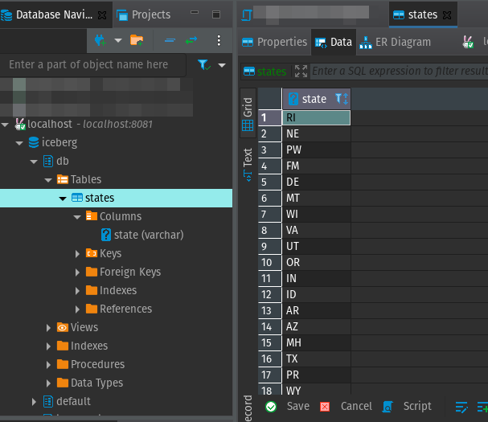

We're in about ~5,000 words so far and have achieved very little, in case you were curious. I know for a fact you weren't, though. Is this why everybody is doing "Cloud" (trick question...)?


*At this point, and that is unfortunately not a joke, my laptop got into the habit of running out of RAM (it had 16GB installed) constantly, so I tried to migrate all of this onto my server, which I quickly stopped, because it would mean setting up `hdfs` or move to Cloud. The solution for this? A literal RAM upgrade. The things I do...*

## The 2nd Build Phase: Ingestion
We are now ready to build the thing. We'll focus on the first 2 steps, ingestion and raw landing first.

Ingesting the data depends on the source. We'll mostly do this in `Python`, as the overwhelming majority of the wall time here is network, not compute; using `Spark` for this is overkill, but I won't judge you for trying. 

Shoehorning things into distributed, complex frameworks they weren't designed for is a surefire way to see the bottom of a bottle of bourbon out of frustration, but that's an experience everybody should try for themselves! (Please don't)

Pretend we're using something like `Airflow` and have some clever CI/CD and CDC in place here. In the real world, a *lot* of complexity comes from the overall developer infrastructure around your data platform.

We'll *also* pretend we have abstractions in our `Python` code, and each `to_csv` or `save(self)` method can talk to a `file://`, `s3://`, `gcs://`, `hdfs://` [...] endpoint (as opposed to just to disk) and nothing is hard-coded. We'll also, finally, pretend we write code with proper abstraction, which I certainly didn't do here.

We'll try to organize everything under `/raw/states/{state_shortcode}`; a US state is not a perfect top-level element, but it's close enough for all of our use cases.

_In the interest of privacy, each examples called out here will use a different geographical region in the state of Georgia than the one that's actually on the table._

### `zips.csv` and `counties.csv`
These are the *geographic* baseline files, i.e. the master list of all zips and counties.

#### Raw Layer Layout
```
/raw/states/
/raw/states/states.txt

/raw/states/{state_shortcode}/
/raw/states/{state_shortcode}/counties.csv
/raw/states/{state_shortcode}/zips.csv
```

#### Ingestion
We can get the definitive list of counties from the census:


mkdir -p data/raw/states/
wget https://www2.census.gov/geo/docs/maps-data/data/gazetteer/2021_Gazetteer/2021_Gaz_counties_national.zip
unzip 2021_Gaz_counties_national.zip && rm 2021_Gaz_counties_national.zip


And we'll parse this flat file into different states:

import pandas as pd
import os

class CountyAcquisition:
    def __init__(self, out_dir='raw/states/'):
        self.out_dir = out_dir
        os.makedirs(out_dir, exist_ok=True)

    def run(self, in_file='2021_Gaz_counties_national.txt'):
        """Parse all US counties from here:
        https://www2.census.gov/geo/docs/maps-data/data/gazetteer/2021_Gazetteer/2021_Gaz_counties_national.zip

        Args:
            in_file (str, optional): Input wget file. Defaults to '2021_Gaz_counties_national.txt'.
        """
        df = pd.read_csv(in_file, sep='\t')
        for c in list(df['USPS'].unique()):
            df2 = df.loc[df['USPS'] == c]
            os.makedirs(f'{self.out_dir}/{c}', exist_ok=True)
            df2.to_csv(f'{self.out_dir}/{c}/counties.csv')


Resulting in a layout like this:

├── raw
│   └── states
│       ├── AK
│       │   └── counties.csv
│       ├── AL
│       │   └── counties.csv
│       ├── AR
│       │   └── counties.csv
│       ├── AZ
│       │   └── counties.csv


In the following format:

USPS	GEOID	ANSICODE	NAME	ALAND	AWATER	ALAND_SQMI	AWATER_SQMI	INTPTLAT	INTPTLONG                                                                                                               
AL	01001	00161526	Autauga County	1539634184	25674812	594.456	9.913	32.532237	-86.64644                                                                               

We'll also use this data to create `states.txt` (what we used to test `Iceberg` earlier as such:

find raw/states -mindepth 1 -maxdepth 1 -type d -exec basename {}  \; >> raw/states/states.tx


For ZIPs, it isn't as straightforward. As outlined above, ZIP codes span states and counties. The Census data here:

wget https://www2.census.gov/geo/docs/maps-data/data/gazetteer/2021_Gazetteer/2021_Gaz_zcta_national.zip
unzip 2021_Gaz_zcta_national.zip && rm 2021_Gaz_zcta_national.zip


Provides a layout like this:

GEOID	ALAND	AWATER	ALAND_SQMI	AWATER_SQMI	INTPTLAT	INTPTLONG                                                                                                                          00601	166847909	799292	64.42	0.309	18.180555	-66.749961    


Which doesn't allow us to cross-reference it against anything but Polygons/Shapefiles, based on the lat/long pairs the Census Bureau provides.

Forunately, for non-commercial purposes, [unitedstateszipcodes.org](https://www.unitedstateszipcodes.org/zip-code-database/) provides a handy `csv` that does this for us.

Which we can parse the same way:

class StateAcquisition:
    def __init__(self, out_dir='raw/states/'):
        self.out_dir = out_dir
        os.makedirs(out_dir, exist_ok=True)

    def run(self, in_file='zip_code_database.csv'):
        """Parses a list of all ZIPS per state

        Args:
            in_file (str, optional): [description]. Defaults to 'zip_code_database.csv'.
        """
        df = pd.read_csv(in_file)
        for c in list(df['state'].unique()):
            df2 = df.loc[df['state'] == c]
            os.makedirs(f'{self.out_dir}/{c}', exist_ok=True)
            df2.to_csv(f'{self.out_dir}/{c}/zips.csv')


### ACS Data
These are the *demographic* baseline files, i.e. the demographic details on all (relevant) zips and counties.

#### Raw Layer Layout
```
/raw/states/
/raw/states/{state_shortcode}/counties/
/raw/states/{state_shortcode}/counties/{county}.json

/raw/states/{state_shortcode}/
/raw/states/{state_shortcode}/zips/
/raw/states/{state_shortcode}/zips/{zip}.json
```

#### Ingestion
We can simply access `CensusReporter.org`'s S3 cache for all geographies:

>Each profile page requires queries against a few dozen Census tables. To lighten the database load, profile data has been pre-computed and stored as JSON in an Amazon S3 bucket, so most of these pages should never touch the API. When the Census Reporter app sees a profile request, the GeographyDetail view checks for flat JSON data first, and falls back to a profile generator if necessary.
>
> https://github.com/censusreporter/censusreporter#the-profile-page-back-end

The URL format for this cache is `http://embed.censusreporter.org.s3.amazonaws.com/1.0/data/profiles/{year}/{860}00US{identifier}.json`. [1]

Two things to keep in mind here:
1. We can build a GeoID as such:

- `860` Summary level (three digits) - in this case, the 5-Digit ZIP Code Tabulation Area; `050` for a county
- `00` 	Geographic component (always 00)*
- `US` 	Separator (always US)
- `{identifier}` Identifier (variable length depending on summary level)

With the identifier in this case of course being the ZIP itself.

You might have realized that we're encountering a bit of a "chicken and egg" problem - we would need to rely on the data from the *previous* step to query the data (as this contains the counties `GeoIDs`).

This, unfortunately, is not a problem I can satisfactorily solve; we'll have to treat `/raw/states/GA/counties.csv` and `zips.csv` as an input file.

2. The `ACS` year needs to be provided. If it doesn't exist, we'll just recursively try again.

With this logic out of the way, we can wrap this in an acquisition script:

from pandas.core.frame import DataFrame
import requests
import json
import os 
import logging
logger = logging.getLogger(__name__)


class GeographicsAcquisition:
    def __init__(self, out_dir: str):
        self.out_dir = out_dir
        os.makedirs(os.path.join(out_dir, 'counties/'), exist_ok=True)
        os.makedirs(os.path.join(out_dir, 'zips/'), exist_ok=True)

    def _save(self, data: dict, out_path: str):
        if not data:
            return 
        with open(out_path, 'w') as f:
            json.dump(data, f)

    def _get_geographics(self, by: str, on: str, i=0) -> dict:
        """Gets Geographics data from CensusReporter.org

        Args:
            by (str): Either zip or county
            on (str): Zipcode or county ID
            i (int, optional): Recursion coutner. Defaults to 0.

        Returns:
            dict: JSON data for the chosen geographics
        """
        years = ['2018','2019','2020','2021','2017','2016','2015']
        if i >= len(years):
            return None 
        year = years[i]
        # Set Summary
        if by == 'zip':
            summary = '860'
        else:
            summary = '050'
        # Try
        with requests.Session() as s:
            r = s.get(f'http://embed.censusreporter.org.s3.amazonaws.com/1.0/data/profiles/{year}/{summary}00US{on}.json', timeout=2)
        if (r.status_code) != 200:
            return self._get_geographics(by, on=on, i=i+1)
        _js = json.loads(r.content.decode())
        return _js

    def run(self, zips: DataFrame, counties: DataFrame):
        for i, r in zips.iterrows():
            try:
                _zip = r['zip']
                _out_file = f'zips/{_zip}.json'
                _out_path = os.path.join(self.out_dir, _out_file)
                # Avoid updates for now
                if not os.path.exists(_out_path):
                    self._save(self._get_geographics(by='zip', on=_zip), out_path=_out_path)
            except Exception as e:
                logger.exception(e)
        for i, r in counties.iterrows():
            try:
                # GEOID -> NAME
                geoid = r['GEOID']
                county = r['NAME'].replace(' County', '')
                _out_file = f'counties/{county}.json'
                _out_path = os.path.join(self.out_dir, _out_file)
                # Avoid updates for now
                if not os.path.exists(_out_path):
                    self._save(self._get_geographics(by='zip', on=geoid), out_path=_out_path)
            except Exception as e:
                logger.exception(e)


As you can tell by the copy-paste code, those should really ever only be treated as what they are: Scripts. Re-tries here? `try, catch`, run again.

I highly suggest running this with `multithreading` enabled, since it's trivial to parallelize. 

In any case, at the end of the day, we'll have all our raw demographics data, as well as the baseline for our geographic data available.

[1] In case you were curious, the project does have a [donation page](https://opencollective.com/censusreporter) on OpenCollective, if you want to support the project or are worried about `S3` costs for their team. That seems fair when siphoning off several GiB of demographics data. :)

### FBI Crime Data
This is simply all NIBRS data the FBI made available for a given state.

#### Raw Layer Layout
```
/raw/states/
/raw/states/{state_shortcode}/
/raw/states/{state_shortcode}/crime/
/raw/states/{state_shortcode}/crime/nibrs/
```
#### Ingestion
This data can simply be downloaded and extracted, already split per state, from [here](https://crime-data-explorer.fr.cloud.gov/pages/downloads).


wget https://s3-us-gov-west-1.amazonaws.com/cg-d4b776d0-d898-4153-90c8-8336f86bdfec/2019/GA-2019.zip && unzip GA-2019.zip && rm GA-2019.zip
mkdir -p raw/states/GA/nibrs
mv GA-2019/*csv raw/states/GA/nibrs
rm -r GA-2019


These are CSV files, with a data dictionary an diagram explaining their use.

### GeoJSON files
Geographic boundaries, as [GeoJSON](https://datatracker.ietf.org/doc/html/rfc7946) and/or shapefiles, used for geospatial queries and drawing maps.

#### Raw Layer Layout
```
/raw/states/
/raw/states/{state_shortcode}/
/raw/states/{state_shortcode}/counties.geo.json
/raw/states/{state_shortcode}/zips.geo.json
```

#### Ingestion
A sample repo for this is [this](https://github.com/OpenDataDE/State-zip-code-GeoJSON) one, and pull from `raw/states/states.txt` that we created earlier.


#!/bin/bash
git clone https://github.com/OpenDataDE/State-zip-code-GeoJSON.git 
while read state; do
    mv State-zip-code-GeoJSON/$(echo "$state" | awk '{print tolower($0)}')*.json raw/states/$state/zips.geo.json
done <raw/states/states.txt
rm -rf State-zip-code-GeoJSON/


Similar, for counties, I've used [this](https://github.com/deldersveld/topojson/tree/master/countries/us-states) repo.


#!/bin/bash
git clone https://github.com/deldersveld/topojson.git
while read state; do
    mv topojson/countries/us-states/$state*.json raw/states/$state/counties.geo.json
done <raw/states/states.txt
rm -rf topojson/


### Summary
This concludes the entirety of the data acquisition process. We now have all data, for each US state (or, given the filters above, at least base-line data for everything but GA), i.e.:
- A list of all counties
- County demographics
- County geographic boundaries
- A list of all ZIPs
- ZIP demographics
- ZIP geographic boundaries
- Crime data for the entire state

In raw, albeit **organized** format.

Organization in Data Engineering is *critical*. By following very clear naming standards, I can now *ask my filesystem a question*. For instance: "Where would I find all ZIP codes for Kentucky?", and the answer is, naturally, `raw/states/KY/zips.csv`, because that's what we defined earlier.

And this is how you build a raw landing layer. [1]

[1] *...minus ACL/IAM, permissions, metadata, CI/CD, CDC, distributed filesystem, automation, repetition... but it's a start. :)*

## The 3rd Build Phase: Transformations
We now have our data available in a raw format, have set up `Spark`, `Toree`, `Hadoop`, a `Hive` Metastore, and `Trino`. Now, we can actually work on the data and make it available via `Iceberg`.

As a reminder, this is the structure *for each state* and all files we need to process:


.
├── counties
│   ├── Appling.json
│   ├── Atkinson.json
│   ├── Bacon.json
...
├── counties.csv
├── counties.geo.json
├── nibrs
│   ├── agencies.csv
│   ├── NIBRS_ACTIVITY_TYPE.csv
│   ├── NIBRS_AGE.csv
│   ├── NIBRS_ARRESTEE.csv
│   ├── NIBRS_ARRESTEE_WEAPON.csv
...
├── zips
│   ├── 30002.json
│   ├── 30004.json
...
├── zips.csv
└── zips.geo.json

3 directories, 923 files




### Cleaning up Tables & Migrating to Iceberg
The first step is, fortunately, the simplest: We simply move the existing ZIP and County records, i.e. all `csv`s, to `Iceberg` and standardize some column names.

Take for example `zips.csv`:
```
df = [_c0: int, zip: int ... 14 more fields]

+-----+-----+--------+--------------+----------------+--------------------+-------------------+-----+---------------+----------------+-----------+------------+-------+--------+---------+------------------------+
|  _c0|  zip|    type|decommissioned|    primary_city|   acceptable_cities|unacceptable_cities|state|         county|        timezone| area_codes|world_region|country|latitude|longitude|irs_estimated_population|
+-----+-----+--------+--------------+----------------+--------------------+-------------------+-----+---------------+----------------+-----------+------------+-------+--------+---------+------------------------+
|12905|30002|STANDARD|             0|Avondale Estates|        Avondale Est|               null|   GA|  DeKalb County|America/New_York|    404,678|        null|     US|   33.77|   -84.26|                    5640|
```

We don't need the `_c0` `pandas` index, and should decide for a standard on County names, such as not using "`<name> County`:, but rather just "`<name>`".

> [...] i.e., not "Laramie County, Wyoming", but rather just "Laramie", alongside a `state` column as "WY"

This can be done as such:

df.withColumn("county", regexp_replace(col("county"), " County", ""))


Following the same logic, we can clean up all tables - common issues include:
- Inconsistent county/city names
- Invalid data types
- Invalid `NULL` handling

Etc - all pretty standard stuff, which is now relatively easy, given the updated structure.

One neat trick is that we can convert `DataFrames` into `Schemas` natively:

import org.apache.iceberg.Schema
import org.apache.iceberg.types.Types
import org.apache.iceberg.spark.SparkSchemaUtil

df.createOrReplaceTempView("tmp")
val tblSchema = SparkSchemaUtil.schemaForTable(spark, "tmp")


Gives us:
```
tblSchema = 

table {
  0: zip: optional int
  1: type: optional string
  2: decommissioned: optional int
  ...
```

Which allows for neat little tricks using the `Java` API in `Scala`, such as automatic schema generation and table creation:

def createOrUpdateIcebergTable(tableId: String, df: DataFrame, schemaCleanup: (Schema) => Schema) {
    df.createOrReplaceTempView("tmp")
    val tblSchema = SparkSchemaUtil.schemaForTable(spark, "tmp");
    // Allow for custom adjustments
    val cleanTblSchema = schemaCleanup(tblSchema)

    // Create
    val ti = TableIdentifier.of(tableId)
    if (!catalog.tableExists(ti)) {
      // TODO: schema evolution
      catalog.createTable(ti, cleanTblSchema)
    }
  }
// ...
createOrUpdateIcebergTable("hive_prod.db.zips", df, { s: Schema => s.asStruct().fields().remove(0); s })


We need to avoid

 Query: Query for candidates of org.apache.hadoop.hive.metastore.model.MTableColumnStatistics and subclasses resulted in no possible candidates
Required table missing : "CDS" in Catalog "" Schema "". DataNucleus requires this table to perform its persistence operations. Either your MetaData is incorrect, or you need to enable "datanucleus.schema.autoCreateTables"
org.datanucleus.store.rdbms.exceptions.MissingTableException: Required table missing : "CDS" in Catalog "" Schema "". DataNucleus requires this table to perform its persistence operations. Either your MetaData is incorrect, or you need to enable "datanucleus.schema.autoCreateTables"


By making sure we add `conf.set("hive.metastore.uris", hiveUri)` to the `SparkConf`, otherwise `Spark` doesn't know that the `Hive Metastore` exists and pretends we didn't run the `SchemaTool`.

Back to the data, this can be a simple transformation:

def buildZips(): DataFrame = {
    // Zips
    val df = spark.read.format("csv")
      .option("sep", ",")
      .option("inferSchema", "true")
      .option("header", "true")
      .load(dataDir.concat("zips.csv"))
    // Normalize the county, cast the ZIP, drop the index
    val df2 = df.withColumn("county", regexp_replace(col("county"), " County", ""))
      .withColumn("zip", col("zip").cast(StringType))
      // Normalize coordinates
      .withColumnRenamed("latitude", "lat")
      .withColumnRenamed("longitude", "lon")
      // If we want, we might want to drop `irs_estimated_population`, since it has nothing to do in a lookup table
      //.drop("irs_estimated_population")
      .drop("_c0")

    // Write
    createOrUpdateIcebergTable("zips", df2, { s: Schema => s })
    df2.writeTo(database.concat(".zips")).append()
    df2
  }


And since we've established a naming schema, we can actually hard-code `zips.csv` as a source.

`Spark` can do integrated `glob` pattern matching so:

.load(dataDir.concat("zips.csv"))


Can turn into e.g `/data/raw/states/GA/zips.csv` or `/dara/raw/states/*/zips.csv`. For development, it makes sense to start with one state.

We'll do the same for the `counties.csv`, with slightly different rules:


  def buildCounties(): DataFrame = {
    val df = spark.read.format("csv")
      .option("sep", ",")
      .option("inferSchema", "true")
      .option("header", "true")
      .load(dataDir.concat("counties.csv"))
    // Here, we just re-name and normalize the names a bit, so they match `zips.csv`
    val df2 = df.withColumn("county", regexp_replace(col("NAME"), " County", ""))
      .withColumnRenamed("USPS", "state")
      .withColumnRenamed("GEOID", "geo_id")
      .withColumnRenamed("ANSICODE", "ansi_code")
      .withColumnRenamed("ALAND", "land_area_sqm")
      .withColumnRenamed("AWATER", "water_area_sqm")
      // One of the standards is that we use metric, for better or for worse, so we'll plain drop the sqmi conversion
      .drop("ALAND_SQMI")
      .drop("AWATER_SQMI")
      .drop("name")
      // Normalize coordinates
      .withColumnRenamed("INTPTLAT", "lat")
      .withColumnRenamed("INTPTLONG", "lon")
      .drop("_c0")

    // Write
    createOrUpdateIcebergTable("counties", df2, { s: Schema => s })
    df2.writeTo(database.concat(".counties")).append()
    df2
  }


#### Data Covered
So far, we've processed:
- [ ] `counties/`
- [X] `counties.csv`
- [ ] `counties.geo.json`
- [ ] `nibrs/`
- [ ] `zips/`
- [X] `zips.csv`
- [ ] `zips.geo.json`


### Parsing Demographics
Next, we'll need to parse the deeply nested `json` files we got from `CensusReporter.org`. 


{
    "geography": {
        "census_release": "ACS 2018 5-year",
        "parents": {
            "state": {
                "total_population": 10297484,
                "short_name": "Georgia",
                "land_area": 149482048342,
                "sumlevel": "040",
                "full_name": "Georgia",
                "full_geoid": "04000US13"
            },
            ...


Reading the JSON renders them as such:

val df = spark.read.json("raw/states/GA/zips/30032.json")
df.show()

```
+--------------------+--------------------+--------------------+--------------------+--------------------+--------------------+--------------------+
|        demographics|           economics|            families|        geo_metadata|           geography|             housing|              social|
+--------------------+--------------------+--------------------+--------------------+--------------------+--------------------+--------------------+
|{{{{ACS 2018 5-ye...|{{{{0.12, 0.11, 1...|{{{{{0.51, 0.42, ...|{35323058, 78604,...|{ACS 2018 5-year,...|{{{{0.19, 0.14, 1...|{{{{0.23, 0.16, 1...|
+--------------------+--------------------+--------------------+--------------------+--------------------+--------------------+--------------------+
```

And since they are all nested `structs`, they are trivial to parse, e.g.  like this:

// ZIP parsing
df.withColumn("zip", col("geography.this.full_name"))
    .withColumn("total_population", col("geography.this.total_population"))
    .withColumn("land_area_sqm", col("geography.this.land_area"))
    .withColumn("sumlevel", col("geography.this.sumlevel"))
    .withColumn("short_geoid", col("geography.this.short_geoid"))
    .withColumn("full_geoid", col("geography.this.full_geoid"))
    .withColumn("census_release", col("geography.census_release"))
    .withColumn("total_population", col("geography.this.total_population"))

```
+--------------------+--------------------+--------------------+-----+----------------+-------------+--------+-----------+------------+---------------+
|        demographics|           geography|              social|  zip|total_population|land_area_sqm|sumlevel|short_geoid|  full_geoid| census_release|
+--------------------+--------------------+--------------------+-----+----------------+-------------+--------+-----------+------------+---------------+
|{{{{ACS 2018 5-ye...|{ACS 2018 5-year,...|{{{{0.23, 0.16, 1...|30032|           49456|     35323058|     860|      30032|86000US30032|ACS 2018 5-year|
+--------------------+--------------------+--------------------+-----+----------------+-------------+--------+-----------+------------+---------------+
```

At this point, the attributes we pick are arbitrary; this all depends on the ones that are deemed important. The example above simply focusses on geographic features.

At this point, we're making quite a fundamental decision: Using a **flat table** vs. a **normalized table**. All attributes pulled from here could be in their own feature table, or they could live in one large, flat table, where we add columns as desired.

As far as `Iceberg` is concerned, *I don't think it matters here*, but I wouldn't mind an opposing opinion being thrown my way. If I was doing this on a larger scale (where the real answer is always "it depends"), I would probably opt for a normalized schema for most projects; this is mostly because it tends to make schema evolution less intrusive with many stakeholders and allows for more flexible query schemas. In my opinion, this is a much bigger struggle than performance for 90%+ of all real-world datasets.

From a performance perspective, though, even with `Icebergs` hidden partitions, we don't have a concept like `HBase`'s namespaces, i.e. separate physical trees for individual sections (think "geography", "social".. above being "virtual" tables that are scanned in one query).

For this use case, we do have the benefit of already having the data pre-partitioned by logical areas, so I see no reason not to keep it, especially since we're maintaining a 1:1 relation between them.

So, here's what I did:


  def parseDemographics(df: DataFrame, level: String): Unit = {

    val rawDf = df
      .withColumn("total_population", col("geography.this.total_population"))
      .withColumn("land_area_sqm", col("geography.this.land_area"))
      .withColumn("sumlevel", col("geography.this.sumlevel"))
      .withColumn("short_geoid", col("geography.this.short_geoid"))
      .withColumn("full_geoid", col("geography.this.full_geoid"))
      .withColumn("census_release", col("geography.census_release"))
      // Overall parents
      .withColumn("state_name", col("geography.parents.state.short_name"))
      .withColumn("state_full_geoid", col("geography.parents.state.full_geoid"))
      .withColumn("county", regexp_replace(col("geography.parents.county.short_name"), " County", ""))
    var baseDf: DataFrame = null
    if (level.equals("zip")) {
      baseDf = rawDf // Parents - for ZIP
        .withColumn("zip", col("geography.this.full_name"))
        .withColumn("county_full_geoid", col("geography.parents.county.full_geoid"))

    } else {
      // Just the state as a parent, so we just need to re-assign the geoid - it's redundant, but keeps queries constitent
      baseDf = rawDf
        .withColumn("county_full_geoid", col("geography.this.full_geoid"))
    }

    // Store results
    var results = new HashMap()[String, DataFrame]

    val socialDf = baseDf
      // Social
      .withColumn("percent_bachelor_degree_or_higher_percent", col("social.educational_attainment.percent_bachelor_degree_or_higher.values.this"))
      .withColumn("foreign_born_total_percent", col("social.place_of_birth.percent_foreign_born.values.this"))
      .withColumn("foreign_born_europe_percent", col("social.place_of_birth.distribution.europe.values.this"))
      .withColumn("foreign_born_asia_percent", col("social.place_of_birth.distribution.asia.values.this"))
      .withColumn("foreign_born_africa_percent", col("social.place_of_birth.distribution.africa.values.this"))
      .withColumn("foreign_born_oceania_percent", col("social.place_of_birth.distribution.oceania.values.this"))
      .withColumn("foreign_born_latin_america_percent", col("social.place_of_birth.distribution.latin_america.values.this"))
      .withColumn("foreign_born_north_america_percent", col("social.place_of_birth.distribution.north_america.values.this"))
      .withColumn("veterans_percent", col("social.veterans.percentage.values.this"))
    results += ("social" -> socialDf)

    // ...

    // parse results
    results.keys.foreach { k =>
      // Drop unused columns
      val df2 = results(k)
        .drop("geography")
        .drop("economics")
        .drop("families")
        .drop("geo_metadata")
        .drop("housing")
    // And Write
      createOrUpdateIcebergTable(database, k, df2, { s: Schema => s })
      df2.writeTo(database.concat(".".concat(k))).append()
    }


Which we can then run once per row in a `DataFrame` on all `jsons`:

  def buildDemographics(level: String): Unit = {
    var inGlob: String = null
    if (level.equals("zip")) {
      inGlob = "zips/*.json"
    } else {
      inGlob = "counties/*.json"
    }
    val df = spark.read.json(dataDir.concat(inGlob))
    parseDemographics(df, level)
  }


Unfortunately, this whole process can be pretty hard on memory, since we're unpacking some pretty deeply nested JSONs all in-memory, all while running a large zoo of applications (`Hive Metastore`, `Trino`, `Spark`) in the background.

However, this step creates (and appends to, transactionally safe I might add), our `Iceberg` files, accessible via `Trino`. At this point, the data is simply available for consumption, with relatively little transformations done to it. We did, however, process a massive list of `json` files into a tabular format and set the groundwork for enabling a change data capture process on the way.


#### Data Covered
- [X] `counties/`
- [X] `counties.csv`
- [ ] `counties.geo.json`
- [ ] `nibrs/`
- [X] `zips/`
- [X] `zips.csv`
- [ ] `zips.geo.json`

### FBI Crime Data
The FBI's UCR data already exists in neat, organized `csv` files. Here's a sample:


This gives us a distinct advantage: We can re-use the same boilerplace `Scala` method as before and just point it at each `csv` file - there's 42 of them. The FBI also provides `Postgres` scripts for creating and importing this data, and everything is highly relational and normalized, with lots of small tables like this:


CREATE TABLE nibrs_circumstances (
    circumstances_id smallint NOT NULL,
    circumstances_type character(1),
    circumstances_code smallint,
    circumstances_name character varying(100)
);


In order to avoid just creating a plain copy of this data (which, for the record, you'd want to do for a real Data Lake), we'll be focussing on one use case: Matching crime to the 2 demographic targets we defined earlier, namely ZIPs and counties.

As you might recall from earlier in this magnum opus of wasted time and sadness, the FBI doesn't let you match ZIPs to agencies. So what can we do, without ZIPs or GeoIDs?

Well, the only way I came up with (which I'm sure isn't the only way to do it) is by means of *fuzzy matching* (we'll connect the dots later). We cannot do geospatial matches ("point in polygon") or even geocoding (see below), since these police agencies follow their own spatial logic; they do not match to anything else that I'm currently aware of.

Essentially, for matching agencies to a county, we can rely on the `COUNTY_NAME` column - this is a `1:n` match. When it comes to ZIPs, we already have a column called `primary_city` in the `zips` table, which is part of our master data record for the states.

So, the closest level of aggregation we can *theoretically* get is on a city level, which the agencies table provides... more or less.

See, we have the following attributes:

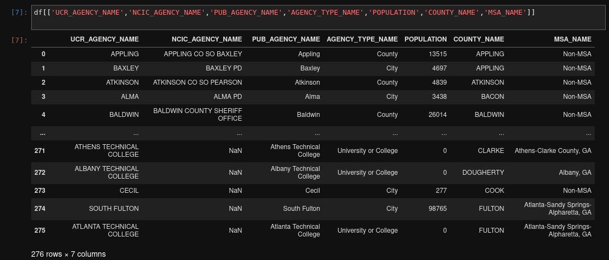

The MSA, or "Metropolitan Statistical Area", isn't precise at all - matter of fact, 110 out of 276 agencies are rural enough not to belong to any city, followed by 93 for the "general Atlanta area":
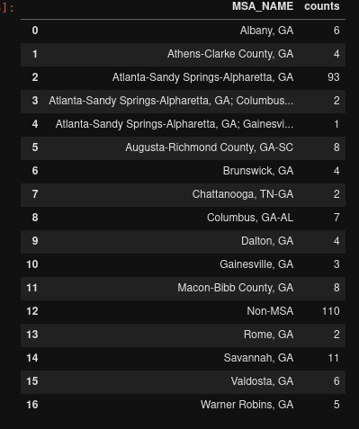

Within the "Atlanta-Sandy Springs-Alpharetta, GA" MSA, out of those 93 agencies, we can break it down as follows:


On thing is missing, though: The ~1,600 officers strong APD (Atlanta Police Department), since they only started submitting data to the FBI on 2020-10-01. The most recent data extract for GA is from 2019.

So what happens if we do a query to the effect of (in `pandas`):

df2.loc[(df2['AGENCY_TYPE_NAME'] == 'City') & (df2['PUB_AGENCY_NAME'] == 'Atlanta')]
# None


Correct, it's entirely empty, because our data extract doesn't contain any data for the City of Atlanta.

But, as any good Data Engineer, **let's consider real-life use cases**. Take the East Lake Golf Course in East Atlanta, for instance:



On the left, you'll find the City of Atlanta - on the right, unincorporated Dekalb, an administrative district that doesn't belong to any city and hence, has no city police department, with ZIPs and addresses overlapping with the *City* of Decatur, Georgia. 

Confused? Wonderful. Welcome to geospatial data.

Now, the left (or western) part is serviced by the APD, the eastern part by the *County* (not the *City*) police department of Dekalb PD, also missing in the agency data. See this ArcGIS map, outlining the APD zones? Zone 6 ends right where the East Lake Golf Course ends (the black dot on the map). 




To get back to our `Spark` pipeline: The only semi-realistic way to get data for any of this is to rely on aggregates and accept that we'll have both gaps (such as APD), as well as overlaps (such as counties spanning departments). We'll also join in offenses and other tables into one simplified view of "crime", by using some `groupBy` and aggregate logic:


def buildCrime(level: String): DataFrame = {
    // Agencies
    val agencies = readCsv("nibrs/agencies.csv")
      // Some basic cleaning - `initcap` is `Title Case`
      .withColumn("county", regexp_replace(initcap(lower(col("COUNTY_NAME"))), " County", ""))
      // Technically a simplification
      .withColumn("city", initcap(col("UCR_AGENCY_NAME")))
      .withColumnRenamed("POPULATION", "population")
      .withColumn("total_officers", col("MALE_OFFICER") + col("FEMALE_OFFICER"))
      .withColumn("AGENCY_TYPE_NAME", lower(col("AGENCY_TYPE_NAME")))

    // Incidents and offenses
    val incidents = readCsv("nibrs/NIBRS_incident.csv")
      .withColumnRenamed("AGENCY_ID", "agency_id")

    val offenses = readCsv("nibrs/NIBRS_OFFENSE.csv")
    val offense_type = readCsv("nibrs/NIBRS_OFFENSE_TYPE.csv")

    // Simple filter for city or state
    val df2 = agencies
      .where(col("AGENCY_TYPE_NAME") === level)

    // Join to a final DF
    val crimes = df2.withColumnRenamed("DATA_YEAR", "year")
      .join(incidents, incidents("agency_id") === df2("agency_id"), "left")
      .join(offenses, offenses("INCIDENT_ID") === incidents("INCIDENT_ID"), "left").drop(offenses("INCIDENT_ID"))
      .join(offense_type, offenses("OFFENSE_TYPE_ID") === offense_type("OFFENSE_TYPE_ID"), "left")

    // And aggregate
    val agg = crimes.groupBy(col(level), col("year")).agg(
      sum("total_officers").as("total_officers"),
      countDistinct("OFFENSE_ID").as("total_offenses"),
      countDistinct("INCIDENT_ID").as("total_incidents"))

    // Write
    val tableName = level.concat("_").concat("crime")
    createOrUpdateIcebergTable(tableName, agg, { s: Schema => s })
    agg.writeTo(database.concat(".".concat(tableName))).append()
    agg
  }


Gives us an overview like this:


|    city     | year | total_officers | total_offenses | total_incidents |
|-------------|------|----------------|----------------|-----------------|
| Gainesville | 2019 |           7252 |             74 |              65 |
| Braselton   | 2019 |           7353 |            387 |             387 |
| Alma        | 2019 |           2590 |            259 |             240 |


In case the distinction between "incident" and "offense" here is unclear: A single incident can have multiple offenses logged.

For the sake of not completely ignoring the idea of "fuzzy" matching to ZIPs, I did originally write some `Python` code:

def _filter_city(self, vals, mode, r):
    for val in vals:
        if r[mode] and string_found(val.upper(), r[mode].upper()):
            return val
        elif type(r['NCIC_AGENCY_NAME']) == str and string_found(val.upper(), r['NCIC_AGENCY_NAME'].upper()):
            return val
    return ''
    
def _get_agencies_by_city(self, cities: list):
    ag = pd.read_csv(f'{self.crime_data_dir}/agencies.csv')
    ag = ag.rename(columns={'COUNTY_NAME': 'county'})
    ag['city'] = ag.apply(lambda r: self._filter_city(cities, 'UCR_AGENCY_NAME', r), axis=1)
    return ag.loc[ag['city'] != '']


To do a fuzzy match to cities, but found that wildly inaccurate, to the point of being harmful for data quality.

#### Data Covered
- [X] `counties/`
- [X] `counties.csv`
- [ ] `counties.geo.json`
- [X] `nibrs/`
- [X] `zips/`
- [X] `zips.csv`
- [ ] `zips.geo.json`

### Calculating Travel Times & Geo-Matching
Finally, to make this data truly unique to my use case, travel times are something that can be calculated using the aforementioned `Mapbox` API. However, using REST calls in a distributed data pipeline is always terrifying.

Why is that terrifying? Generally speaking, most distributed systems scale by hard metrics, such as CPU or memory utilization. Network calls are 99% I/O wait time, i.e. idle time, where a single worker doesn't do any actual work. Modern autoscaling becomes very, very difficult all of a sudden.

In these cases, many systems cause massive backlogs and engineers have to come up with manual ways to trick your execution engine into scaling horizontally, often by means of implementing parallelism in systems that pride themselves in already being distributed and, by definition, parallel *by default*. In extreme cases, causing artificial CPU or memory usage to trick an autoscaler into compliance are not smart, but certainly possible options.

Allow me to present you with a *real life example* from `Apache Beam`/`Google Dataflow`, namely Spotify's [scio](https://github.com/spotify/scio) library, that does async calls in a distributed system, and how complex [1] the `Java` code looks like, not to mention underlying constraints, such as everything having to be `<? extends Serializable>`, custom `Coders`, `mutex` usage, `transient` objects etc:



Why do I bring up `Dataflow` in a `Spark` article? Because I had to build a worse version of `BaseAsyncDoFn.java` not too long ago in the real world, to overcome `THROUGHPUT_BASED` autoscaling in `Dataflow`, and felt like sharing the joy. ¯\\_(ツ)_/¯

Ignoring the scalability problem for a moment: If we want to calculate all travel times in advance, we'd need to make a REST call to `Mapbox` for each source location, in combination with each target location. 

I found this to be a use case where `Iceberg`'s schema evolution comes in handy, because a simple table for this *could* look like this:

|    zip     | county | lat | lon | atlanta_travel_time_min |
|-------------|------|----------------|----------------|-----------------|
| 30107 | cherokee | 34.3 | -84.3 | 60

And if we wanted to add a column, say `athens_traveL_time`, we could do that after the fact by adding a column to that table's schema.

However, it does pose a different question: Is this really data that should be statically stored in a Data Lake? Or, to ask the question a different way, **is this data useful for anyone but the person building the data for the current query?**

The answer to that is a pretty definitive **no** for me: A Data Lake should be a multi-purpose system. I should be answer the question whether Hall County is a place we might like; other people (hypothetically) might want to use the data to analyze migration patterns across counties.

Which is why we won't actually include the travel time data in the `Spark` pipeline, but rather do it in the next step: The analysis.

Of course, for a real project, you'd want to "aaS" it (:)) - make it available "as a service", so not every single Analyst or Data Scientist needs to figure out the Mapbox API or get a key for it.

One thing we will do, though, is simply copy all `geojson` data over to our analysis layer. `geojson` is a pretty specific format, and few frameworks and tools can deal with it - `Google BigQuery` comes to mind. Since the 4th build step will just use `Python` (with `geopandas`), we can keep them as is.

In case of larger geospatial datasets, though, indexing them in a system such as `BigQuery` is *highly* recommended, though - they do get massive and sluggish to deal with, as they describe irregular polygons in great detail. Remember the [Physical Layout](#the-physical-layout) above? That's why the "geodata" fields have non-solid lines around their respective `Iceberg` boxes.

[1] Yes, I know, it's actually pretty clever and earlier versions were actually just a single file - point being, this is not a trivial implementation that you can just skim over and understand completely - and it's solving a *very* common problem, such as calling a `GCP` API in `Dataflow`!

#### Data Covered
- [X] `counties/`
- [X] `counties.csv`
- [X] `counties.geo.json`
- [X] `nibrs/`
- [X] `zips/`
- [X] `zips.csv`
- [X] `zips.geo.json`

## The 4th Build Phase: Analysis
With all structured data now available on `Iceberg` (and some on your file system of choice), let's work on the rating engine & data analysis. For this, we'll mostly be re-using the prototype `Python` code, so please excuse some spaghetti code - we're now in the Analyst role. 

We are just out to **answer a question using your shiny Data Lake**. The value here comes from the data, not from clean code (not that the `Scala` above was anything to write home about, but you get the point).

Of course, clean, repeatable pipelines are ideal - but the code I'll share here is real and the type of stuff I actually use to play around with `Jupyter` to answer some of those questions.

### Reading the Data as an Analyst
Now, all we do is boot up `Jupyter` again and run some code. Well focus on `pandas`, because I like `pandas` and it's very popular with the Analyst and Data Science crowd.

Trino [provides](https://trino.io/resources.html) quite a few connectors, mostly `Java`/`Scala`, `go`, `JS`, `Ruby`, `R`, and of course `Python`, which covers most bases. 

We'll use [`pyHive`](https://github.com/dropbox/PyHive) for this, alongside [SQLAlchemy](https://www.sqlalchemy.org/), which [pandas](https://pandas.pydata.org/docs/reference/api/pandas.read_sql.html#pandas.read_sql) supports.

source env/bin/activate # venv, all that
pip3 install pandas geopandas folium numpy matplotlib 'pyhive[trino]' sqlalchemy


The code to integrate with `pandas` is trivial:


### Actually adding Mapbox data
Once you figure out the use case, this is supremely boring to get travel times for all relevant locations. Remember that our `Iceberg` tables contain `lat`/`long` coordinate pairs, so just ask the [API](https://docs.mapbox.com/api/navigation/matrix/) to do it for you and do some `O(n²)` garbage, because you won't be productionizing this.

Of course, you need an input file that determines the locations you frequent; for this, I've used the following Mapbox API for reverse geocoding, i.e. turning a query (such as an address) into coordinates:

def get_reverse_geo(search, access_token, base_url='https://api.mapbox.com/geocoding/v5/mapbox.places', types='postcode'):
    url = '{base_url}/{search}.json?types={types}&country=US&access_token={access_token}'.format(
        base_url=base_url,
        types=types,
        search=search,
        access_token=access_token)
    r = requests.get(url)
    return json.loads(r.content.decode())


Two helper methods make life easier to put everything into a conformant structure:

def find_county(context):
    for e in context:
        if 'district' in e['id'] and 'text' in e and 'County' in e['text']:
            return e['text'].replace(' County', '')
    return None

def parse_reverse_geo(r, is_favorite):
        if 'features' in r and len(r['features']) <= 0:
            return
        p = r['features'][0]
        return {
            'zip': p['text'],
            'lat': p['center'][1],
            'long': p['center'][0],
            'city': p['place_name'].split(',')[0],
            'address': p['place_name'],
            'alias': p['place_name'],
            'county': find_county(p['context']),
            'is_favorite': is_favorite,
        }


These just parse the response properly.

For instance, say this is for somebody who works at the [Georgia Aquarium](https://www.georgiaaquarium.org/), located at 225 Baker St NW, Atlanta, GA 30313, so getting there is super important; we can get the coordinates as such:


This can then be transformed into a `pandas` `DataFrame` with a one-liner:

targets_df = pd.DataFrame([parse_reverse_geo(fish, True)])


Here's the code - the `Builder` superclass contains some path-parsing logic.

class TravelBuilder(Builder):
#...
    def _get_lat_long_pairs(self, df):
        return ';'.join(df[['long', 'lat']].apply(lambda c: f'{c[0]},{c[1]}', axis=1).to_list())

    def _build_matrix_req(self, src):
        coords = self._get_lat_long_pairs(src) + ';' + self._get_lat_long_pairs(self.dests)
        return {
            'profile': 'mapbox/driving',
            'coordinates': coords,
            'sources': ';'.join([str(i) for i in range(0, len(src))]),
            'destinations': ';'.join([str(i) for i in range(len(src), len(src)+len(self.dests))])
        }

    def _get_matrix(self, req, access_token, base_url='https://api.mapbox.com/directions-matrix/v1'):
        url = '{base_url}/{profile}/{coords}?sources={sources}&destinations={destinations}&annotations={annotations}&access_token={access_token}'.format(
            base_url=base_url,
            coords=req['coordinates'],
            profile=req['profile'],
            destinations=req['destinations'],
            sources=req['sources'],
            annotations='duration,distance',
            access_token=access_token)
        # print(url)
        r = requests.get(url)
        return json.loads(r.content.decode())

        def _parse_matrix(self, r, ix=0):
          """
          Parse the result from the request as df
          """
          res = []
          i = 0
          for s in r['sources']:
              ii = 0
              durs = r['durations'][i]
              for d in r['destinations']:
                  src_name = self._resolve_name(s['name'], self.src, i)
                  dst_name = self._resolve_name(d['name'], self.dests, ii)
                  #print(f'{src_name} -> {dst_name}, {durs[ii]/60}min')
                  dur_s = durs[ii]
                  dist_m = r['distances'][i][ii]
                  res.append({
                      'zip': self.src.iloc[ix]['zip'],
                      'source': src_name,
                      'src_lat': s['location'][1],
                      'src_lon': s['location'][0],
                      'dest_zip': self.dests.iloc[ii]['zip'],
                      'destination': dst_name,
                      'dest_lat': d['location'][1],
                      'dest_lon': d['location'][0],
                      'duration_s': dur_s,
                      'duration_min': dur_s/60,
                      'distance_m': dist_m,
                      'distance_mi': dist_m/1609})
                  ii += 1
              i += 1
              ix += 1
          return pd.DataFrame(res), ix

        def run(self, src: DataFrame, dests: DataFrame, dest_cols: list[String]) -> DataFrame:
          self.dests = dests
          self.src = src
          logger.info(f'Determining travel time for {len(self.src)} sources and {len(self.dests)} destinations...')
          n = 10
          res = []
          for df in [self.src[i:i+n] for i in range(0, self.src.shape[0], n)]:
              req = self._build_matrix_req(df)
              r = self._get_matrix(req, access_token)
              res.append(r)

          ms = []
          ix = 0
          for r in res:
              m, ix = self._parse_matrix(r, ix)
              ms.append(m)

          matrix = pd.concat(ms).drop_duplicates()

          df = matrix.pivot_table(index=['zip'], columns='destination',
                                  values='duration_min').reset_index().rename_axis(None, axis=1)
          # Add Mean
          df['mean_travel_time'] = df[dest_cols].mean(axis=1)
          df = df.merge(matrix[['zip', 'src_lat', 'src_lon']
                              ].drop_duplicates(), on='zip', how='inner')

          return df


Leading us to this:


The returning `DataFrame` can be stored however you like; there is a philosophical argument to be made whether this data should also be stored on the Lake (in an accessible format) or not; since for this exercise, everything from hereon out is accessed almost exclusively via `pandas`, so e.g. `feather`/`pyArrow` does the trick just fine.

We also made the choice to store the travel time as column, rather than in a row-based format, so the column "Aquarium" is somewhat specific.

### The Rating Engine
Similar to what we've done before, this is a simple `Python` exercise against a set of criteria.

In order to run the rating, we'll do some simple, customized data wrangling:

# Get Crime Data
crime_df_city =  pd.read_sql('select * from db.city_crime where state="GA"', con=engine)
crime_df_county = pd.read_sql('select * from db.county_crime where state="GA"', con=engine)
# Get demographic data
county_demographics = pd.read_sql('select * from db.county_demographics where state="GA"', con=engine)
zip_demographics = pd.read_sql('select * from db.zip_demographics where state="GA"', con=engine)
# ...


We can then join this data, since we pre-defined join criteria (e.g., normalized County names) while building the Lake:
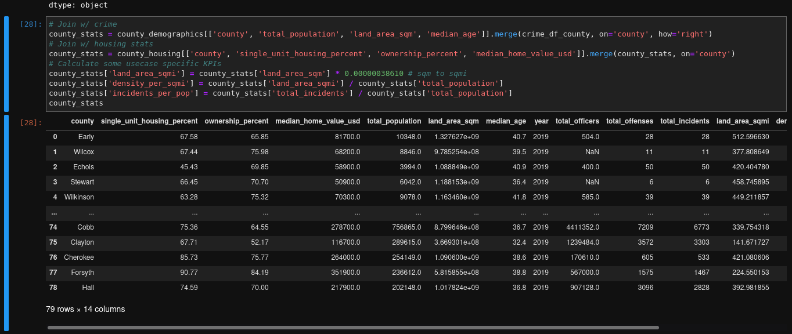

If any metric is ever confusing, `pandas` helps to understand them:

county_stats['incidents_per_pop'].describe()
'''
count    79.000000
mean      0.006704
std       0.005812
min       0.000000
25%       0.003284
50%       0.005566
75%       0.008159
max       0.038823
Name: incidents_per_pop, dtype: float64
'''


The cool thing is: We can re-use practically the same logic/function to do the same on a ZIP level now! For crime, we merely must pretend that each ZIP has a primary county and use that counties crime data, join the zip code's "primary" city from our ZIP code master list, and take the average:

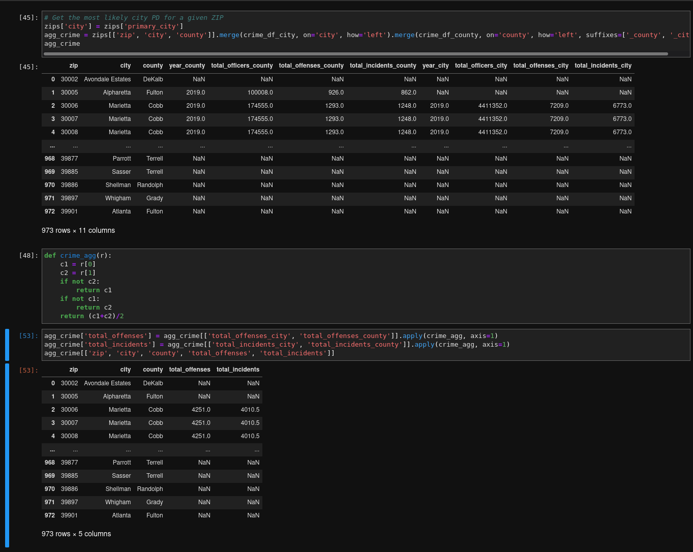

Now, naturally this isn't perfect; but still easily achievable, given our standardized data.

The rest stays almost completely the same, and should probably live inside a standardized function:

# Join w/ crime
zip_stats = zip_demographics[['zip', 'county', 'total_population', 'land_area_sqm', 'median_age']].merge(agg_crime[['zip', 'city', 'total_offenses', 'total_incidents']], on='zip', how='right')
# Join w/ housing stats
zip_stats = zip_housing[['zip', 'county', 'single_unit_housing_percent', 'ownership_percent', 'median_home_value_usd']].merge(zip_stats, on='zip')
# Calculate some usecase specific KPIs
zip_stats['land_area_sqmi'] = zip_stats['land_area_sqm'] * 0.00000038610 # sqm to sqmi
zip_stats['density_per_sqmi'] = zip_stats['land_area_sqmi'] / zip_stats['total_population']
zip_stats['incidents_per_pop'] = zip_stats['total_incidents'] / zip_stats['total_population']
zip_stats


When it comes to the actual ratings: For this example, we'll stick to "working at the Aquarium", "somewhat urban, but probably suburbs", and "low-ish crime", creating our criteria as such:

rating_criteria = {
    # Some baseline demographics
    'density':  RatingCriteria(min_v=1000, max_v=2000, weight=0.3), # Density: Somewhat urban; 1600 people/sqmi is the US city average
    'occupied_pct':  RatingCriteria(min_v=75, max_v=100, weight=0.4), # Occupied percentage: Not too many vanancies
    'owner_pct':  RatingCriteria(min_v=0, max_v=100), # Looking for ownership, not rent
    'single_family_pct':  RatingCriteria(min_v=0, max_v=100), # Looking for mostly single family residential
    # External: Travel Time
    'Aquarium': RatingCriteria(min_v=10, max_v=70, weight=4, order='desc'), # Short travel time to the Aquarium is very important
    # External: Crime
    'incidents_per_pop': RatingCriteria(min_v=0.0, max_v=0.038823, weight=1), # Unreliable data!
}


Each dictionary key refers to one field in our target `DataFrame`, so we can apply it as such:
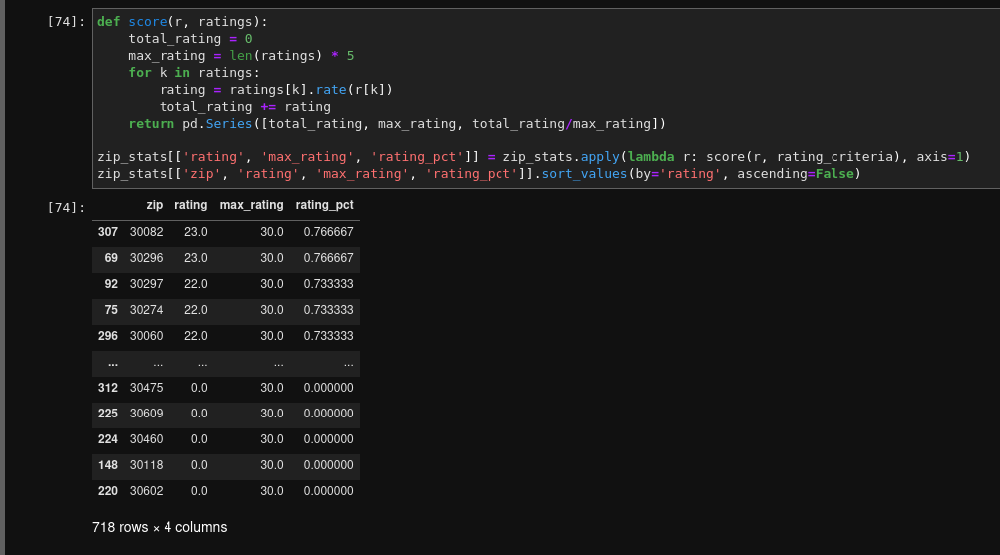

Cool! But now, where is zip code 30082? Well, that's an easy query, now that we have all our data in place:


It's Smyrna, a pretty popular Atlanta suburb in Cobb County - according to this rating scheme, a big favorite!

### Drawing Maps
Last but not least, we can also visualize this data, once again drawing from the Lake's wealth of data. For this, we'll use [`folium`](https://python-visualization.github.io/folium/), a useful package for geo visualization, alongside [`geopandas`](https://geopandas.org/en/stable/), the de facto standard for geospatial data with `Python` and `pandas`.

The APIs are super straightforward:


And once rendered, we'll see that for these queries, we'll fine a specific area of metro Atlanta to be very interesting:


Of course, this also includes far away counties; we could always pre-filter the list of potential ZIPs or filter out commutes of e.g. >1hr:


But with the same function, we can also draw some random facts we collected. How about the median age in the entire state of Georgia? Just change the "`by`" parameter:


### Asking other questions
The beauty of a Data Lake, of course, is that we can ask very different questions without much change to our code.

Imagine our fictitious fish friend all of a sudden has a deep desire to learn about the **median home price by County in South Dakota**. 

Well, that's easy! Just do the same thing with a different `WHERE` clause - we already have all the data available for querying:


state = 'SD'
filterq = f' WHERE state=\'{state}\''
with engine.begin() as connection:
    counties = pd.read_sql(f'select * from db.counties {filterq}', con=engine)
    county_demographics = pd.read_sql(f'select * from db.county_demographics {filterq}', con=engine)
    county_housing = pd.read_sql(f'select * from db.county_housing {filterq}', con=engine)


And ask the same question:
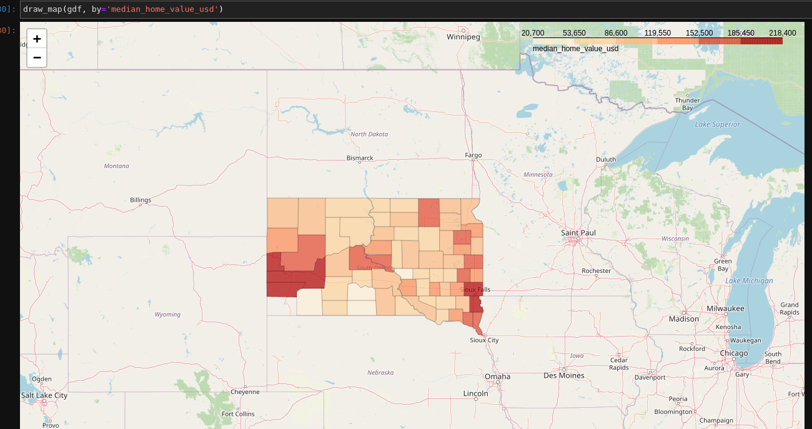

Just in case you were curious! Took less than 5 minutes to answer. Often times, it's wise to filter out 99% quantiles, due to outliers and large default values.

Larger maps, however, can be somewhat... harsh... with regards to the memory requirements:


So you might want to give `geopandas'` [Douglas-Peucker iterative end-point fit algorithm](https://geopandas.org/en/stable/docs/reference/api/geopandas.GeoSeries.simplify.html) a spin.

## A Word on Volume
The final **raw** layer contained **33,727 files**, *excluding* NIBRS data in about **3.4GiB**. 

This is actually lower than expected - 

val dataDir = "data/raw/states/*/"
val df = spark.read.format("csv")
      .option("sep", ",")
      .option("inferSchema", "true")
      .option("header", "true")
      .load(dataDir.concat("zips.csv"))
df.count()
// 42724


But we already knew there would be some geographics where simply no ACS data was cached.

All the `Iceberg` data put together came in at *less than 100MiB* - which makes sense, given that we're not dealing with raw text data anymore.

Needless to say, those are not volumes where one would usually use a system that complex.

## Conclusion
God knows how many hours later, we've done it: A Data Lake at home. One that can answer many questions about every state in the Union, down to the ZIP level, can visualize those questions, and can be customized with a bit of `Python` to find the perfect neighborhood.

That, believe it or not, is actually useful. Yes, certainly: Just grabbing the data by hand for a given state and analyzing a handful of potential ZIPs would be "good enough" - but even for an "at home" use case, following professional standards and best practices to organize the data makes life a lot easier. 

If Fullstack Engineers are allowed automate their lives away with LAN-only APIs to turn the lights on and post it on HackerNews, I can build my own Data Lake, gosh darn it!

And keep in mind: We don't have to stop here. With the structure in place, we can easly **add more data**, **run Machine Learning models**, or simply **ask different questions**.

Ever wondered which ZIP code contains has the most people working at home? Fear not, I can answer this question: One of them is *55450* in Hennepin County, MN! Okay, it's the Minneapolis-Saint Paul International Airport, so the data isn't super accurate all the time, but still!

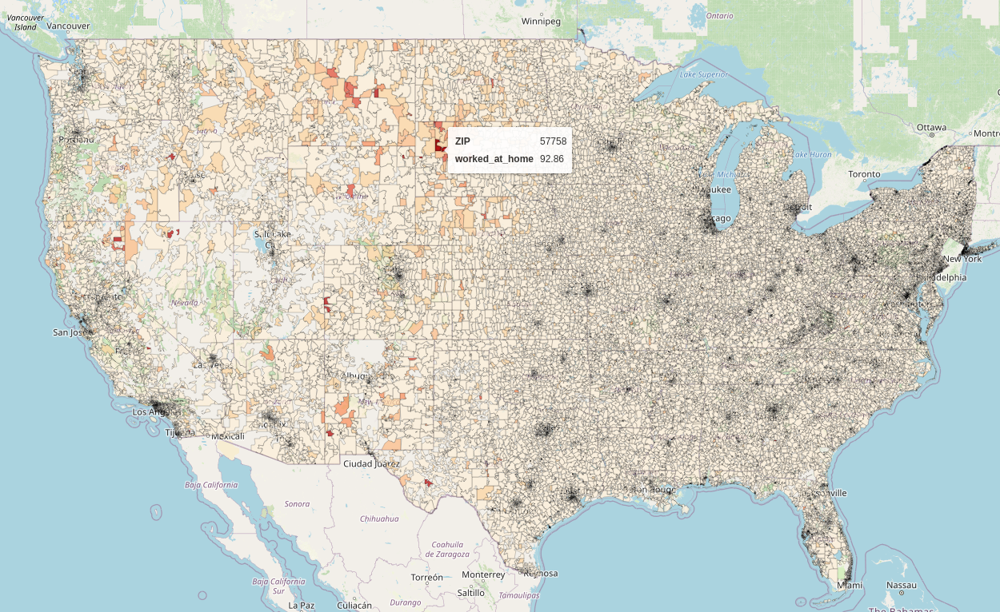

In terms of tech, if `Iceberg` is the perfect tool, how it scales, how schema evolution works in practice, how it integrates on Cloud - no idea from this article alone. Here, we have a somewhat clever abstraction layer on top of `parquet`, alongside a whole bunch of execution and querying frameworks.

What I do know is that I *actually bought more DDR4 memory for my laptop*, because these types of overkill-setups are not easy on your hardware and as we know, **completely unnecessary for small data volumes**.


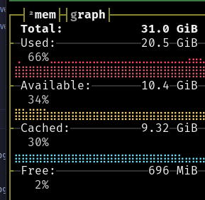

So, in conclusion: This was a fun exercise, the maps are pretty (and pretty interesting), but it is also horribly over engineered. But hey, I'm still throwing random questions at the thing, so I had fun building it and continue to have fun using it!

Also, while we haven't *really* started looking for places, this data *actually* helped us narrow down ZIP codes quite drastically - using the same code and data as outlined here, just with different criteria!

_All development and benchmarking was done under GNU/Linux [PopOS! 21.04 on Kernel 5.13] with 12 Intel i7-9750H vCores @ 4.5Ghz and 32GB RAM on a 2019 System76 Gazelle Laptop_